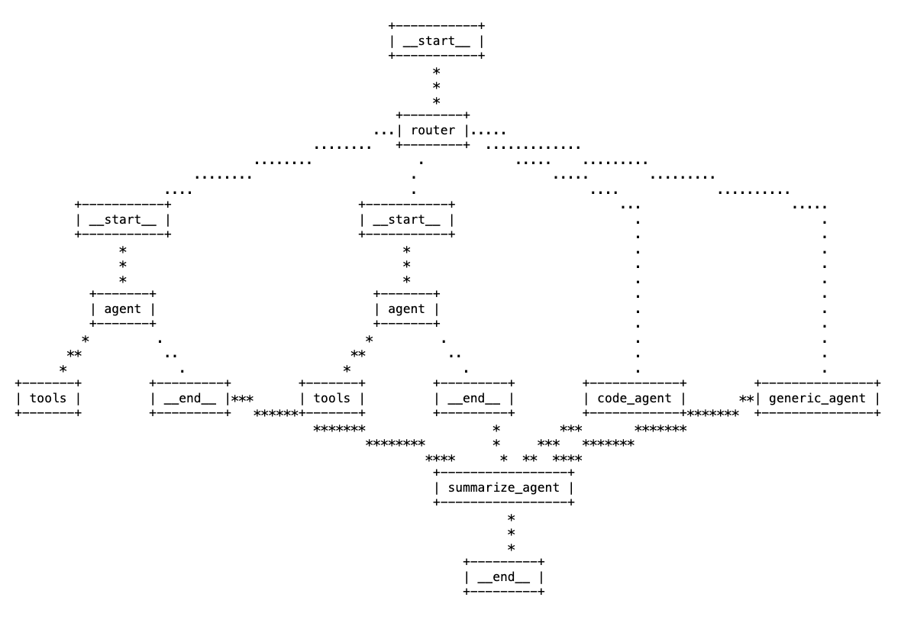

# Retail AI Agent

A conversational AI system for retail operations built on Databricks, providing recommendation, inventory management, and product information capabilities through a unified agent architecture.

## Overview

This project implements a LangGraph-based conversational AI agent for retail operations that can:

- Answer questions about product inventory
- Provide product recommendations based on customer preferences
- Look up specific product details
- Answer general retail-related questions

The system uses Databricks Vector Search, Unity Catalog, and LLMs to provide accurate, context-aware responses.

## Architecture

The agent uses a routing architecture that directs user questions to specialized sub-agents:

- **Code Agent**: Handles code-related queries with step-by-step explanations
- **Vector Search Agent**: Processes product recommendation queries using vector search
- **Genie Agent**: Answers inventory and product information questions using Databricks Genie
- **General Agent**: Handles general questions



## Prerequisites

- Python 3.12+
- Databricks workspace with access to:
  - Unity Catalog
  - Model Serving
  - Vector Search
  - Genie
- Databricks model endpoints:
  - LLM endpoint (default: databricks-meta-llama-3-3-70b-instruct)
  - Embedding model endpoint (default: databricks-gte-large-en)

## Setup

1. Clone this repository
2. Install dependencies:

```bash
# Create and activate a Python virtual environment 
python -m venv venv
source venv/bin/activate  # On Windows: venv\Scripts\activate

# Install dependencies
pip install -e .
```

## Configuration

Configuration is managed through `model_config.yaml`, which includes:

- Catalog and database information
- LLM model endpoints
- Vector search settings
- Genie space ID
- Application deployment details

## Notebooks

The project includes several notebooks for setup and execution:

1. `01_ingest-and-transform.py`: Ingests product data and prepares it for vector search
2. `02_provision-vector-search.py`: Creates vector search endpoint and index
3. `03_generate_evaluation_data.py`: Prepares evaluation data for the agent
4. `04_unity_catalog_tools.py`: Creates Unity Catalog functions
5. `05_agent_as_code_driver.py`: Deploys the agent as a model

## Development

### Project Structure

- `retail_ai/`: Core package containing agent implementation
  - `agents.py`: Agent implementation 
  - `catalog.py`: Unity Catalog integration
  - `graph.py`: LangGraph workflow definition
  - `models.py`: MLflow model integration
  - `nodes.py`: Agent node definitions
  - `tools.py`: Tool definitions for the agent
  - `vector_search.py`: Vector search utilities

### Building the Package

```bash
make dist
```

### Running Tests

```bash
make test
```

## Deployment

The agent can be deployed as a model endpoint using MLflow:

```python
# Register the model
mlflow.register_model(
    name="retail_ai_agent",
    model_uri=logged_agent_info.model_uri
)

# Deploy as an endpoint
agents.deploy(
  model_name="retail_ai_agent", 
  model_version=latest_version,
  endpoint_name="retail_ai_agent"
)
```

## Usage

Once deployed, the agent can be called with:

```python
from mlflow.deployments import get_deploy_client

client = get_deploy_client("databricks")
response = client.predict(
  endpoint="retail_ai_agent",
  inputs={
    "messages": [
      {"role": "user", "content": "Can you recommend a lamp to match my oak side tables?"}
    ],
    "custom_inputs": {
      "configurable": {
        "thread_id": "1",
        "tone": "friendly"
      }
    }
  }
)
```

## License

This project is licensed under the MIT License - see the [LICENSE](LICENSE) file for details.