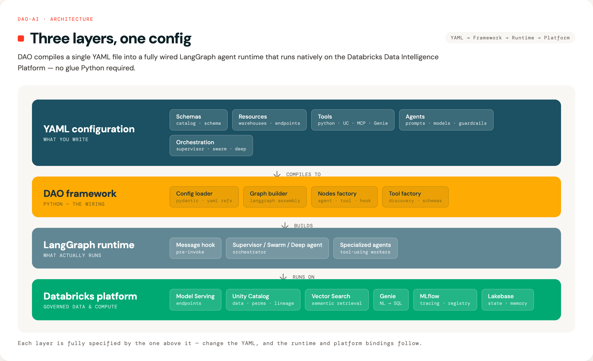

# DAO: Declarative Agent Orchestration

[](CHANGELOG.md)
[](https://www.python.org/)
[](LICENSE)

**Production-grade AI agents defined in YAML, powered by LangGraph, deployed on Databricks.**

DAO is an **infrastructure-as-code framework** for building, deploying, and managing multi-agent AI systems. Instead of writing boilerplate Python code to wire up agents, tools, and orchestration, you define everything declaratively in YAML configuration files.

```yaml
# Define an agent in 10 lines of YAML
agents:
  product_expert:
    name: product_expert
    model: *claude_sonnet
    tools:
      - *ai_search_tool
      - *genie_tool
    prompt: |
      You are a product expert. Answer questions about inventory and pricing.
```

### 🎨 Visual Configuration Studio

Prefer a visual interface? Check out **[DAO AI Builder](https://github.com/natefleming/dao-ai-builder)** — a React-based web application that provides a graphical interface for creating and editing DAO configurations. Perfect for:

- **Exploring** DAO's capabilities through an intuitive UI
- **Learning** the configuration structure with guided forms
- **Building** agents visually without writing YAML manually
- **Importing** and editing existing configurations

DAO AI Builder generates valid YAML configurations that work seamlessly with this framework. Use whichever workflow suits you best — visual builder or direct YAML editing.

<p align="center">
  
</p>

---

## 📚 Documentation

### Getting Started
- **[Why DAO?](docs/why-dao.md)** - Learn what DAO is and how it compares to other platforms
- **[Quick Start](#quick-start)** - Build and deploy your first agent in minutes
- **[Architecture](docs/architecture.md)** - Understand how DAO works under the hood

### Core Concepts
- **[Key Capabilities](docs/key-capabilities.md)** - Explore 15 powerful features for production agents
- **[Configuration Reference](docs/configuration-reference.md)** - Complete YAML configuration guide
- **[Examples](docs/examples.md)** - Ready-to-use example configurations
- **[A2A Protocol](docs/a2a_protocol.md)** - Google Agent2Agent endpoints on every Apps deployment
- **[MCP Server](docs/mcp_server.md)** - Expose dao-ai Genie + AI Search tools as MCP via `dao-ai generate-mcp`
- **[Background Agents](docs/background_agents.md)** - kickoff/poll/cancel for multi-minute graph runs

### Reference
- **[CLI Reference](docs/cli-reference.md)** - Command-line interface documentation
- **[Python API](docs/python-api.md)** - Programmatic usage and customization
- **[FAQ](docs/faq.md)** - Frequently asked questions

### Contributing
- **[Contributing Guide](docs/contributing.md)** - How to contribute to DAO

---

## Quick Start

### Prerequisites

Before you begin, you'll need:

- **Python 3.11 or newer** installed on your computer ([download here](https://www.python.org/downloads/))
- **A Databricks workspace** (ask your IT team or see [Databricks docs](https://docs.databricks.com/))
  - Access to **Unity Catalog** (your organization's data catalog)
  - **Model Serving** or **Databricks Apps** enabled (for deploying AI agents)
  - *Optional*: AI Search (formerly Vector Search), Genie (for advanced features)

**Not sure if you have access?** Your Databricks administrator can grant you permissions.

### Installation

**Option 1: Install from PyPI (Recommended)**

The simplest way to get started:

```bash
# Install directly from PyPI
pip install dao-ai
```

**Option 2: For developers familiar with Git**

```bash
# Clone this repository
git clone <repo-url>
cd dao-ai

# Create an isolated Python environment
uv venv
source .venv/bin/activate  # On Windows: .venv\Scripts\activate

# Install DAO and its dependencies
make install
```

**Option 3: For those new to development**

1. Download this project as a ZIP file (click the green "Code" button on GitHub → Download ZIP)
2. Extract the ZIP file to a folder on your computer
3. Open a terminal/command prompt and navigate to that folder
4. Run these commands:

```bash
# On Mac/Linux:
python3 -m venv .venv
source .venv/bin/activate
pip install -e .

# On Windows:
python -m venv .venv
.venv\Scripts\activate
pip install -e .
```

**Verification:** Run `dao-ai --version` to confirm the installation succeeded.

### Your First Agent

Let's build a simple AI assistant in 4 steps. This agent will use a language model from Databricks to answer questions.

**Step 1: Create a configuration file**

Create a new file called `config/my_agent.yaml` and paste this content:

```yaml
schemas:
  my_schema: &my_schema
    catalog_name: my_catalog        # Replace with your Unity Catalog name
    schema_name: my_schema          # Replace with your schema name

resources:
  llms:
    default_llm: &default_llm
      name: databricks-gpt-5-4-mini  # The AI model to use

agents:
  assistant: &assistant
    name: assistant
    model: *default_llm
    prompt: |
      You are a helpful assistant.

app:
  name: my_first_agent
  registered_model:
    schema: *my_schema
    name: my_first_agent
  agents:
    - *assistant
  orchestration:
    swarm:
      default_agent: *assistant
```

**💡 What's happening here?**
- `schemas`: Points to your Unity Catalog location (where the agent will be registered)
- `resources`: Defines the AI model (Llama 3.3 70B in this case)
- `agents`: Describes your assistant agent and its behavior
- `app`: Configures how the agent is deployed and orchestrated

**Step 2: Validate your configuration**

This checks for errors in your YAML file:

```bash
dao-ai validate -c config/my_agent.yaml
```

You should see: ✅ `Configuration is valid!`

**Step 3: Visualize the agent workflow** (optional)

Generate a diagram showing how your agent works:

```bash
dao-ai graph -c config/my_agent.yaml -o my_agent.png
```

This creates `my_agent.png` — open it to see a visual representation of your agent.

**Step 4: Deploy to Databricks**

**Option A: Using Python** (programmatic deployment)

```python
from dao_ai.config import AppConfig

# Load your configuration
config = AppConfig.from_file("config/my_agent.yaml")

# Package the agent as an MLflow model
config.create_agent()

# Deploy to Databricks Model Serving
config.deploy_agent()
```

**Option B: Using the CLI** (one command)

```bash
dao-ai pipeline --deploy --run -c config/my_agent.yaml
```

This single command:
1. Validates your configuration
2. Packages the agent
3. Deploys it to Databricks
4. Creates a serving endpoint

**Deploying to a specific workspace:**

```bash
# Deploy to AWS workspace
dao-ai pipeline --deploy --run -c config/my_agent.yaml --profile aws-field-eng

# Deploy to Azure workspace
dao-ai pipeline --deploy --run -c config/my_agent.yaml --profile azure-retail
```

**Step 5: Interact with your agent**

Once deployed, you can chat with your agent using Python:

```python
from mlflow.deployments import get_deploy_client

# Connect to your Databricks workspace
client = get_deploy_client("databricks")

# Send a message to your agent
response = client.predict(
    endpoint="my_first_agent",
    inputs={
        "messages": [{"role": "user", "content": "Hello! What can you help me with?"}],
        "configurable": {
            "thread_id": "1",           # Conversation ID
            "user_id": "demo_user"      # User identifier
        }
    }
)

# Print the agent's response
print(response["message"]["content"])
```

**🎉 Congratulations!** You've built and deployed your first AI agent with DAO.

**Next steps:**
- Explore the [`config/examples/`](config/examples/) folder for more advanced configurations
- Try the [DAO AI Builder](https://github.com/natefleming/dao-ai-builder) visual interface
- Learn about [Key Capabilities](docs/key-capabilities.md) to add advanced features
- Read the [Architecture](docs/architecture.md) documentation to understand how it works

### Parameterising a Config

Make one YAML re-usable across catalogs, schemas, environments, and users by declaring `parameters:` and referencing them with `${param.NAME}` (or its alias `${var.NAME}`). The config can also reference workspace context (host, current user) using the same `${workspace.*}` namespace as Databricks Asset Bundles.

```yaml
parameters:
  catalog:
    description: Unity Catalog catalog name
    default: main
  genie_parent_path:
    description: Workspace folder for the Genie space
    default: "/Users/${workspace.current_user.userName}/genie"

schemas:
  s:
    catalog_name: ${param.catalog}
    schema_name: dao_ai

genie_rooms:
  ops:
    parent_path: ${param.genie_parent_path}
    workspace_url: ${workspace.host}
```

Supported workspace references (match the DABs convention):

- `${workspace.host}` — workspace URL, no trailing slash
- `${workspace.current_user.userName}` — full email
- `${workspace.current_user.short_name}` — email prefix, dots intact
- `${workspace.current_user.domain_friendly_name}` — email domain

Override declared parameters at runtime, or inspect them:

```bash
dao-ai chat -c dao_ai.yaml --param catalog=nfleming
dao-ai parameters list -c dao_ai.yaml      # see all declared parameters + resolved workspace values
```

`dao-ai vars` and `--var` remain as aliases for backwards compatibility.

Full reference: [Parameters (Load-Time Substitution)](docs/configuration-reference.md#parameters-load-time-substitution).

---

## Key Features at a Glance

DAO provides powerful capabilities for building production-ready AI agents:

| Feature | Description |
|---------|-------------|
| **Dual Deployment Targets** | Deploy to Databricks Model Serving or Databricks Apps with a single config |
| **Long-Running Agents** | OpenAI Responses API–compatible background kickoff + poll / stream retrieve backed by Lakebase; survives Model Serving's 5 min worker timeout and Databricks Apps' 120 s proxy timeout |
| **Multi-Tool Support** | Python functions, Unity Catalog, MCP, Agent Endpoints |
| **Orchestration Patterns** | Supervisor, Swarm, **Deep Agent** (langgraph deepagents — todo, filesystem, shell, sub-agents, skills, AGENTS.md memory) |
| **On-Behalf-Of User** | Per-user permissions and governance |
| **Advanced Caching** | Two-tier (LRU + Semantic) caching for cost optimization |
| **AI Search Reranking** | Improve RAG quality with FlashRank |
| **Human-in-the-Loop** | Approval workflows for sensitive operations |
| **Memory & Persistence** | Long-term memory with structured schemas, background extraction, auto-injection; PostgreSQL, Lakebase, or in-memory backends |
| **Prompt Registry** | Version and manage prompts in MLflow |
| **Prompt Optimization** | Automated tuning with GEPA (Generative Evolution of Prompts and Agents) |
| **Guardrails** | Content filters, safety checks, validation |
| **Middleware** | Input validation, logging, performance monitoring, audit trails |
| **Conversation Summarization** | Handle long conversations automatically |
| **Structured Output** | JSON schema for predictable responses |
| **Custom I/O** | Flexible input/output with runtime state |
| **Hook System** | Lifecycle hooks for initialization and cleanup |

👉 **Learn more:** [Key Capabilities Documentation](docs/key-capabilities.md)

---

## Architecture Overview



👉 **Learn more:** [Architecture Documentation](docs/architecture.md)

---

## Example Configurations

The `config/examples/` directory contains ready-to-use configurations organized in a **progressive learning path**:

- `01_getting_started/minimal.yaml` - Simplest possible agent
- `02_tools/vector_search_with_reranking.yaml` - RAG with improved accuracy
- `04_genie/genie_context_aware_cache.yaml` - NL-to-SQL with PostgreSQL context-aware caching
- `04_genie/genie_in_memory_context_aware_cache.yaml` - NL-to-SQL with in-memory context-aware caching (no database)
- `05_memory/conversation_summarization.yaml` - Long conversation handling
- `06_on_behalf_of_user/obo_basic.yaml` - User-level access control
- `07_human_in_the_loop/human_in_the_loop.yaml` - Approval workflows

And many more! Follow the numbered path or jump to what you need. See the full guide in [Examples Documentation](docs/examples.md).

---

## CLI Quick Reference

```bash
# Validate configuration
dao-ai validate -c config/my_config.yaml

# Generate JSON schema for IDE support
dao-ai schema > schemas/model_config_schema.json

# Visualize agent workflow
dao-ai graph -c config/my_config.yaml -o workflow.png

# Deploy with Databricks Asset Bundles
dao-ai pipeline --deploy --run -c config/my_config.yaml

# Deploy to a specific workspace (multi-cloud support)
dao-ai pipeline --deploy -c config/my_config.yaml --profile aws-field-eng
dao-ai pipeline --deploy -c config/my_config.yaml --profile azure-retail

# Generate a deployable Databricks Apps bundle
dao-ai generate-bundle -c config/my_config.yaml -o ./my-bundle
# Then `cd` in and run `uv sync` to produce uv.lock — see "Deploying to
# Databricks Apps" below for the full two-step workflow.

# Interactive chat with agent
dao-ai chat -c config/my_config.yaml

# Inspect declared parameters and resolved values
dao-ai parameters list -c config/my_config.yaml --param catalog=nfleming
```

### Deploying to Databricks Apps

`dao-ai generate-bundle` produces a bundle skeleton (`pyproject.toml` + app/resource YAML + your config), but it deliberately does **not** generate `uv.lock`. The lock encodes URLs and pins specific to your environment, so you own it.

**External users** (default index = public PyPI):

```bash
dao-ai generate-bundle -c config/my_config.yaml -o ./my-bundle
cd ./my-bundle
uv sync                                # produces uv.lock from public PyPI
databricks bundle deploy -t dev -p <profile>
databricks bundle run <app-name> -t dev -p <profile>
```

**Databricks-internal users** (local `uv` config defaults to the internal `pypi-proxy.dev.databricks.com` mirror): you need one extra step. The mirror is not reachable from Apps containers, so the lock URLs must be rewritten to public PyPI before deploy. The mirror is transparent, so hashes match — only the URLs need to change:

```bash
dao-ai generate-bundle -c config/my_config.yaml -o ./my-bundle
cd ./my-bundle
uv sync                                # produces uv.lock with internal-proxy URLs
sed -i '' \
  -e 's|pypi-proxy\.dev\.databricks\.com/packages/|files.pythonhosted.org/packages/|g' \
  -e 's|pypi-proxy\.dev\.databricks\.com/simple/|pypi.org/simple/|g' \
  uv.lock
databricks bundle deploy -t dev -p <profile>
databricks bundle run <app-name> -t dev -p <profile>
```

Apps' native uv support (announced 2026) activates automatically when `pyproject.toml` + `uv.lock` are present and `requirements.txt` is absent. The BUILD phase runs `uv sync --locked --no-dev`; the runtime command is bare `python -m dao_ai.apps.start_app` (chat-proxy variant) or `python -m dao_ai.apps.server` (no chat UI). No `uv run` wrapper needed.

#### Trace persistence on Apps

MLflow's default control-plane trace export does **not** work on Databricks Apps today: the artifact-storage host (`us-east-1.storage.cloud.databricks.com`) is unreachable from App containers, so trace spans are silently dropped (you'll see `WARNING mlflow.tracing.export.mlflow_v3: ... Connection refused` in the App logs). To capture traces, set `app.trace_location` in your config so traces export through a SQL warehouse → UC OTEL tables (reachable from Apps):

```yaml
app:
  name: my_app
  # ...
  trace_location:
    schema: *retail_schema                   # reference an existing SchemaModel anchor
    warehouse: "your-warehouse-id"           # or a *warehouse anchor
```

When `trace_location` is set, `generate-bundle` automatically attaches the SQL warehouse as an App resource (with `CAN_USE` for the App SP) and adds `MLFLOW_TRACING_SQL_WAREHOUSE_ID` to the App's env. The OTEL trace tables themselves are auto-created by MLflow at first trace write — dao-ai does not emit per-table grants because the tables don't exist at deploy time and the Apps platform would reject the bundle. After deploy, grant the App SP schema-level privileges so MLflow can create + write to the OTEL tables (one-time setup):

```bash
SP=$(databricks apps get <app-name> -p <profile> --output json | jq -r .service_principal_client_id)
databricks grants update catalog <catalog> -p <profile> \
  --json "{\"changes\":[{\"principal\":\"$SP\",\"add\":[\"USE_CATALOG\"]}]}"
databricks grants update schema <catalog>.<schema> -p <profile> \
  --json "{\"changes\":[{\"principal\":\"$SP\",\"add\":[\"USE_SCHEMA\",\"CREATE_TABLE\",\"MODIFY\",\"SELECT\"]}]}"
```

When `trace_location` is unset, `generate-bundle` emits a loud warning. Local notebook/CLI runs and Model Serving deploys are unaffected and continue to use the default control-plane path. See `config/examples/01_getting_started/ai_gateway.yaml` for a commented example.

### Multi-Cloud Deployment

DAO AI supports deploying to Azure, AWS, and GCP workspaces with automatic cloud detection:

```bash
# Deploy to AWS workspace
dao-ai pipeline --deploy -c config/my_config.yaml --profile aws-prod

# Deploy to Azure workspace
dao-ai pipeline --deploy -c config/my_config.yaml --profile azure-prod

# Deploy to GCP workspace
dao-ai pipeline --deploy -c config/my_config.yaml --profile gcp-prod
```

The CLI automatically:
- Detects the cloud provider from your profile's workspace URL
- Selects appropriate compute node types for each cloud
- Creates isolated deployment state per profile

👉 **Learn more:** [CLI Reference Documentation](docs/cli-reference.md)

---

## Community & Support

- **Documentation**: [docs/](docs/)
- **Examples**: [config/examples/](config/examples/)
- **Issues**: [GitHub Issues](https://github.com/your-org/dao-ai/issues)
- **Discussions**: [GitHub Discussions](https://github.com/your-org/dao-ai/discussions)

---

## Contributing

We welcome contributions! See the [Contributing Guide](docs/contributing.md) for details on:

- Setting up your development environment
- Code style and testing guidelines
- How to submit pull requests
- Project structure overview

---

## License

This project is licensed under the MIT License - see the [LICENSE](LICENSE) file for details.
