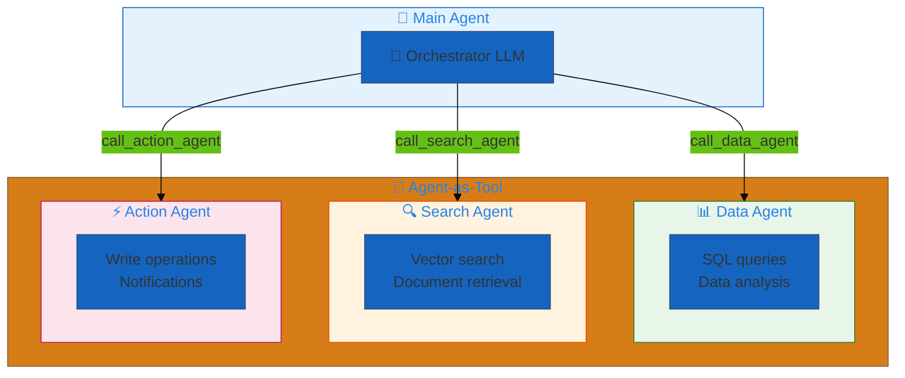
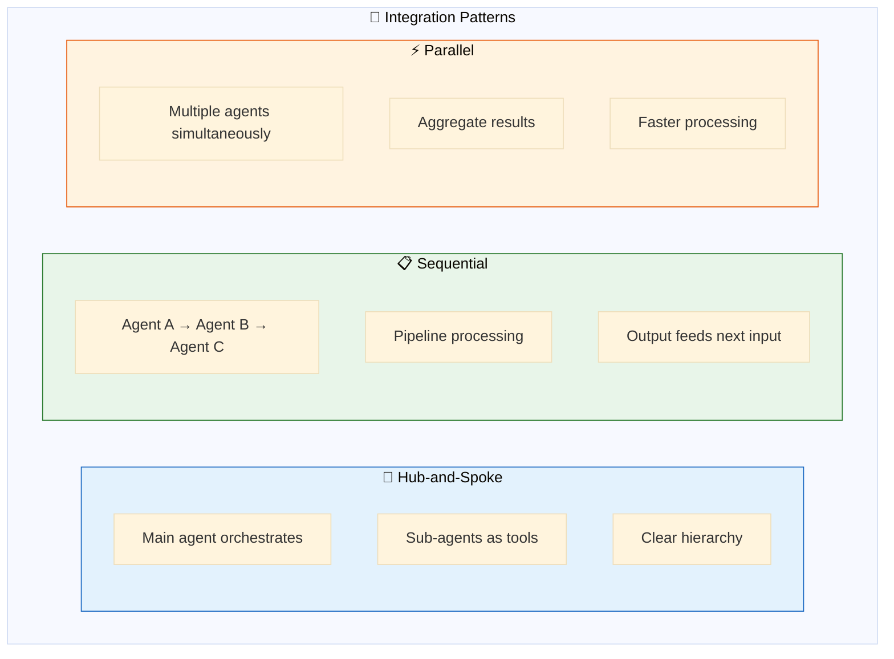
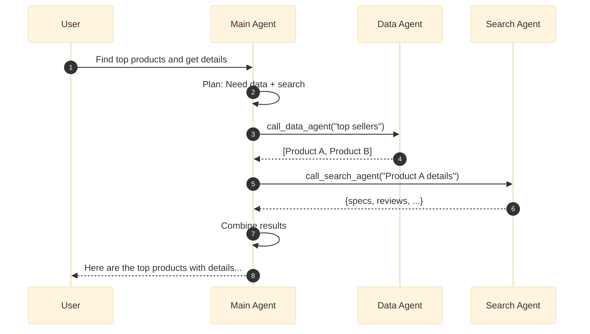
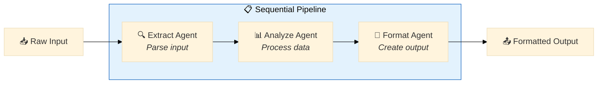
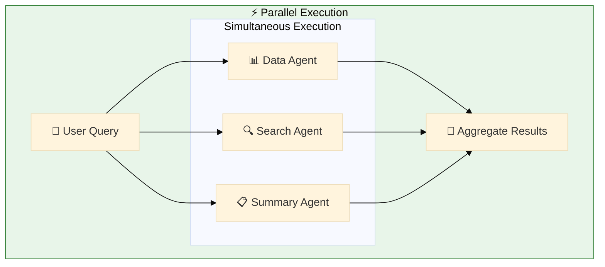
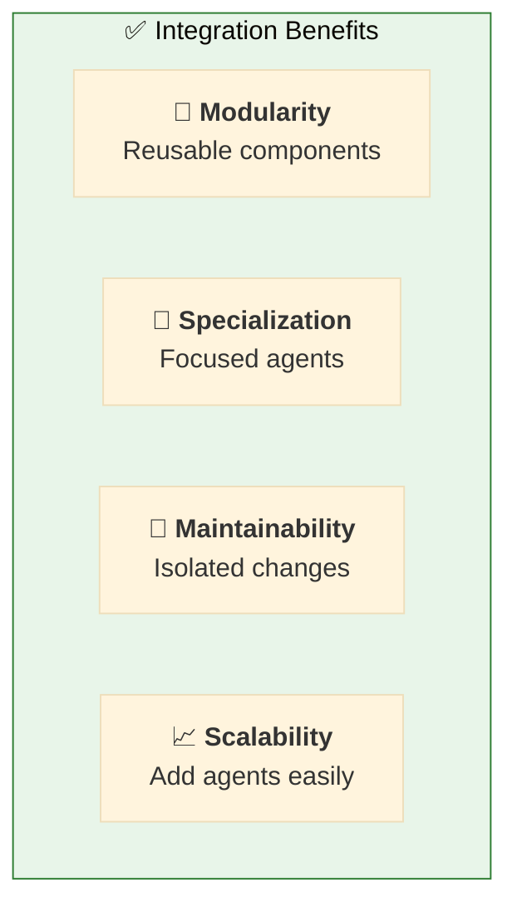
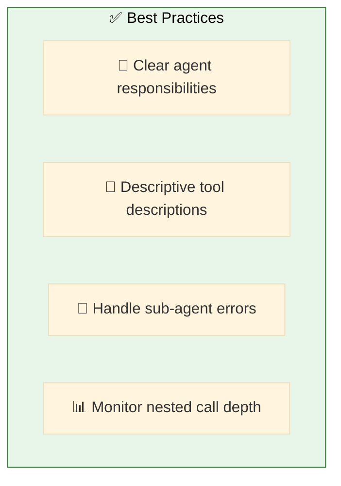

# 10. Agent Integrations

**Compose agents for modular architectures**

Build complex systems by integrating specialized agents as tools within other agents.

## Architecture Overview



## Examples

| File | Description |
|------|-------------|
| [`nested_agents.yaml`](./nested_agents.yaml) | Main agent calling specialized sub-agents |
| [`parallel_agents.yaml`](./parallel_agents.yaml) | Parallel agent execution pattern |
| [`agent_bricks.yaml`](./agent_bricks.yaml) | Delegate to Databricks Agent Bricks endpoints |
| [`kasal.yaml`](./kasal.yaml) | Delegate to Kasal specialist agents |
| [`gcp_agent_endpoint.yaml`](./gcp_agent_endpoint.yaml) | Call a Google Cloud ADK agent on Vertex AI Agent Engine |

## GCP Vertex AI Agent Engine (ADK)

The `gcp_agent_endpoint.yaml` example shows how to delegate to a Google ADK
agent deployed on Vertex AI Agent Engine. Key points:

- **Endpoint protocol** — Vertex ADK agents are invoked via the proprietary
  `:streamQuery` REST endpoint (not A2A). The tool aggregates the NDJSON
  stream internally and returns a single synchronous string to the caller.
- **Credentials** — service-account JSON can be supplied as a local file
  path, a Databricks Volume path (`/Volumes/...`), or as inline JSON (e.g.
  stored in a Databricks secret scope). The tool auto-detects the format.
- **Session continuity** — `context.thread_id` is forwarded to ADK as the
  `session_id` so conversation state (ADK `state_delta` events) persists
  across turns. If ADK returns 404 or an empty-body 200 (both indicate the
  `session_id` is unknown), the tool transparently retries without it so
  ADK auto-creates a fresh session.

## Integration Patterns



## Hub-and-Spoke Pattern



## Configuration

### Define Sub-Agents

```yaml
agents:
  # 📊 Specialized data agent
  data_agent: &data_agent
    name: data_analyst
    model: *default_llm
    tools:
      - *sql_tool
      - *genie_tool
    prompt: |
      You are a data analysis specialist.
      Execute queries and return structured results.

  # 🔍 Specialized search agent
  search_agent: &search_agent
    name: search_specialist
    model: *default_llm
    tools:
      - *vector_search_tool
    prompt: |
      You are a search specialist.
      Find relevant documents and information.
```

### Create Agent Tools

```yaml
tools:
  # 🔧 Wrap data_agent as a tool
  call_data_agent: &call_data_agent
    name: call_data_agent
    function:
      type: factory
      name: dao_ai.tools.agent.create_agent_tool
      args:
        agent: *data_agent
    description: |
      Call the data analysis agent for SQL queries and data analysis.

  # 🔧 Wrap search_agent as a tool
  call_search_agent: &call_search_agent
    name: call_search_agent
    function:
      type: factory
      name: dao_ai.tools.agent.create_agent_tool
      args:
        agent: *search_agent
```

### Main Agent Uses Sub-Agents

```yaml
agents:
  main_agent: &main_agent
    name: orchestrator
    model: *default_llm
    tools:
      - *call_data_agent      # ← Sub-agent as tool
      - *call_search_agent    # ← Sub-agent as tool
    prompt: |
      You are an orchestrator that coordinates specialized agents.
      
      Use call_data_agent for data queries and analysis.
      Use call_search_agent for document search and retrieval.
      
      Combine results from multiple agents when needed.
```

## Sequential Pattern



## Parallel Pattern



## Benefits



## Quick Start

```bash
# Run nested agent example
dao-ai chat -c config/examples/10_agent_integrations/nested_agents.yaml

# Test agent delegation
> Analyze sales data and find related product reviews

# Main agent calls data_agent for sales, search_agent for reviews
```

## Best Practices



## Troubleshooting

| Issue | Solution |
|-------|----------|
| Wrong agent called | Improve tool descriptions |
| Deep nesting | Flatten hierarchy, limit depth |
| Slow responses | Use parallel pattern |

## Next Steps

- **13_orchestration/** - Compare with supervisor/swarm
- **12_middleware/** - Apply middleware to sub-agents
- **15_complete_applications/** - Production patterns

## Related Documentation

- [Agent Tools](../../../docs/key-capabilities.md#agent-tools)
- [Orchestration](../13_orchestration/README.md)
