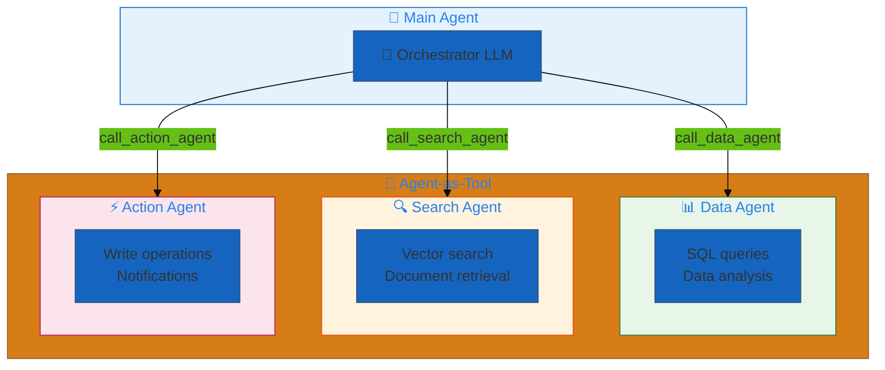
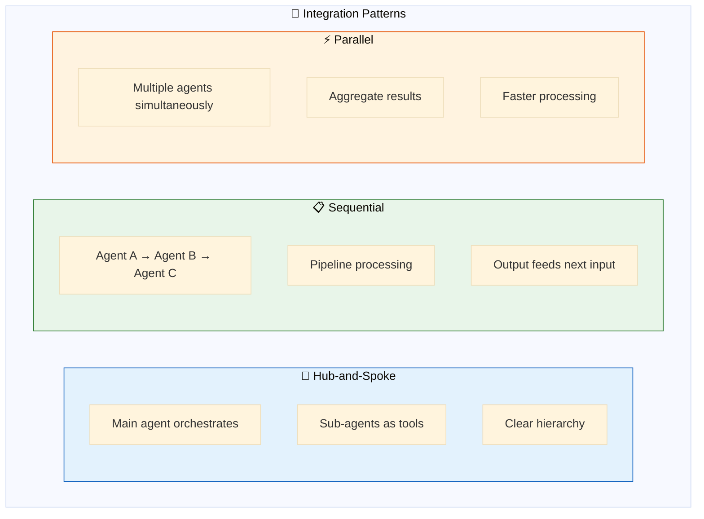
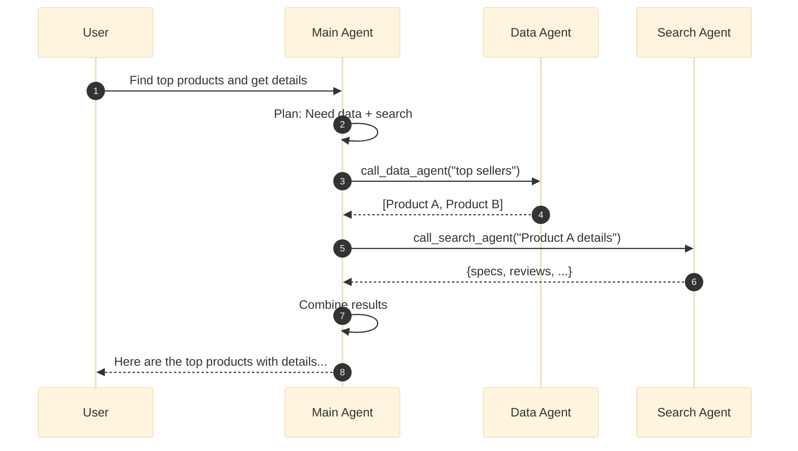
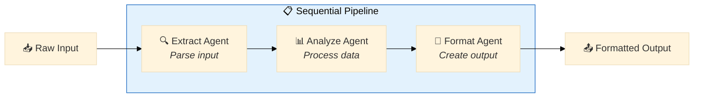
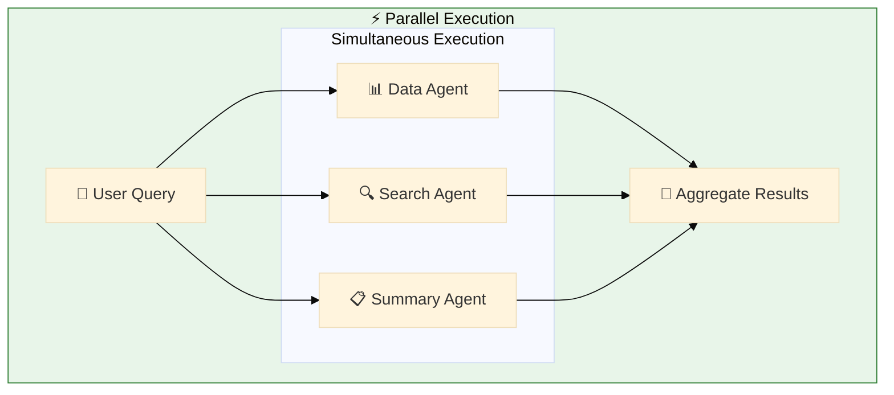
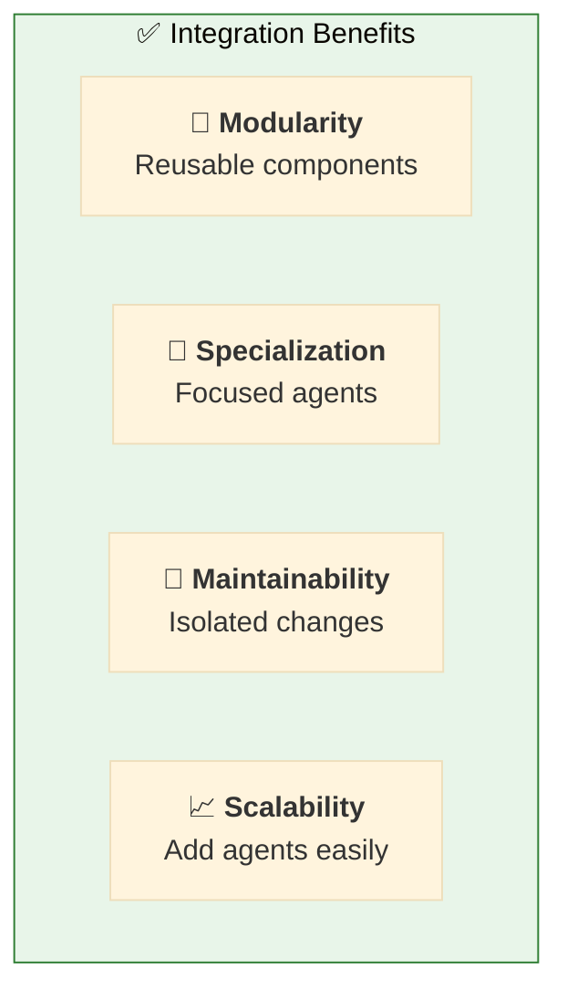
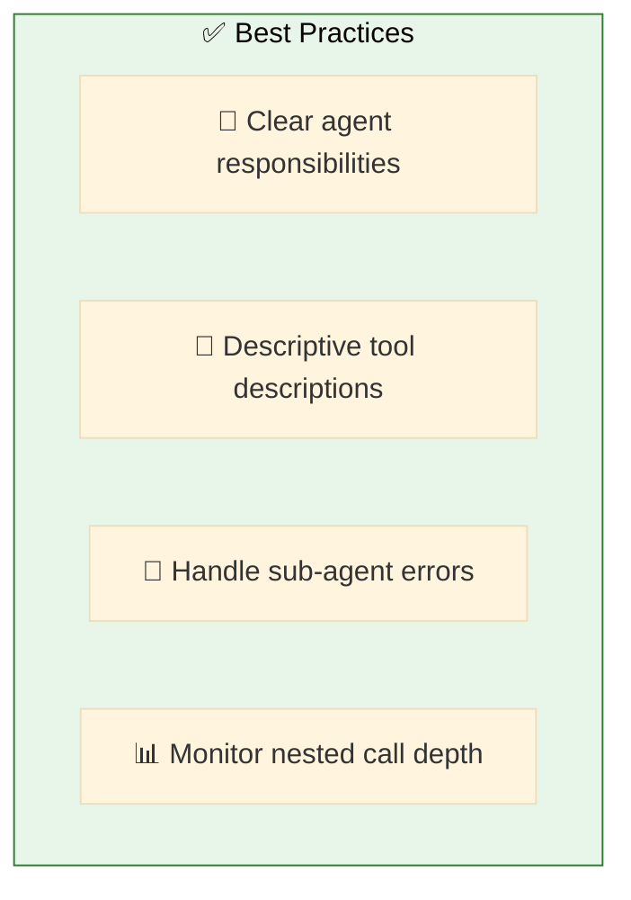

# 10. Agent Integrations

**Compose agents for modular architectures**

Build complex systems by integrating specialized agents as tools within other agents.

## Architecture Overview



## Picking the right tool shape

Three first-class shapes cover the vast majority of agent-composition cases. **Pick by the target kind**, not by the workload — agents can run on either apps or Model Serving endpoints, and both shapes support both wire protocols (OpenAI Responses + Chat Completions):

| Remote target | Use | How wire shape is selected |
|---|---|---|
| **Databricks App** (any app exposing OpenAI Responses or Chat Completions — dao-ai apps, `mlflow.agents` ResponsesAgent apps, custom apps) | [`type: app`](./app_first_class.yaml) with `app:` | `api:` — `responses` (default if unset and discovery fails), `completions`, or unset → lazy probe of `<app_url>/agent/info`. |
| **Model Serving endpoint** (FMAPI / Foundation Model API, UC-registered agents, Knowledge Assistants, Agent Bricks) | [`type: serving_endpoint`](./serving_endpoint_first_class.yaml) with `endpoint:` | `api:` — `responses`, `completions` (default if unset and discovery fails), or unset → lazy probe of `serving_endpoints.get(name).task`. |
| **External A2A agent** (Vertex AI Agent Engine, Crew.ai, ADK, third-party) | [`type: a2a`](./a2a_agent.yaml) with `endpoint:` | Explicit A2A protocol over an external URL, with custom auth (`bearer` / `gcp_service_account` / `none`), card paths, streaming, timeouts. |
| **MCP Databricks App** (`mcp-` prefix) | `type: mcp` with `app:` | The MCP factory speaks MCP. `type: app` rejects `mcp-` apps at validation. |
| **Sub-agent defined in the same dao-ai config** | `type: factory + dao_ai.tools.agent.create_agent_tool` ([`nested_agents.yaml`](./nested_agents.yaml)) | In-process LangGraph delegation — no network hop. |

**Why per-target types?** Naming the type after the target kind (app vs serving_endpoint) keeps the mental model simple — same `api:` semantics, same defaults-and-discovery behavior, different target field. Aligns with the [Databricks Agent Bricks Supervisor API](https://docs.databricks.com/aws/en/generative-ai/agent-bricks/supervisor-api) naming.

## Examples

| File | Description |
|------|-------------|
| [`app_first_class.yaml`](./app_first_class.yaml) | **`type: app`** — call a Databricks App; `api:` unset (auto), `api: completions` (explicit) |
| [`serving_endpoint_first_class.yaml`](./serving_endpoint_first_class.yaml) | **`type: serving_endpoint`** — FMAPI + UC-registered agent endpoint + full `InferenceEndpointModel` with temperature override |
| [`a2a_first_class.yaml`](./a2a_first_class.yaml) | **`type: a2a` for external A2A agents** — minimal example |
| [`nested_agents.yaml`](./nested_agents.yaml) | Main agent calling specialized sub-agents (in-process LangGraph delegation) |
| [`parallel_agents.yaml`](./parallel_agents.yaml) | Parallel agent execution pattern |
| [`agent_bricks.yaml`](./agent_bricks.yaml) | Delegate to Databricks Agent Bricks endpoints using `type: serving_endpoint` with full `InferenceEndpointModel` (temperature / max_tokens per tool) |
| [`kasal.yaml`](./kasal.yaml) | Delegate to Kasal specialist agents using `type: serving_endpoint` |
| [`vertex_agent_engine.yaml`](./vertex_agent_engine.yaml) | Call a Google Cloud ADK agent on Vertex AI Agent Engine |
| [`a2a_agent.yaml`](./a2a_agent.yaml) | Comprehensive `type: a2a` walkthrough — bearer / GCP / none auth, AppResource mode, card-path overrides |
| [`genie_agent_model.yaml`](./genie_agent_model.yaml) | **Genie Agent as a model** — a `GenieAgentModel` (Genie Agent Mode API) as an agent's streaming reasoning model, not a tool; `tools: []` Genie specialist |
| [`genie_agent_model_obo.yaml`](./genie_agent_model_obo.yaml) | Same, with `on_behalf_of_user` + `app:` block — deployable App exercising forwarded-token OBO |

## Genie Agent as a model (not a tool)

The `genie_agent_model*.yaml` examples use the Databricks **Genie Agent Mode
API** as an agent's **reasoning model** rather than wrapping it as a tool. A
`GenieAgentModel` streams Genie's output (SQL + table + narrative) as
`AIMessageChunk`s, so an agent with `tools: []` is a streaming "Genie
specialist" a supervisor can route to. Contrast `type: genie` (the tool), which
is atomic and returns one `ToolMessage`. Key points:

- **Assignment** — `model: *genie_room_anchor` (bare room auto-wraps) or the
  explicit `model: {genie_room: *anchor, timeout_seconds: N}` wrapper.
- **Registration** — the room MUST be under `resources.genie_rooms` (deploy
  grant + OBO scope); config-load fails otherwise.
- **Multi-turn / OBO** — `GenieAgentMiddleware` caches the Genie
  `conversation_id` in `session.genie.spaces[agent_id]` and builds the
  per-request client (forwarded token on Apps, `ModelServingUserCredentials`
  on Model Serving). See [configuration-reference → Genie Agent as a model](../../../docs/configuration-reference.md#genie-agent-as-a-model).

## Vertex AI Agent Engine (Google ADK)

The `vertex_agent_engine.yaml` example shows how to delegate to a Google ADK
agent deployed on Vertex AI Agent Engine. Key points:

- **Endpoint protocol** — Vertex ADK agents are invoked via the proprietary
  `:streamQuery` REST endpoint (not A2A). The tool aggregates the NDJSON
  stream internally and returns a single synchronous string to the caller.
- **Auth modes** — three supported via the `auth_type` discriminator:
  `gcp_service_account` (default, backward-compatible — service-account
  JSON as a local file path, Databricks Volume path `/Volumes/...`, or
  inline JSON in a secret scope; the loader auto-detects), `bearer`
  (pre-minted token for Workload Identity Federation, impersonation
  chains, or on-behalf-of flows), and `adc` (Application Default
  Credentials discovered from `GOOGLE_APPLICATION_CREDENTIALS`, gcloud
  user login, or the GCE/GKE metadata server).
- **Session continuity** — `context.thread_id` is forwarded to ADK as the
  `session_id` so conversation state (ADK `state_delta` events) persists
  across turns. If ADK returns 404 or an empty-body 200 (both indicate the
  `session_id` is unknown), the tool transparently retries without it so
  ADK auto-creates a fresh session.

## Google A2A Agents (Agent-to-Agent Protocol)

The `a2a_agent.yaml` example shows how to delegate to any remote agent
speaking Google's open [A2A protocol](https://a2a-protocol.org). A2A is a
framework-agnostic JSON-RPC + SSE standard — the remote agent can be built
with Google ADK, LangGraph, Crew.ai, or a custom toolkit. Key points:

- **Protocol** — the tool uses the official `a2a-sdk` Python client. Agent
  discovery hits `<endpoint>/.well-known/agent-card.json` (current spec)
  with an automatic fallback to the pre-1.0 `/.well-known/agent.json`.
  The streaming response is aggregated internally and returned as a single
  string so the tool integrates as a standard synchronous LangChain tool.
- **Auth modes** — three supported via the `auth_type` discriminator:
  `bearer` (API key / static OAuth token), `gcp_service_account` (for
  Vertex-AI-hosted A2A agents — refreshes tokens automatically from a
  service-account key), and `none` (public agents). Auth material is
  never logged or captured in MLflow spans.
- **Session continuity** — `context.thread_id` is forwarded as the A2A
  `Message.context_id` so multi-turn conversations persist server-side.
  `context.user_id` is forwarded in `Message.metadata` under the
  `dao_ai.user_id` key. If the remote server rejects the context id
  (empty stream or failed Task), the tool retries once without it.
- **Vertex A2A** — Vertex AI Agent Engine speaks A2A natively, so this
  tool doubles as an alternative to `vertex_agent_engine` for Vertex-
  hosted ADK agents. Switch `auth_type: gcp_service_account` and point
  `endpoint` at the Vertex A2A URL.

## Integration Patterns



## Hub-and-Spoke Pattern



## Configuration

### Define Sub-Agents

```yaml
agents:
  # 📊 Specialized data agent
  data_agent: &data_agent
    name: data_analyst
    model: *default_llm
    tools:
      - *sql_tool
      - *genie_tool
    prompt: |
      You are a data analysis specialist.
      Execute queries and return structured results.

  # 🔍 Specialized search agent
  search_agent: &search_agent
    name: search_specialist
    model: *default_llm
    tools:
      - *vector_search_tool
    prompt: |
      You are a search specialist.
      Find relevant documents and information.
```

### Create Agent Tools

```yaml
tools:
  # 🔧 Wrap data_agent as a tool
  call_data_agent: &call_data_agent
    name: call_data_agent
    function:
      type: factory
      name: dao_ai.tools.agent.create_agent_tool
      args:
        agent: *data_agent
    description: |
      Call the data analysis agent for SQL queries and data analysis.

  # 🔧 Wrap search_agent as a tool
  call_search_agent: &call_search_agent
    name: call_search_agent
    function:
      type: factory
      name: dao_ai.tools.agent.create_agent_tool
      args:
        agent: *search_agent
```

### Main Agent Uses Sub-Agents

```yaml
agents:
  main_agent: &main_agent
    name: orchestrator
    model: *default_llm
    tools:
      - *call_data_agent      # ← Sub-agent as tool
      - *call_search_agent    # ← Sub-agent as tool
    prompt: |
      You are an orchestrator that coordinates specialized agents.
      
      Use call_data_agent for data queries and analysis.
      Use call_search_agent for document search and retrieval.
      
      Combine results from multiple agents when needed.
```

## Sequential Pattern



## Parallel Pattern



## Benefits



## Quick Start

```bash
# Run nested agent example
dao-ai chat -c config/examples/10_agent_integrations/nested_agents.yaml

# Test agent delegation
> Analyze sales data and find related product reviews

# Main agent calls data_agent for sales, search_agent for reviews
```

## Best Practices



## Troubleshooting

| Issue | Solution |
|-------|----------|
| Wrong agent called | Improve tool descriptions |
| Deep nesting | Flatten hierarchy, limit depth |
| Slow responses | Use parallel pattern |

## Next Steps

- **13_orchestration/** - Compare with supervisor/swarm
- **12_middleware/** - Apply middleware to sub-agents
- **15_complete_applications/** - Production patterns

## Related Documentation

- [Agent Tools](../../../docs/key-capabilities.md#agent-tools)
- [Orchestration](../13_orchestration/README.md)
