# 13. Orchestration

**Multi-agent coordination patterns**

Coordinate multiple specialized agents to solve complex problems using supervisor or swarm orchestration.

## Architecture Overview

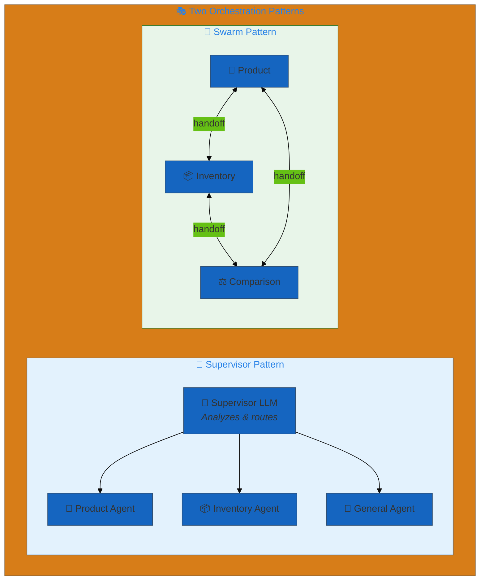

## Examples

| File | Pattern | Description |
|------|---------|-------------|
| [`supervisor_pattern.yaml`](./supervisor_pattern.yaml) | 👔 Supervisor | Central LLM routes to specialized agents |
| [`swarm_pattern.yaml`](./swarm_pattern.yaml) | 🐝 Swarm | Agents use handoff tools to transfer |
| [`deterministic_handoff_pattern.yaml`](./deterministic_handoff_pattern.yaml) | 🔗 Deterministic | Pipeline-style predetermined routing |
| [`parallel_fan_out_pattern.yaml`](./parallel_fan_out_pattern.yaml) | 🌊 Parallel fan-out | Source dispatches concurrently to N sibling agents that converge on a shared join |
| [`deep_agent_pattern.yaml`](./deep_agent_pattern.yaml) | 🧠 Deep Agent | Single planner with todo, filesystem, shell, sub-agents (langgraph deepagents) |
| [`deep_agent_with_subagents.yaml`](./deep_agent_with_subagents.yaml) | 🧠 Deep Agent | Three sub_agent declaration forms: anchor, name, inline |
| [`deep_agent_with_skills.yaml`](./deep_agent_with_skills.yaml) | 🧠 Deep Agent | Local + volume-backed skills, AGENTS.md memory, permissions, HITL |

## Pattern Comparison

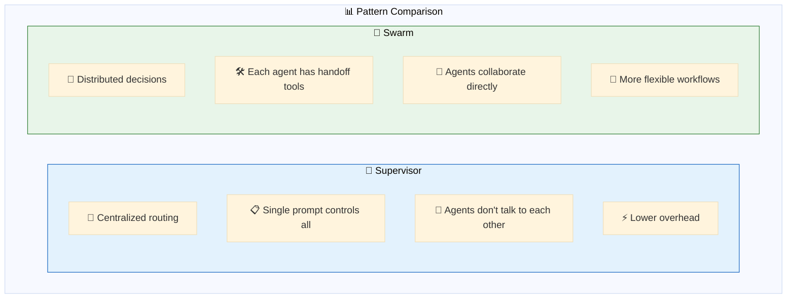

| Aspect | 👔 Supervisor | 🐝 Swarm | 🧠 Deep Agent |
|--------|--------------|----------|---------------|
| **Control** | Centralized LLM | Distributed agents | Single planner with sub-agents |
| **Routing** | Supervisor prompt | Handoff tools per agent | `task` tool delegation |
| **Configuration** | `orchestration.supervisor` | `orchestration.swarm` | `orchestration.deep_agent` |
| **Built-in tools** | None | Handoff tools | Todo, filesystem, shell, task |
| **Skills** | n/a | n/a | First-class — local + UC volume |
| **Best For** | Clear categories | Fluid collaboration | Long-horizon planning |
| **Overhead** | Single router call | Per-agent logic | Heavier base middleware |

## 🧠 Deep Agent Pattern

A single planning agent equipped with deepagents' built-in tool suite —
`write_todos`, filesystem ops (`ls`, `read_file`, `write_file`, `edit_file`,
`glob`, `grep`), shell `execute`, and the `task` tool that delegates to
sub-agents. Skills (Markdown workflow files) and AGENTS.md memory are
first-class concepts that ship with the model artifact.

```yaml
orchestration:
  deep_agent:
    model: *default_llm                  # LLMModel anchor or "provider:name" string
    system_prompt: |
      You are a planner. Break complex tasks into todos before answering.
    tools: [*current_time]               # ToolModel anchors or string refs
    skills: [*research_skill]            # SkillModel refs (local or volume-backed)
    instruction_files: [skills/.../AGENTS.md]   # AGENTS.md instruction files loaded into prompt
    subagents:                           # three accepted forms
      - *product_specialist              #   1. AgentModel anchor (full carry-over)
      - inventory_specialist             #   2. name lookup in app.agents
      - name: math_helper                #   3. inline SubAgentModel dict
        description: ...
        system_prompt: ...
    permissions:                         # Filesystem permission rules
      - paths: ["/workspace/**"]
        mode: allow
        operations: [read, write]
    interrupt_on:                        # HITL on selected tools
      write_file: true
```

**When to use deep_agent:**
- Long-horizon, multi-step tasks where the agent needs to plan, scratchpad
  intermediate state, and iterate.
- Workflows where pre-authored Markdown skills capture institutional
  knowledge that should ship with the agent.
- Apps where you want a single API surface (one `CompiledStateGraph`) but
  still want delegation to specialists.

**Skills layout** — by convention, skills live in a `skills/` directory at
the project root, organized by vertical (mirrors `functions/`):

```
skills/
└── sporting_goods_store/
    ├── research/
    │   ├── SKILL.md       # what the skill does
    │   └── AGENTS.md      # persistent memory
    └── product-lookup/
        └── SKILL.md
```

Local skills are bundled via `code_paths` (Model Serving) and the app source
(Databricks Apps). Volume-backed skills (`/Volumes/...`) live on Unity Catalog
and are read at runtime — declare them as `SkillModel` with a `volume:` field
so deployment wires the read permission automatically.

---

## 👔 Supervisor Pattern

A central supervisor LLM analyzes requests and routes to specialized worker agents.

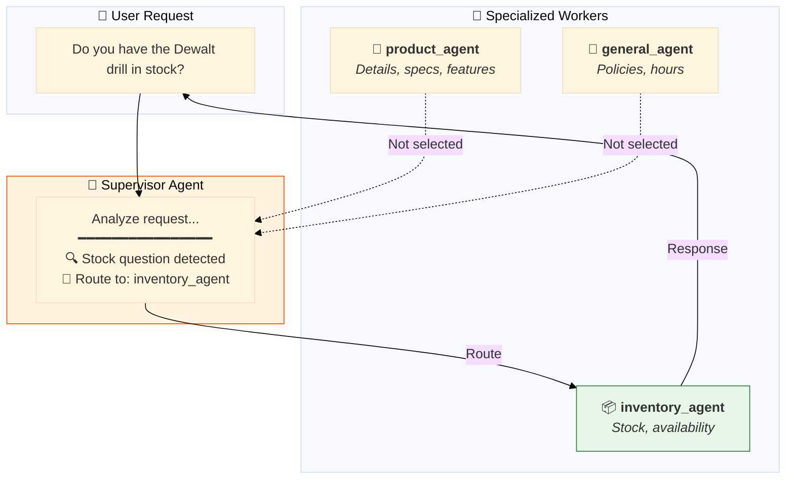

### Configuration

```yaml
app:
  agents:
    - *product_agent      # 🛒 Product details
    - *inventory_agent    # 📦 Stock levels
    - *general_agent      # 💬 General inquiries

  orchestration:
    supervisor:
      model: *default_llm
      prompt: |
        You are a routing coordinator. Analyze requests and route to:
        
        - product_agent: Product details, features, specs, pricing
        - inventory_agent: Stock availability, inventory levels
        - general_agent: Store policies, hours, general questions
        
        Route to the single most appropriate agent.
```

### Sequence Diagram

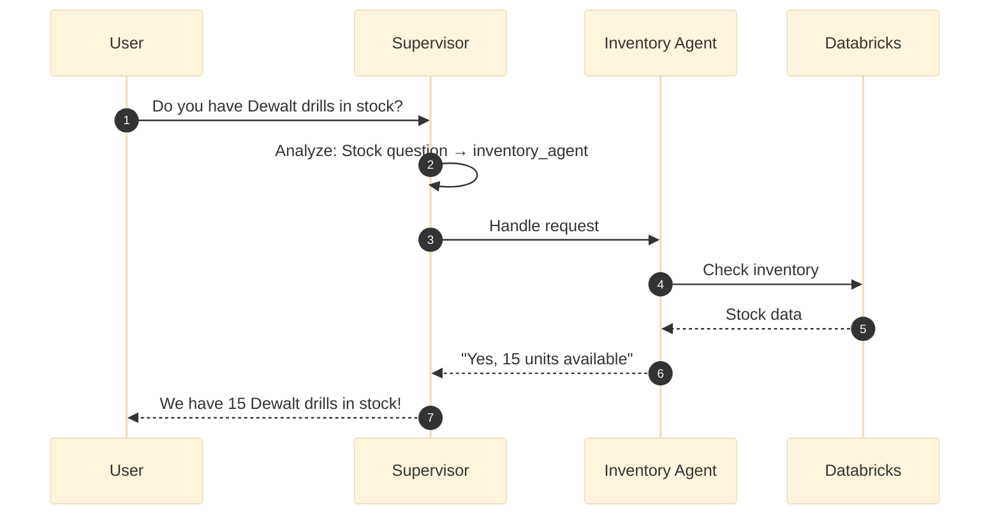

---

## 🐝 Swarm Pattern

Agents dynamically hand off conversations to each other using handoff tools.

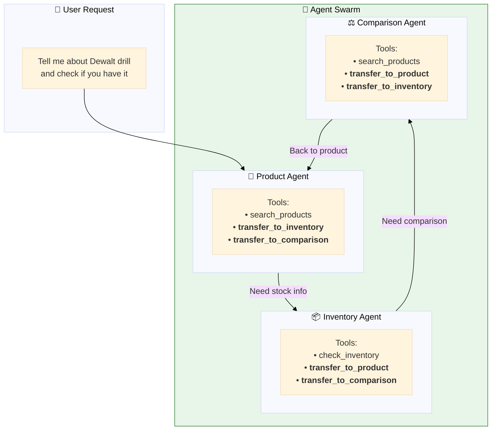

### Configuration

```yaml
tools:
  # 🔀 Handoff tools for agent-to-agent routing
  transfer_to_inventory: &transfer_to_inventory
    name: transfer_to_inventory
    function:
      type: factory
      name: dao_ai.tools.agent.create_handoff_tool
      args:
        agent_name: inventory_agent

  transfer_to_product: &transfer_to_product
    name: transfer_to_product
    function:
      type: factory
      name: dao_ai.tools.agent.create_handoff_tool
      args:
        agent_name: product_agent

agents:
  product_agent: &product_agent
    name: product_agent
    tools:
      - *search_products
      - *transfer_to_inventory     # Can hand off
      - *transfer_to_comparison    # Can hand off
    prompt: |
      You are a product specialist.
      
      When to hand off:
      - STOCK questions → use transfer_to_inventory
      - COMPARE requests → use transfer_to_comparison
    handoff_prompt: |
      Questions about product details of a SINGLE product.
```

### Sequence Diagram

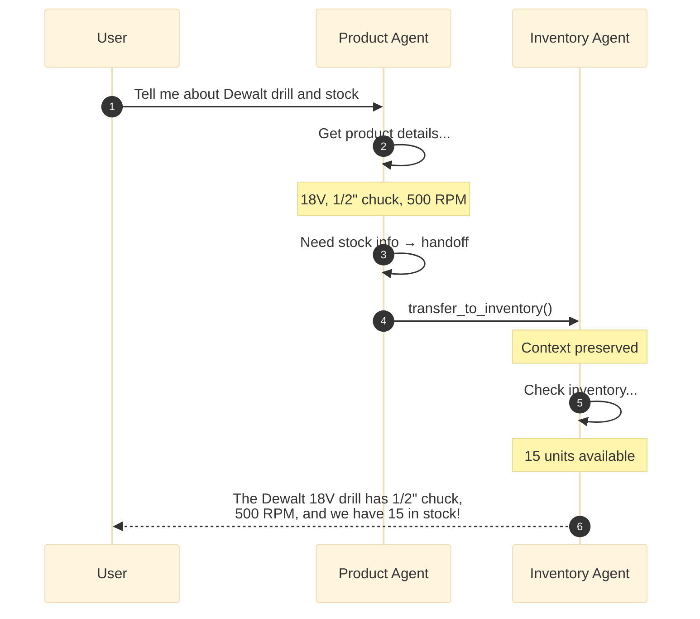

---

## 🔗 Deterministic Handoff Pattern

Agents always transfer control to a predetermined next agent after completing their turn, creating a pipeline-style workflow. Deterministic handoffs can be combined with agentic (tool-based) handoffs.

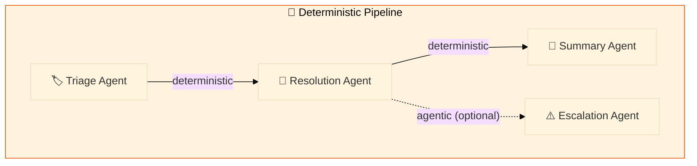

### Configuration

Use `HandoffRouteModel` with `is_deterministic: true` to declare deterministic routes:

```yaml
orchestration:
  swarm:
    default_agent: triage_agent
    handoffs:
      triage_agent:
        - agent: resolution_agent
          is_deterministic: true       # always hand off here
      resolution_agent:
        - agent: summary_agent
          is_deterministic: true       # always hand off here
        - escalation_agent             # agentic: LLM decides via tool
```

### Sequence Diagram

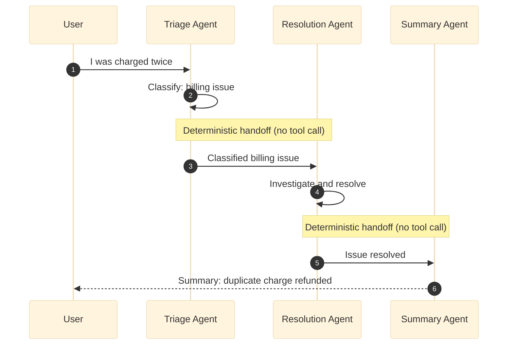

---

## 🌊 Parallel Fan-Out Pattern

A source agent invokes multiple sibling agents concurrently in a single LLM
turn, and all siblings converge on a shared **join** agent that synthesizes
their outputs into one response. A cohort is declared as a single handoff
entry with `agents:` (the siblings) and `join:` (the shared reducer).

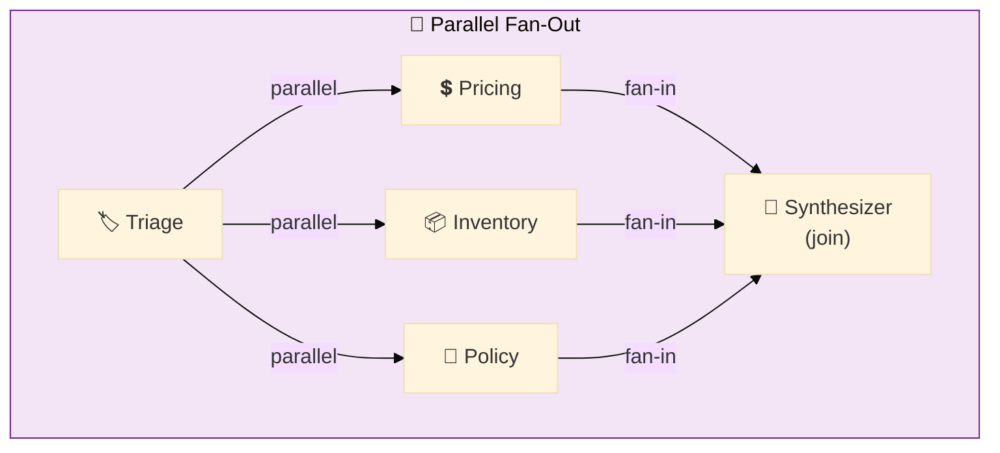

### Configuration

```yaml
orchestration:
  swarm:
    default_agent: triage_agent
    handoffs:
      triage_agent:
      - agents: [pricing_agent, inventory_agent, policy_agent]
        join: synthesizer_agent      # shared join for the cohort
      pricing_agent: []
      inventory_agent: []
      policy_agent: []
      synthesizer_agent: []
```

You can also mix a cohort with regular single-target handoffs on the same source:

```yaml
handoffs:
  triage_agent:
  - agents: [pricing_agent, inventory_agent, policy_agent]
    join: synthesizer_agent
  - escalation_agent                 # regular agentic peer
  - agent: emergency_agent
    is_deterministic: true           # single-target deterministic peer
```

### How it works

- The cohort entry produces one per-sibling parallel handoff tool
  (`handoff_to_pricing_agent`, etc.). The source LLM invokes multiple of
  these in a single turn (Claude & GPT support parallel tool calls
  natively).
- LangGraph runs the targeted siblings in the **same superstep** —
  concurrent execution, not serialized.
- Each sibling has a static edge to the shared join. Because they share
  one join, LangGraph runs the join **exactly once** after all fired
  siblings complete.

### Configuration rules (validated at load time)

- A cohort entry must set both `agents` (list of ≥ 2 distinct siblings)
  and `join`. `agent` (singular) and `agents` are mutually exclusive on
  the same entry.
- `is_deterministic` is not meaningful on a cohort entry — the join is
  always reached deterministically after fan-in.
- The join must not also appear in `agents` (no self-edge).
- A sibling cannot belong to two cohorts with different joins.
- A sibling cannot itself be the source of another cohort (nested fan-out
  is out of scope).
- Cycles containing any parallel or deterministic edge are rejected.

### Sequence Diagram

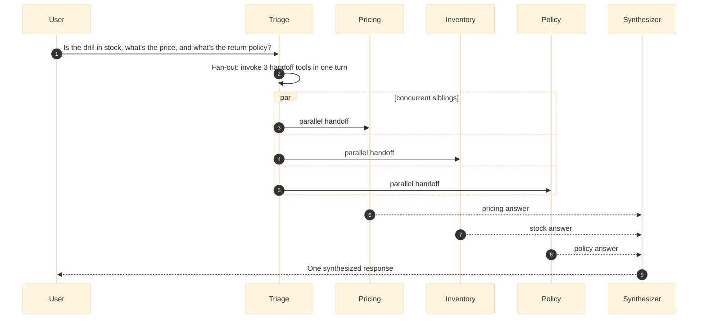

---

## When to Use Each Pattern

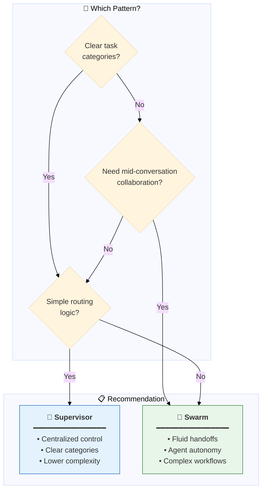

## Quick Start

```bash
# Validate patterns
dao-ai validate -c config/examples/13_orchestration/supervisor_pattern.yaml
dao-ai validate -c config/examples/13_orchestration/swarm_pattern.yaml
dao-ai validate -c config/examples/13_orchestration/deep_agent_with_skills.yaml

# Chat with supervisor or deep_agent
dao-ai chat -c config/examples/13_orchestration/supervisor_pattern.yaml
dao-ai chat -c config/examples/13_orchestration/deep_agent_pattern.yaml

# Visualize architecture
dao-ai graph -c config/examples/13_orchestration/supervisor_pattern.yaml -o graph.png

# Generate a Databricks Asset Bundle for a deep_agent app
dao-ai generate-bundle -c config/examples/13_orchestration/deep_agent_with_skills.yaml
```

## Prerequisites

- Understanding of single-agent patterns
- Multiple specialized agents defined
- Clear task decomposition strategy
- For swarm: handoff tools configured

## Troubleshooting

| Issue | Solution |
|-------|----------|
| Wrong agent selected | Improve supervisor/handoff prompts |
| Infinite handoff loops | Add termination conditions |
| Context lost | Configure shared memory |

## Next Steps

- **12_middleware/** - Add cross-cutting concerns
- **15_complete_applications/** - See orchestration in production

## Related Documentation

- [Orchestration Architecture](../../../docs/architecture.md)
- [Multi-Agent Patterns](../../../docs/key-capabilities.md)
