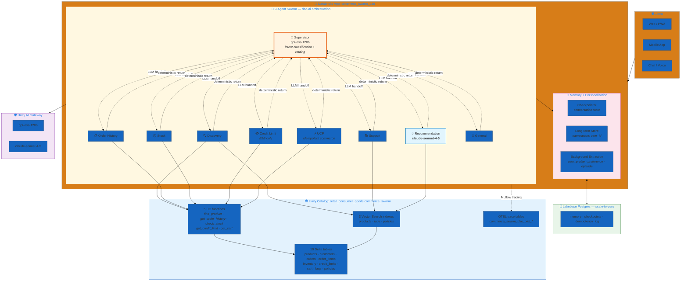
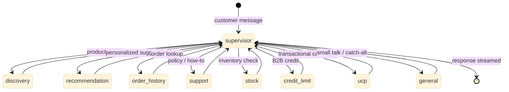
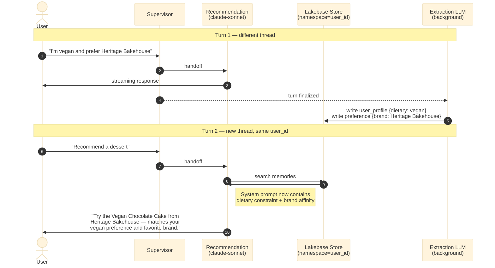
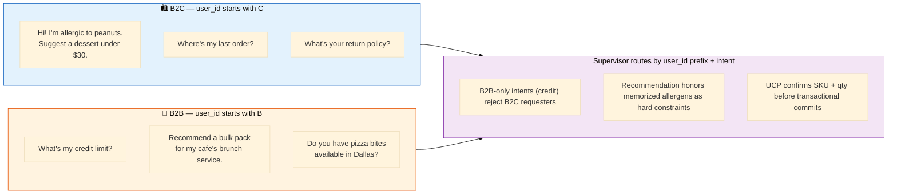

# Commerce Swarm — LangGraph Commerce Agent (B2B + B2C)

> **Reference implementation of the [LangGraph Commerce Agent v2.1 architecture](https://blog.langchain.dev/) on dao-ai.** A 9-agent swarm serving both consumer (B2C) and foodservice (B2B) traffic, with hyper-personalization driven by Lakebase-backed long-term memory and Unity AI Gateway routing on every model call.

| ✨ Feature | What this example shows |
|---|---|
| 🐝 **Swarm orchestration** | Supervisor as default entry, specialists fan out and return — clean triage topology with no specialist↔specialist hops |
| 🧠 **Hyper-personalization** | Lakebase checkpointer + store + background extraction of `user_profile` / `preference` / `episode` schemas. `auto_inject` prepends memories into handler prompts |
| 🛡️ **Unity AI Gateway** | `ai_gateway: true` on every model — uniform governance, usage tracking, rate-limit pooling |
| 🎯 **Mixed-model assignment** | `gpt-oss-120b` for fast routing/lookups, `claude-sonnet-4-5` for reasoning-heavy recommendation |
| 💸 **Lakebase scale-to-zero** | `autoscaling_min_cu: 0` — zero idle cost, ~few-second cold-start when traffic resumes |
| 📊 **Three VS indexes** | Delta-Sync over `products` / `faqs` / `policies` |
| 🔁 **UCP idempotency** | Audit log table backs idempotent commerce/payment commands |
| 📍 **UC trace_location** | Traces persist to OTEL tables in `retail_consumer_goods.commerce_swarm` — required for Databricks Apps |
| 🔒 **No OBO** | Stable SP authentication everywhere |

---

## Architecture

### High-level: client → swarm → data plane



### Swarm routing topology



**Why this topology?**
- **No specialist↔specialist hops** — every specialist returns to supervisor. Eliminates handoff loops and keeps the trace flat.
- **No parallel fan-out needed** — multi-intent messages get serialized through repeated supervisor handoffs (cursor-style), so stock dao-ai swarm (single-active-agent semantics) covers the diagram's behavior without extension.
- **Supervisor stays cheap** — `gpt-oss-120b` does intent classification only; specialists own the response budget.

### Memory + hyper-personalization



**Three memory schemas extracted automatically in the background:**

| Schema | Cardinality | Example contents |
|---|---|---|
| `user_profile` | 1 per user (singleton, overwrite) | `{first_name: "Maya", customer_type: "B2C", dietary: ["vegan"], channel: "mobile"}` |
| `preference` | many per user (append) | `{category: "brand", value: "Heritage Bakehouse"}`, `{category: "price_band", value: "premium"}` |
| `episode` | many per user (append) | `{situation: "complaint", topic: "thawed_arrival", resolution: "replacement_sent"}` |

The `recommendation` handler treats memorized **dietary restrictions as hard constraints** — it will never suggest a product that conflicts with a stored allergen — and **brand/category affinity as soft signals** for ranking.

---

## Agents

| # | Agent | Model | Tools | Role |
|---|---|---|---|---|
| 1 | `supervisor` | gpt-oss-120b | — | Entry-point triage. Classifies intent and routes via LLM tool-call handoffs. Never answers customer questions directly. |
| 2 | `discovery` | gpt-oss-120b | `product_search` (VS), `find_product_uc` | Semantic product search and SKU/ID lookup. |
| 3 | `recommendation` | **claude-sonnet-4-5** | `product_search`, `get_order_history_uc` | Personalized suggestions. Synthesizes memory + order history + catalog. Hard constraints from dietary memories. |
| 4 | `order_history` | gpt-oss-120b | `get_order_history_uc` | Order tracking, shipping/delivery status. |
| 5 | `support` | gpt-oss-120b | `faq_search` (VS), `policy_search` (VS) | Policy and FAQ Q&A. Prefers FAQ for short answers; falls back to policy for formal detail. |
| 6 | `stock` | gpt-oss-120b | `check_stock_uc`, `find_product_uc` | Inventory across distribution locations with ATP (available-to-promise) calculation. |
| 7 | `credit_limit` | gpt-oss-120b | `get_credit_limit_uc` | B2B-only credit availability + payment terms. Politely redirects B2C requesters to support. |
| 8 | `ucp` | gpt-oss-120b | `get_cart_uc`, `find_product_uc` | Idempotent commerce executor. MCP-ready for Commercetools / Stripe / Adyen wiring. |
| 9 | `general` | gpt-oss-120b | — | Greetings, brand questions, small talk. Hands back when the topic shifts to a specialist domain. |

**Model assignment rationale:**
- **`gpt-oss-120b`** — strong tool-call fidelity, low latency, low cost. Right for triage, structured lookups, and idempotent commerce.
- **`claude-sonnet-4-5`** — multi-step reasoning over memory + history + catalog. Right for the one handler where response quality moves the needle on conversion.
- **AI Gateway routing on every endpoint** — uniform governance, usage tracking, rate-limit pooling, PII guardrails.

---

## Data plane

### Schema layout

```
retail_consumer_goods.commerce_swarm/
├── 📊 Tables (10) — all Delta with CLUSTER BY AUTO + CDF
│   ├── products              ← VS source (description embedded)
│   ├── customers             ← B2C + B2B (loyalty_tier or null)
│   ├── orders                ← FK customers.customer_id
│   ├── order_items           ← FK orders.order_id + products.product_id
│   ├── inventory             ← FK products.product_id, 3 locations
│   ├── credit_limits         ← FK customers.customer_id (B2B subset)
│   ├── cart                  ← multi-row carts
│   ├── faqs                  ← VS source (answer embedded)
│   ├── policies              ← VS source (body embedded)
│   └── idempotency_log       ← UCP audit (populated at runtime)
│
├── 🛠️ UC Functions (5)
│   ├── find_product(sku_or_id)
│   ├── get_order_history(customer_id, row_limit)
│   ├── check_stock(sku)
│   ├── get_credit_limit(customer_id)
│   └── get_cart(customer_id)
│
└── 🔍 VS Indexes (3) — Delta-Sync, TRIGGERED
    ├── products_description_index ← source: products.description
    ├── faqs_index                 ← source: faqs.answer
    └── policies_index             ← source: policies.body
```

### Synthetic data overview

| Table | Rows | Notes |
|---|---|---|
| `products` | 40 | Specialty foodservice catalog — frozen desserts, bakery, toppings, pizza, custom decorating, plant-based, catering, seasonal, B2B-bulk. Detailed human-readable descriptions for VS recall. |
| `customers` | 200 | 150 B2C + 50 B2B accounts across 16 US cities |
| `orders` | 600 | 12-month rolling history, status distribution: delivered 60% / shipped 15% / confirmed 10% / placed 8% / cancelled 4% / returned 3% |
| `order_items` | ~2,000 | FK-consistent line items, B2B baskets larger than B2C |
| `inventory` | 120 | 40 SKUs × 3 distribution locations (Buffalo, Dallas, LA) |
| `credit_limits` | 50 | B2B-only; Net30 dominant, Net60/COD subset |
| `cart` | ~120 | Active multi-row carts for recent shoppers |
| `faqs` | 18 | Curated across shipping / returns / account / products / b2b / payment |
| `policies` | 8 | Formal docs: returns, shipping, privacy, b2b terms, credit, food safety, pricing, damaged-items |
| `idempotency_log` | 0 | Empty at deploy; UCP writes idempotency rows at runtime |

Data is FK-consistent and deterministic (seeded random). Generated once, committed as static `*_data.sql` files — no runtime generation.

### B2C vs B2B persona traffic



---

## Why these design choices?

### Why swarm, not supervisor pattern?

The diagram's specialists are mostly self-contained — once supervisor classifies, the specialist owns the response. Stock supervisor pattern would force the supervisor LLM to re-evaluate routing after every specialist turn (wasted tokens). Swarm with deterministic returns gives us the same one-shot triage while keeping handoff costs to one LLM call per turn.

### Why not the original 12-agent planner+resolver+router+composer breakdown?

The diagram's `Resolver` and `Router` are deterministic — pure function over state. dao-ai requires `AgentModel.model`, so making them no-LLM agents would need framework work. We fold their logic into the supervisor's handoff decision and the planner's plan-cursor advance. The `Composer` collapses into each handler's natural streaming response — modern LLMs format and stream inline. This drops 3 LLM calls per turn with zero behavioral loss.

### Why mixed models?

`gpt-oss-120b` is fast (low latency, low cost) and has strong tool-calling. Right for the 8 handlers that do mostly classify-then-call-a-tool. `claude-sonnet-4-5` shines at multi-step reasoning that needs to weigh constraints, history, and personalization — exactly what `recommendation` does. Spending the Claude budget where it produces the biggest quality lift is more efficient than uniformly applying Sonnet everywhere.

### Why Lakebase scale-to-zero?

Demo and customer-POC apps are idle most of the time. `autoscaling_min_cu: 0` removes idle baseline cost entirely. The ~few-second cold-start on first query is acceptable for non-production workloads and disappears within the warm-up window for any real customer engagement.

### Why three Vector Search indexes instead of one?

Mixing product descriptions, FAQ answers, and policy bodies into a single index hurts recall — the semantic spaces are too different. Separating them lets each handler hit a focused index with higher precision. The cost is three Delta-Sync pipelines instead of one (acceptable).

---

## Deploy

### Prerequisites

- **Profile**: `fevm` (or your equivalent Databricks profile) configured via `databricks configure`
- **Secret scope**: `retail_consumer_goods` exists with keys `RETAIL_AI_DATABRICKS_CLIENT_ID` and `RETAIL_AI_DATABRICKS_CLIENT_SECRET`
- **Service principal**: Has `READ` on the secret scope, and `USE_CATALOG` / `USE_SCHEMA` / `SELECT` / `EXECUTE` on the target catalog
- **Vector Search endpoint**: `dbdemos_vs_endpoint` exists (or change the `endpoint.name` in the YAML)
- **SQL Warehouse ID**: Update `parameters.warehouse_id` to point at your serverless warehouse if the default is wrong

### Provision + deploy

```bash
# Validate first (catches schema, anchor, and graph-construction errors)
DATABRICKS_CONFIG_PROFILE=fevm uv run dao-ai validate \
  -c config/examples/15_complete_applications/commerce_swarm/commerce_swarm.yaml

# Deploy + provision everything in one shot
uv run dao-ai pipeline --deploy --run \
  -c config/examples/15_complete_applications/commerce_swarm/commerce_swarm.yaml \
  -p fevm \
  --deployment-target apps
```

The deploy will:
1. Provision the Lakebase `commerce-swarm` project (scale-to-zero configured)
2. Create `retail_consumer_goods.commerce_swarm` schema + 10 tables + load synthetic data
3. Create 5 UC functions
4. Create the Vector Search endpoint (if missing) + 3 Delta-Sync indexes
5. Register the Model Serving endpoint
6. Deploy the Databricks App (`commerce_swarm_dao`)

### Verify

```bash
# Tables created
databricks --profile fevm tables list retail_consumer_goods.commerce_swarm

# Lakebase project ONLINE
databricks --profile fevm database list-database-instances | grep commerce-swarm

# App running
databricks --profile fevm apps get commerce_swarm_dao
```

---

## Sample prompts

### B2C consumer (user_id starts with `C`)

| Prompt | Expected route |
|---|---|
| `"Hi! I'm planning a brunch for 20 people next weekend — what would you recommend?"` | `supervisor → recommendation` |
| `"I'm allergic to peanuts. Suggest a dessert under $30."` | `supervisor → recommendation` (uses memory next turn) |
| `"Where's my last order?"` | `supervisor → order_history` |
| `"What's your return policy?"` | `supervisor → support` |
| `"Is FRZ-CAKE-001 in stock?"` | `supervisor → stock` |
| `"Show me vegan cakes"` | `supervisor → discovery` |
| `"What's my credit limit?"` | `supervisor → credit_limit → handoff back (B2B-only redirect)` |

### B2B foodservice (user_id starts with `B`)

| Prompt | Expected route |
|---|---|
| `"What's my credit limit?"` | `supervisor → credit_limit` |
| `"Recommend a bulk pack for my cafe's weekend brunch service."` | `supervisor → recommendation` (B2B-aware, prefers bulk SKUs) |
| `"Do you have pizza bites available in Dallas?"` | `supervisor → stock` |
| `"Add 5 cases of FRZ-CAKE-002 to my cart."` | `supervisor → ucp` (idempotent, MCP-ready) |
| `"Place the order."` | `supervisor → ucp` (confirmation flow) |

---

## File layout

```
commerce_swarm/
├── README.md                                    # this file
└── commerce_swarm.yaml                           # dao-ai config

../../data/commerce_swarm/                         # DDL + seed data (10 tables × 2 files)
├── products.sql + products_data.sql
├── customers.sql + customers_data.sql
├── orders.sql + orders_data.sql
├── order_items.sql + order_items_data.sql
├── inventory.sql + inventory_data.sql
├── credit_limits.sql + credit_limits_data.sql
├── cart.sql + cart_data.sql
├── faqs.sql + faqs_data.sql
├── policies.sql + policies_data.sql
└── idempotency_log.sql                         # DDL only — empty at deploy

../../functions/commerce_swarm/                    # 5 UC SQL functions
├── find_product.sql
├── get_order_history.sql
├── check_stock.sql
├── get_credit_limit.sql
└── get_cart.sql
```

---

## Related dao-ai patterns referenced

- **Swarm orchestration** — `config/examples/13_orchestration/swarm_pattern.yaml`
- **Lakebase memory** — `config/examples/15_complete_applications/hardware_store_lakebase.yaml`
- **AI Gateway** — `config/examples/01_getting_started/ai_gateway.yaml`
- **A2A protocol pair** — `config/examples/15_complete_applications/procurement_supplier_a2a/`
