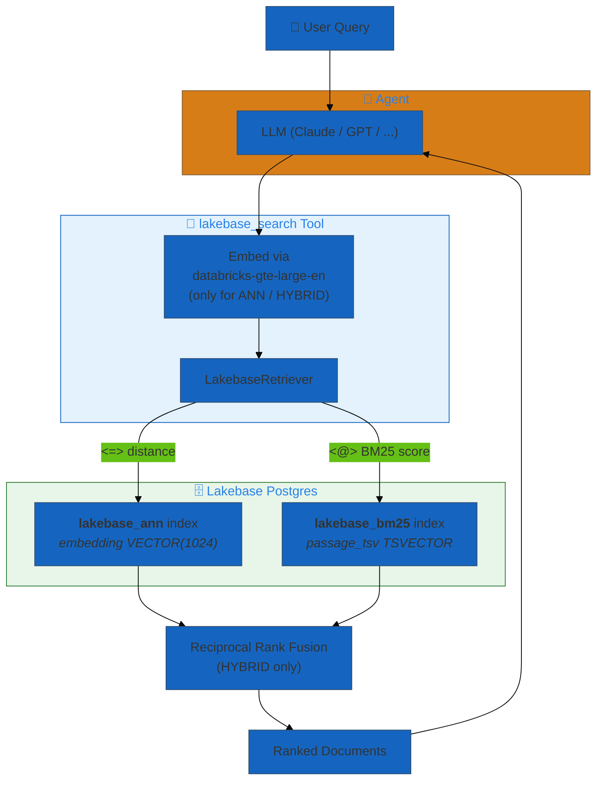

# 21. Lakebase Search

**Retrieval over Databricks Lakebase Postgres — ANN, BM25, and hybrid RRF**

Query embeddings and lexical text living in Lakebase Postgres directly from an
agent, using the `lakebase_vector` and `lakebase_text` extensions. Sibling of
`ai_search`; same YAML shape, different backend.

## When to use this vs. AI Search

| | `type: ai_search` | `type: lakebase_search` |
|---|---|---|
| Backend | Databricks-managed Vector Search index | Postgres in a Lakebase project |
| Data location | Delta table (source) synced to the index | Rows in Lakebase Postgres |
| Auto-embedding | Yes (Delta Sync) | No — client-side embed via Model Serving |
| Hybrid | Native | Client-side RRF |
| Best fit | Static or Delta-native document corpora | Data already in Postgres (OLTP joins, transactional writes) |

Pick `lakebase_search` when your source of truth is already in Lakebase and
you'd like retrieval to be a straight SQL query alongside your other Postgres
data (users, orders, sessions, etc.).

## Architecture



## Examples

| File | Mode | Use case |
|------|------|----------|
| [`ann_only.yaml`](./ann_only.yaml) | ANN | Semantic similarity search — minimal config, no BM25 setup needed |
| [`hybrid_rrf.yaml`](./hybrid_rrf.yaml) | HYBRID | Dense + lexical fused via RRF — highest recall |
| [`bm25_only.yaml`](./bm25_only.yaml) | BM25 | Exact-term lookup (SKUs, error codes) — no embedding calls |
| [`filters_and_traces.yaml`](./filters_and_traces.yaml) | HYBRID | Static filters (equality / IN / comparison / LIKE) + `trace_location` to UC OTEL tables |

## Prerequisites

1. **Enable Lakebase Search on the project** (workspace UI → Compute →
   Postgres → your project → Settings → Enable Lakebase Search).
   This is a one-time, project-level, **irreversible** toggle that restarts
   all compute in the project.
2. **Install the extensions** in the target database:
   ```sql
   CREATE EXTENSION IF NOT EXISTS lakebase_vector CASCADE;
   CREATE EXTENSION IF NOT EXISTS lakebase_text;    -- only if BM25 / HYBRID
   ```
3. **Create the table** with a vector column matching your embedding
   endpoint's output dimension (1024 for `databricks-gte-large-en`):
   ```sql
   CREATE TABLE kb_articles (
     id           TEXT PRIMARY KEY,
     category     TEXT,
     source_url   TEXT,
     passage      TEXT NOT NULL,
     embedding    VECTOR(1024),
     passage_tsv  TSVECTOR GENERATED ALWAYS AS
       (to_tsvector('english', passage)) STORED     -- only if BM25 / HYBRID
   );

   CREATE INDEX ON kb_articles USING lakebase_ann  (embedding vector_cosine_ops);
   CREATE INDEX ON kb_articles USING lakebase_bm25 (passage_tsv);   -- only if BM25 / HYBRID
   ```
4. **Populate embeddings client-side.** Lakebase has no in-database
   embedding function; the caller must embed and INSERT the vector:
   ```python
   from databricks_langchain import DatabricksEmbeddings

   emb = DatabricksEmbeddings(endpoint="databricks-gte-large-en")
   vec = emb.embed_documents([passage])[0]   # list[float] of length 1024
   cur.execute(
       "INSERT INTO kb_articles (id, category, passage, embedding) "
       "VALUES (%s, %s, %s, %s::vector)",
       (id, category, passage, vec),
   )
   # passage_tsv is generated automatically by Postgres; no client work.
   ```

## Configuration surface

### `LakebaseVectorStoreModel` — bare table reference

| Field | Required | Default | Notes |
|---|---|---|---|
| `database` | ✓ | — | Reference to a `DatabaseModel` (Lakebase or standard Postgres) |
| `schema_name` | | `"public"` | Postgres schema |
| `table` | ✓ | — | Table name |
| `id_column` | | `"id"` | Primary-key column; populated on `Document.id` and `metadata` |
| `content_column` | ✓ | — | Text column → `Document.page_content` |
| `embedding_column` | ✓ | — | `VECTOR(N)` column |
| `tsvector_column` | | `None` | `TSVECTOR` column; **required** for BM25 / HYBRID |
| `metadata_columns` | | `[]` | Extra columns surfaced on `Document.metadata`; also the filter allowlist |
| `embedding_model` | ✓ | — | `InferenceEndpointModel` — bare string is auto-coerced |
| `bm25_index_name` | | auto | `<schema>.<table>_<tsvector_column>_bm25` if omitted |
| `distance_metric` | | `"cosine"` | `cosine` / `l2` / `ip` → `<=>` / `<->` / `<#>` |
| `tsv_language` | | `"english"` | Passed to `to_tsvector(<lang>, ...)` |

### `LakebaseRetrieverModel` — full retriever

Wraps a `LakebaseVectorStoreModel` with `SearchParametersModel`
(`num_results`, `filters`, `query_type`). Enforces that
`query_type in {BM25, HYBRID}` requires `tsvector_column`.

### Filter operators

Filter keys must appear in `metadata_columns` (allowlist enforced at query
time). Values may be scalar (equality shorthand) or `{op, value}` /
`{op, values}` dicts:

| Op | SQL emitted | Value form |
|---|---|---|
| `=` (or bare scalar) | `col = %s` | `value: <scalar>` |
| `!=` | `col <> %s` | `value: <scalar>` |
| `<`, `<=`, `>`, `>=` | `col <op> %s` | `value: <scalar>` |
| `in` | `col = ANY(%s)` | `values: [...]` |
| `not_in` | `NOT (col = ANY(%s))` | `values: [...]` |
| `like`, `ilike` | `col LIKE %s` / `ILIKE %s` | `value: <pattern>` |
| `is_null` | `col IS NULL` / `IS NOT NULL` | `value: true` / `false` (default `true`) |

Column names are wrapped in `psycopg.sql.Identifier`; values are always bound
as `%s` parameters — no string interpolation ever.

## MLflow tracing

All three retrieval helpers are wrapped with
`@mlflow.trace(span_type=SpanType.RETRIEVER)`:

```
[TOOL      ] lakebase_search
  [RETRIEVER ] LakebaseRetriever                    (LangChain BaseRetriever auto-span)
    [RETRIEVER ] lakebase_hybrid_search             (@mlflow.trace)
      [RETRIEVER ] lakebase_ann_search              (@mlflow.trace)
      [RETRIEVER ] lakebase_bm25_search             (@mlflow.trace)
```

This matches the span shape `ai_search` produces, so existing trace-review
tooling (the `analyze-mlflow-trace` and `retrieving-mlflow-traces` skills,
MLflow UI) works unmodified. See `filters_and_traces.yaml` for a
`trace_location` config that ships spans to a UC OTEL Delta table set.

## What's not yet supported (roadmap)

- **Rerank + instructed retrieval** — planned Stage 2. Today the retriever
  matches `ai_search`'s field shape for `search_parameters` but does not yet
  honor `rerank` or `instructed`.
- **Auto-provisioning** — planned Stage 3. Today the caller is responsible
  for `CREATE TABLE`, indexes, and embedding backfill; there is no
  `source_table` / auto-sync equivalent to `AiSearchIndexModel`.
- **Per-column typed filter kwargs on the tool schema** — planned Stage 4.
  Today the tool exposes a single `filters: dict` argument; the LLM must
  know the column names. Static filters set in `search_parameters.filters`
  work with equal fidelity to `ai_search`.

## Try it

```bash
# Validate one of the configs — swap in your own project / schema / table names first.
dao-ai validate -c config/examples/21_lakebase_search/hybrid_rrf.yaml

# Deploy as a Databricks App bundle.
dao-ai generate-bundle -c config/examples/21_lakebase_search/hybrid_rrf.yaml \
  -o /tmp/lakebase-agent --force --development -p <profile>
cd /tmp/lakebase-agent
databricks bundle deploy --target dev -p <profile>
databricks bundle run dao-ai-lakebase-hybrid-example --target dev -p <profile>
```
