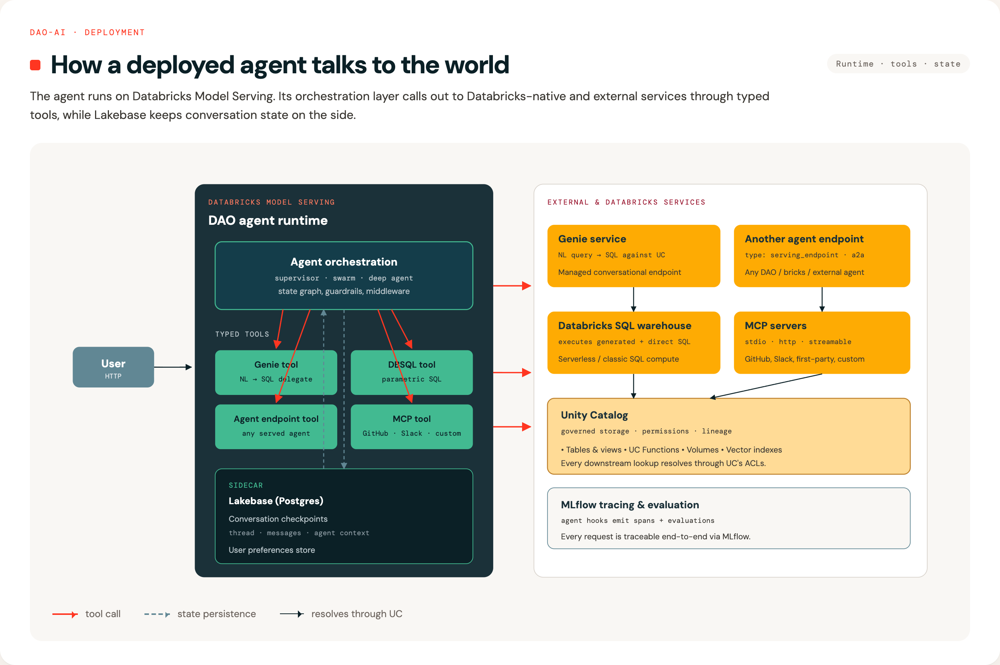
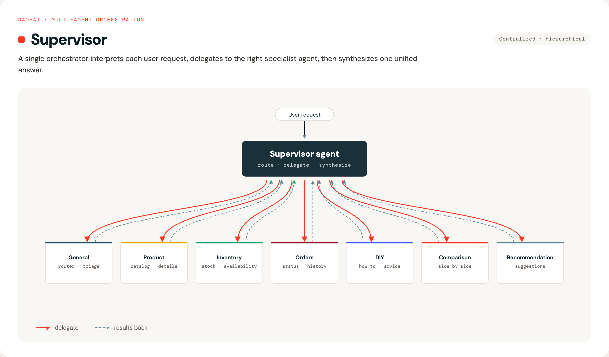
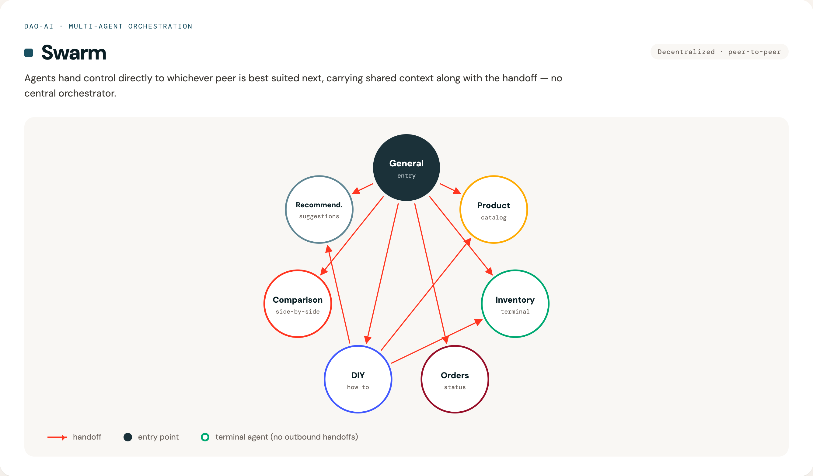
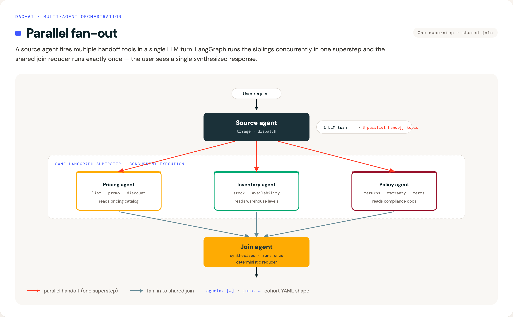

# Architecture

## How It Works (Simple Explanation)

Think of DAO as a three-layer cake:

**1. Your Configuration (Top Layer)** 🎂  
You write a YAML file describing what you want: which AI models, what data to access, what tools agents can use.

**2. DAO Framework (Middle Layer)** 🔧  
DAO reads your YAML and automatically wires everything together using LangGraph (a workflow engine for AI agents).

**3. Databricks Platform (Bottom Layer)** ☁️  
Your deployed agent runs on Databricks, accessing Unity Catalog data, calling AI models, and using other Databricks services.

## Technical Architecture Diagram

For developers and architects, here's the detailed view:


## System-Level Data Flow

This diagram shows how a deployed DAO agent integrates with Databricks services and external systems:



### Data Flow Explanation

**1. User Interaction**
- User sends a request to the DAO agent via Databricks Model Serving endpoint
- Request includes message, conversation ID, and user context

**2. Agent Processing**
- Agent orchestration layer (Supervisor or Swarm) processes the request
- Determines which tools to invoke based on the user's question
- Multiple agents may collaborate to answer complex queries

**3. Tool Integration Patterns**

**A. Genie Tool → Genie Service → DBSQL**
- Agent invokes Genie tool with natural language question
- Genie service translates NL to SQL query
- Executes against Databricks SQL / Unity Catalog
- Returns structured data results
- *Use case:* "What products are low on stock?"

**B. Direct DBSQL Tool**
- Agent calls SQL warehouse directly with pre-defined SQL
- Executes Unity Catalog functions or queries
- Returns data from governed tables
- *Use case:* Execute a stored procedure or predefined query

**C. Agent Endpoint Tool**
- Agent calls another deployed agent endpoint
- Enables composition and specialization
- Other agent may use different tools/models
- *Use case:* Call a specialized HR agent from a general assistant

**D. MCP Tool**
- Agent communicates with external MCP server
- Supports GitHub, Slack, custom APIs
- Extends agent capabilities beyond Databricks
- *Use case:* Create GitHub issue, send Slack message

**4. State Persistence**
- Conversation state saved to Lakebase checkpointer (PostgreSQL table)
- User preferences stored in Lakebase store (Unity Catalog governed)
- Enables multi-turn conversations and personalization
- Survives agent restarts and scales across instances

**5. Security & Governance**
- **On-Behalf-Of User**: Requests execute with caller's permissions
- **Unity Catalog**: Row/column-level security enforced
- **Audit Logs**: All data access tracked per user
- **Isolation**: Conversation state partitioned by user/thread

## Orchestration Patterns

When you have multiple specialized agents, you need to decide how they work together. DAO supports two patterns:

**Think of it like a company:**
- **Supervisor Pattern** = Traditional hierarchy (manager assigns tasks to specialists)
- **Swarm Pattern** = Collaborative team (specialists hand off work to each other)

DAO supports both approaches for multi-agent coordination:

### 1. Supervisor Pattern

**Best for:** Clear separation of responsibilities with centralized control

A central "supervisor" agent reads each user request and decides which specialist agent should handle it. Think of it like a call center manager routing calls to different departments.

**Example use case:** Hardware store assistant
- User asks about product availability → Routes to **Inventory Agent**
- User asks about order status → Routes to **Orders Agent**  
- User asks for DIY advice → Routes to **DIY Agent**
- User asks for product details → Routes to **Product Agent**
- User wants product comparison → Routes to **Comparison Agent**
- User needs product suggestions → Routes to **Recommendation Agent**
- General inquiries → Routes to **General Agent**

**Configuration:**

```yaml
orchestration:
  supervisor:
    model: *router_llm
    prompt: |
      Route queries to the appropriate specialist agent based on the content.
```



### 2. Swarm Pattern

**Best for:** Complex, multi-step workflows where agents need to collaborate

Agents work more autonomously and can directly hand off tasks to each other. Think of it like a team of specialists who know when to involve their colleagues.

**Example use case:** Complex customer inquiry
1. User: *"I need a drill for a home project, do we have any in stock, and can you suggest how to use it?"*
2. **General Agent** (entry point) → Hands off to **Product Agent** for product info
3. **Product Agent** checks details → Hands off to **Inventory Agent** for stock
4. **Inventory Agent** confirms availability → Hands off to **DIY Agent** for usage tips
5. **DIY Agent** provides instructions → Done

No central supervisor needed — agents decide collaboratively.

**Configuration:**

```yaml
orchestration:
  swarm:
    default_agent: *general    # Entry point for new conversations
    handoffs:
      general: ~               # Can hand off to ANY agent (universal router)
      diy:                     # DIY can hand off to specific agents
        - product
        - inventory
        - recommendation
      inventory: []            # Terminal agent - no outbound handoffs
```

Handoffs support two modes:
- **Agentic** (default): A handoff tool is created and the LLM decides when to invoke it.
- **Deterministic**: Control always transfers to the target after the source agent completes, with no LLM tool call.

```yaml
# Deterministic handoff example (pipeline-style)
orchestration:
  swarm:
    default_agent: triage
    handoffs:
      triage:
        - agent: resolver              # HandoffRouteModel
          is_deterministic: true        # always route here after triage
      resolver:
        - agent: summarizer
          is_deterministic: true        # always route here after resolution
        - escalation_agent              # agentic: LLM can choose to escalate
```



#### Handoff constraints (`requires`)

Agents can declare prerequisite agents that must have run before they can be reached. This prevents the LLM from peer-routing past required intermediate agents — for example, jumping straight to `checkout` without ever visiting `cart`.

Declare prereqs on the constrained agent:

```yaml
agents:
  checkout: &checkout
    name: checkout
    model: *default_llm
    prompt: ...
    requires: [cart]   # cannot be reached until 'cart' has appeared in message history
```

The swarm graph is unchanged in shape — the constraint is a property of the target agent, not of any specific handoff edge:

```yaml
orchestration:
  swarm:
    default_agent: *triage
    handoffs:
      triage:   [cart, checkout]    # 'checkout' edge allowed; refused at runtime
      cart:     [checkout, triage]
      checkout: [triage]
```

**Behavior:**
- `triage → cart → checkout` proceeds normally.
- `triage → checkout` (skipping `cart`) returns a refusal `ToolMessage`:
  ```
  Cannot hand off to 'checkout' — requires [cart]; called so far: [triage].
  Pick a different handoff or continue working.
  ```
  `active_agent` stays on `triage`; the LLM self-corrects on its next step.

**Semantics:** any-order, all-of. Every agent in `requires` must appear in message history (any order) before the handoff is allowed.

**Validation (config-build time):**
- `requires` entries must reference declared agents.
- Self-reference (`A.requires` containing `A`) is rejected.
- Cycles in the `requires` DAG are rejected (unsatisfiable).
- Deterministic handoffs to a target with non-empty `requires` are rejected — deterministic edges fire unconditionally, which contradicts the constraint. Use an agentic handoff for constrained targets.

The check uses the agent name tagged on each `AIMessage` (`message.name`), iterating `state["messages"]` to determine which agents have run. No new state schema; no graph topology change.

> Currently swarm-only. The same field will apply to supervisor routing in a future release.

### 3. Parallel Fan-Out Pattern

**Best for:** Independent enrichment, multi-source research, and judge/critic patterns — anywhere one request should trigger several specialists concurrently, then a single synthesized answer.

A **cohort** is one handoff entry where the source agent lists multiple sibling agents under `agents:` and a shared reducer under `join:`. When the source's LLM invokes several parallel handoff tools in a single turn, LangGraph runs the targeted siblings in the **same superstep** — true concurrent execution — and runs the join **exactly once** after all fired siblings complete. The end user sees one final response from the join.

**Example use case:** Product Q&A that needs pricing, stock, and policy info together

1. User: *"What does the DeWalt drill cost, do you have it, and can I return it if I don't like it?"*
2. **Triage agent** decides to consult pricing, inventory, and policy — invokes all three handoffs in a single LLM turn
3. **Pricing / Inventory / Policy agents** run **concurrently** in one superstep
4. Their outputs are appended to `messages` via the `add_messages` reducer
5. **Synthesizer (join)** runs once, produces the final unified answer for the user

**Configuration:**

```yaml
orchestration:
  swarm:
    default_agent: *triage
    handoffs:
      triage:
      - agents:                        # cohort: fan-out siblings
        - pricing_agent
        - inventory_agent
        - policy_agent
        join: synthesizer_agent        # shared join reducer
      pricing_agent: []                # terminal — sibling
      inventory_agent: []              # terminal — sibling
      policy_agent: []                 # terminal — sibling
      synthesizer_agent: []            # terminal — final answer
```

You can mix a cohort with regular single-target handoffs on the same source (agentic peer, deterministic peer, and cohort in one `handoffs` entry).

**Rules dao-ai enforces at load time:**
- A cohort entry must set both `agents` (≥ 2 distinct siblings) and `join`. `agent` (singular) and `agents` are mutually exclusive on one entry.
- `is_deterministic` is not meaningful on a cohort entry — the join is always reached deterministically after fan-in.
- The join must not also appear in `agents`.
- A sibling cannot belong to two cohorts with different joins.
- Nested fan-out (a sibling being the source of another cohort) is out of scope.
- Cycles containing any parallel or deterministic edge are rejected.

**Prompt tip:** the LLM decides which siblings to invoke, so tell the source agent explicitly to "call ALL parallel handoff tools in a single turn" when that's the intent. If the LLM invokes a subset, only those run before the join. If it invokes zero, the source terminates and the join does not run.



See [`config/examples/13_orchestration/parallel_fan_out_pattern.yaml`](../config/examples/13_orchestration/parallel_fan_out_pattern.yaml) for a complete deployable example.

---

## Navigation

- [← Previous: Why DAO?](why-dao.md)
- [↑ Back to Documentation Index](../README.md#-documentation)
- [Next: Key Capabilities →](key-capabilities.md)
