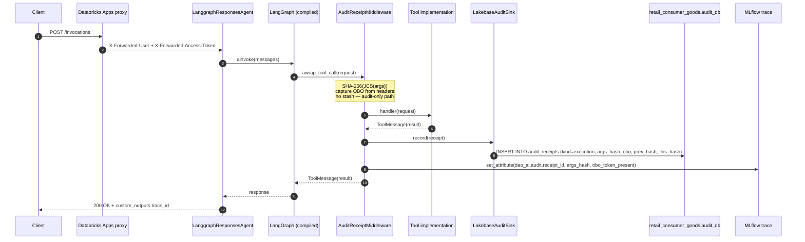
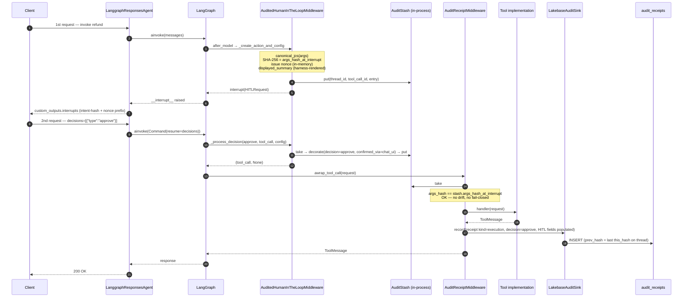
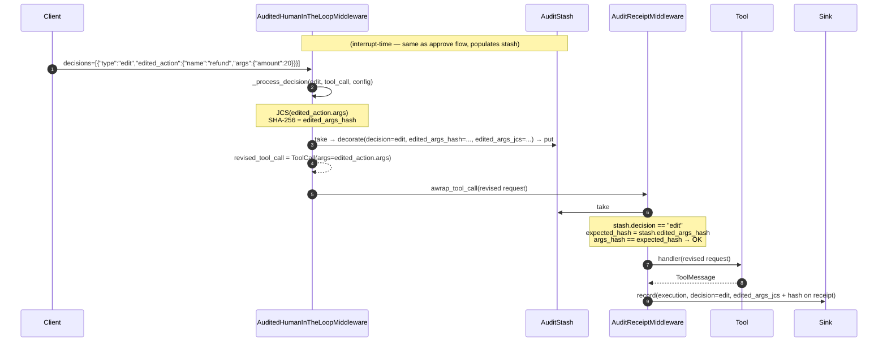
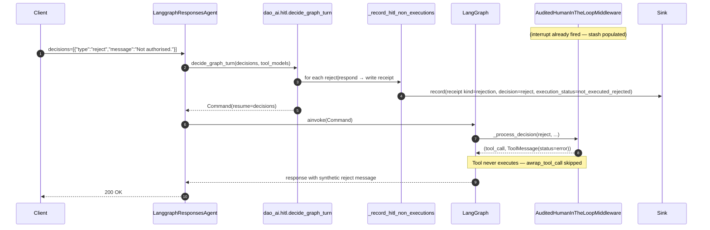
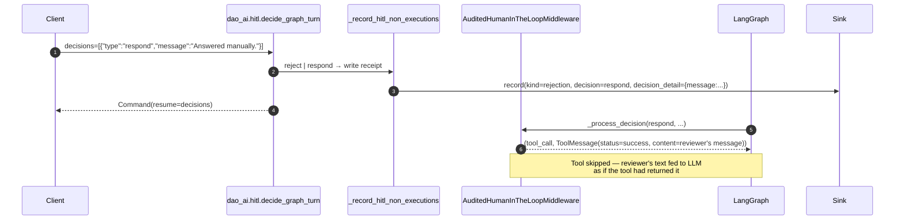
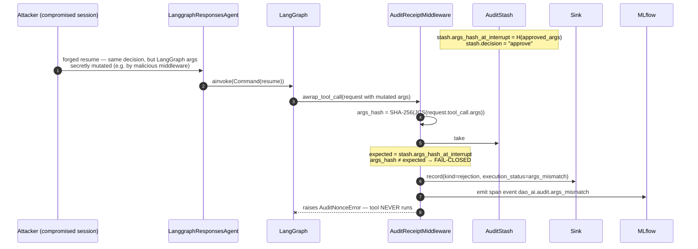
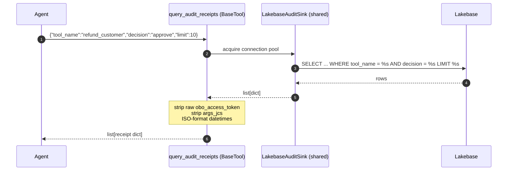

# Auditable Tool Invocations

dao-ai ships a tamper-evident audit trail for LLM-agent tool calls. Every
audited invocation writes a signed receipt to Lakebase, links to the
enclosing MLflow trace, captures the OBO identity of the caller, and
seals into a per-thread hash chain that detects any post-hoc mutation.

Combined with `human_in_the_loop`, the same subsystem produces
**intent-verified approval receipts**: the args a user approves are
byte-hashed at interrupt time and re-hashed at execution time, and any
drift **fail-closes** the tool call with a rejection receipt. This
satisfies the "who approved this exact thing" bar for SOC2 / SOX /
HIPAA-style non-repudiation and is designed against the intent-
verification research captured in the vault
(`00-inbox/dao-ai-auditable-hitl-approvals-research-2026-07-12.md`).

## Contents

1. [When to use it](#when-to-use-it)
2. [Config](#config)
3. [Call flow diagrams](#call-flow-diagrams)
4. [Receipt schema](#receipt-schema)
5. [MLflow span attributes](#mlflow-span-attributes)
6. [`AuditToolkit` — self-service audit queries for agents](#audittoolkit)
7. [Sensitive data handling](#sensitive-data-handling)
8. [Deployment](#deployment)
9. [Guarantees](#guarantees)
10. [Known limitations](#known-limitations)
11. [References](#references)

## When to use it

| Scenario                                     | Configuration                                |
|----------------------------------------------|----------------------------------------------|
| Tool executes autonomously, needs audit log  | `audit:` only                                |
| Tool needs approval, no audit trail          | `human_in_the_loop:` only                    |
| Tool needs approval AND non-repudiation      | Both `audit:` and `human_in_the_loop:`       |

Auditing is per-tool. Tools without `audit:` see no behavioural change
even when the agent hosts other audited tools.

## Config

```yaml
resources:
  databases:
    audit_db: &audit_db
      project: retail-consumer-goods
      autoscaling_min_cu: 0

tools:
  refund_customer:
    name: refund_customer
    function:
      type: python
      name: my_package.tools.refund_customer
      audit:                              # <-- opt this tool into auditing
        database: *audit_db               # anchor reuse (same Lakebase as checkpointer)
        table: audit_receipts             # default; override if you host multiple audits
        # nonce_ttl_seconds: 300          # default; 30-3600 accepted
      human_in_the_loop:                  # <-- optional: also gate on approval
        review_prompt: "Refund of ${amount} to customer ${customer_id}?"
        allowed_decisions: [approve, edit, reject]
```

Multi-tool anchor pattern:

```yaml
- function:
    name: refund_customer
    audit: &audit
      database: *audit_db
      table: audit_receipts
- function:
    name: cancel_subscription
    audit: *audit
```

## Call flow diagrams

Six flows exercise every code path in the subsystem.

### 1. Audit-only tool invocation → execution receipt



### 2. Audit + HITL — approve → intent-verified execution receipt



### 3. Audit + HITL — edit → user-modified args, still bound to intent



### 4. Audit + HITL — reject → tool never runs, rejection receipt



### 5. Audit + HITL — respond → reviewer replies on behalf of tool



### 6. Args tampering — fail-closed rejection receipt



## Receipt schema

Every audited invocation writes exactly one row to the configured table.
Nullable HITL fields land NULL for audit-only tools.

| Column                    | Notes                                                                 |
|---------------------------|-----------------------------------------------------------------------|
| `receipt_id`              | UUID.                                                                 |
| `receipt_kind`            | `execution` \| `approval` \| `rejection`.                             |
| `thread_id`, `agent_id`   | LangGraph thread + agent identifiers.                                 |
| `mlflow_trace_id`         | Links back to the MLflow trace for the same turn.                     |
| `tool_call_id`, `tool_name`| From the LangGraph tool call.                                        |
| `args_jcs`, `args_hash`   | RFC 8785 canonical JSON of args + hex SHA-256 hash.                   |
| `args_hash_at_interrupt` / `_at_resume` | Populated on HITL tools — must match; drift is fail-closed. |
| `edited_args_jcs`, `edited_args_hash` | Populated on `edit` decisions.                             |
| `displayed_summary`       | Harness-generated review text shown to the reviewer (never model-generated). |
| `decision`, `decision_detail` | HITL decision + payload.                                          |
| `approver_sub`, `approver_email` | Identity fields from `X-Forwarded-User` / `X-Forwarded-Email`. |
| `confirmed_via`           | `chat_ui` (v1) — reserved for `obo_jwt` (v2) and `webauthn` (v3).     |
| `obo_access_token`, `obo_token_exp`, `obo_token_sub` | Raw OBO JWT + extracted claims. Only populated when the header is present. |
| `nonce`, `nonce_exp`      | Server-issued single-use approval nonce (in-memory in v1).            |
| `execution_status`, `execution_error` | `ok` / `error` / `args_mismatch` / `not_executed_rejected`. |
| `prev_hash`, `this_hash`  | Hash-chain link over the receipts for this `thread_id`.               |
| `recorded_at`             | Server timestamp (UTC).                                               |

Two side tables live alongside it:

- `<table>_nonces` — approval nonces table. Provisioned by the schema DDL
  for future cross-process nonce persistence; unused in v1 (in-memory
  stash).
- The receipts table has `BEFORE UPDATE`/`BEFORE DELETE` triggers that
  refuse mutation — append-only at the SQL layer.

## MLflow span attributes

For every audited invocation the outer agent span picks up these
attributes (via `set_attribute`, immutable — receipts are the source of
truth for anything sensitive):

- `dao_ai.audit.receipt_id`
- `dao_ai.audit.args_hash`
- `dao_ai.audit.obo_token_present` (bool)
- `dao_ai.audit.approver_sub` (HITL only)
- `dao_ai.audit.decision` (HITL only)
- Span event `dao_ai.audit.args_mismatch` on fail-closed rejections.

The raw OBO JWT is **never** attached to spans — traces have broader
read access than the receipts table.

## AuditToolkit

Agents can inspect their own audit trail via a first-class LangChain
toolkit — `AuditToolkit`. Register it once and the agent gains three
tools:

- `query_audit_receipts` — filtered listing (thread_id, tool_name,
  decision, receipt_kind, approver_sub, since/until, limit).
- `get_audit_receipt_by_id` — single-receipt lookup by `receipt_id`.
- `verify_audit_hash_chain` — walks the per-thread chain and returns any
  `{index, receipt_id, expected_prev_hash, actual_prev_hash}` breaks —
  runtime detection of tampering that got past the append-only trigger.

```yaml
tools:
  audit_toolkit:
    name: audit_toolkit
    function:
      type: factory
      name: dao_ai.tools.audit_query.create_audit_toolkit
      args:
        audit: *audit_config
```

dao-ai's `create_factory_tool` (`src/dao_ai/tools/python.py`) sees the
returned `BaseToolkit` and expands `get_tools()` — the whole audit-query
surface lands on the agent in one registration. This mirrors the
`GenieToolkit` pattern.

**Polymorphic factory shape.** `create_audit_toolkit(audit, extra_tools=...)`
accepts an optional `extra_tools: BaseTool | Sequence[BaseTool] | BaseToolkit`,
letting you bundle custom tools alongside the audit-query surface:

```python
from dao_ai.tools.audit_query import create_audit_toolkit, as_tool_list

toolkit = create_audit_toolkit(audit_model, extra_tools=[my_tool_a, my_tool_b])
# Or reuse another toolkit:
toolkit = create_audit_toolkit(audit_model, extra_tools=other_toolkit)
```

Two shape adapters are also exposed for reuse:

- `as_tool_list(items) -> list[BaseTool]` — normalises `BaseTool |
  Sequence[BaseTool] | BaseToolkit | None` to a flat list.
- `as_toolkit(items) -> BaseToolkit` — packs any of the shapes into a
  `BaseToolkit` (an existing toolkit is returned unchanged to preserve
  identity).



The toolkit uses the **same `AuditSinkManager` cache** as the writers,
so N audited tools + the query surface all share one connection pool
per unique `(database, table)` pair.

## Sensitive data handling

The OBO access token is a live, short-lived JWT (~1h). Because it is
cryptographically verifiable against Databricks JWKS for weeks after
issuance, storing it makes independent post-hoc re-verification
possible.

The receipts table is designed to be governance-scoped:

- Create a Unity Catalog group named `hitl_audit_reviewers` (or your
  own equivalent) and grant `SELECT` on the receipts table only to that
  group.
- Never grant public / catalog-wide SELECT.
- Consider a v1.5 purge job that NULLs `obo_access_token` after 30 days
  while retaining `obo_token_sub` / `obo_token_exp` for attribution.
- The `AuditToolkit`'s row-normaliser drops `obo_access_token` and
  `args_jcs` before returning to the agent — agents get attribution via
  `obo_token_sub` / `args_hash` without ever touching credential
  material or full argument payloads.

## Deployment

### Databricks Apps

Databricks Apps forwards user identity on `X-Forwarded-User` /
`X-Forwarded-Email` / `X-Forwarded-Access-Token`. The audit middleware
picks these up automatically. Deployment flow:

```bash
uv run dao-ai generate-bundle --force --development -c my_config.yaml
databricks bundle deploy -p <profile>
# Critical: link the trace destination BEFORE bundle run.
uv run dao-ai link-trace-destination -c my_config.yaml -p <profile>
databricks bundle run <app_name> -p <profile>
```

The `link-trace-destination` step provisions the OTEL span tables in
the configured `trace_location` schema and links the experiment to
them. Without it, span attributes still emit but the OTEL tables are
missing on cold-start and traces do not surface in the Databricks Trace
UI.

**Lakebase permission:** the service principal that dao-ai uses to
connect to Lakebase must be registered as a
`SERVICE_PRINCIPAL`-typed federated role on the instance (not merely a
Postgres `CREATE ROLE` — Lakebase's OAuth-to-Postgres bridge validates
the identity against a control-plane list). Register via:

```bash
databricks api post "/api/2.0/database/instances/<INSTANCE>/roles" \
  --json '{"name": "<sp_uuid>", "identity_type": "SERVICE_PRINCIPAL"}' \
  -p <profile>
```

Then, connecting as a workspace user with a
`generate-database-credential` token, apply scoped grants:

```sql
GRANT CONNECT ON DATABASE databricks_postgres TO "<sp_uuid>";
GRANT USAGE, CREATE ON SCHEMA public TO "<sp_uuid>";
ALTER DEFAULT PRIVILEGES IN SCHEMA public
    GRANT SELECT, INSERT, UPDATE ON TABLES TO "<sp_uuid>";
```

No `databricks_superuser`, no blanket `ALL` — audit reads/writes are
the only operations the SP needs.

### Model Serving

Model Serving handles trace linking + SP experiment `CAN_EDIT` inside
`agents.deploy()`. No separate CLI step is required. The audit table's
SP identity is the one configured on the `DatabaseModel` — do not mix
with OBO for long-running audit writes.

Model Serving requests do not carry `X-Forwarded-*` headers in the
classical sense; OBO on MS is captured via
`mlflow.models.get_request_headers()`. Callers that don't forward a
token land NULL in `obo_access_token` — the receipt still records
`approver_sub` from context.

## Guarantees

- **Args-hash binding.** For HITL-audited tools, `args_hash` is
  recomputed at execution time and byte-compared against
  `args_hash_at_interrupt` (for approve) or `edited_args_hash` (for
  edit). Drift → hard-reject, rejection receipt with
  `execution_status=args_mismatch`, no tool execution.
- **Fail-closed on integrity failures.** Args mismatch, nonce reuse,
  and expired nonces raise; no configuration knob turns them off.
- **Fail-open on sink I/O.** If a receipt write fails (Lakebase down,
  network partition), the tool call itself proceeds and a WARN is
  emitted. Integrity is preserved; observability is best-effort.
- **Append-only at the SQL layer.** `BEFORE UPDATE`/`BEFORE DELETE`
  triggers on the receipts table refuse mutation. Superuser DDL can
  still truncate — v1.5 WORM anchor closes that residual gap.
- **All four HITL decision types produce receipts.** `approve` and
  `edit` write receipts from `AuditReceiptMiddleware` after execution.
  `reject` and `respond` write receipts from
  `dao_ai.hitl._record_hitl_non_executions` before the graph resumes,
  since the tool itself never fires.

## Known limitations

- **Approval confirm renders in the same chat surface.** The
  `displayed_summary` is harness-generated (not model-generated), which
  is the achievable subset in v1. Full out-of-band confirmation via
  WebAuthn/passkey lands in v3.
- **Process-local approval stash.** The interrupt-time args_hash +
  nonce live in an in-process cache (`AuditStash`), which does not
  survive a process restart during pause. A restart-then-resume writes
  an execution receipt but leaves HITL fields NULL. Cross-process
  approval persistence is a v1.5 improvement.
- **Nonce is in-memory only in v1.** The DB nonce table is provisioned
  by the schema but not written to. LangChain's HITL interrupt hook is
  synchronous and calling into `nest_asyncio.apply()` inside Uvicorn's
  `uvloop` raises. v1.5 will move nonce persistence to an async
  side-channel.
- **OBO JWT is stored raw.** Signature verification against Databricks
  JWKS (v2) and semantic-diff LLM-judge for `edit` decisions (also v2+)
  are follow-ons.

## References

- Vault: `00-inbox/dao-ai-auditable-hitl-approvals-research-2026-07-12.md`
- Config example:
  `config/examples/07_human_in_the_loop/human_in_the_loop_audited.yaml`
- Source:
  - `src/dao_ai/audit/` — receipt schema, JCS, hash chain, Lakebase sink
  - `src/dao_ai/middleware/audit_receipt.py` — execution-time middleware
  - `src/dao_ai/middleware/audit_hitl.py` — HITL enrichment subclass
  - `src/dao_ai/hitl.py` — `_record_hitl_non_executions` tap for
    reject/respond
  - `src/dao_ai/tools/audit_query.py` — `AuditToolkit` for agent
    self-service
- Tests: `tests/dao_ai/audit/`
