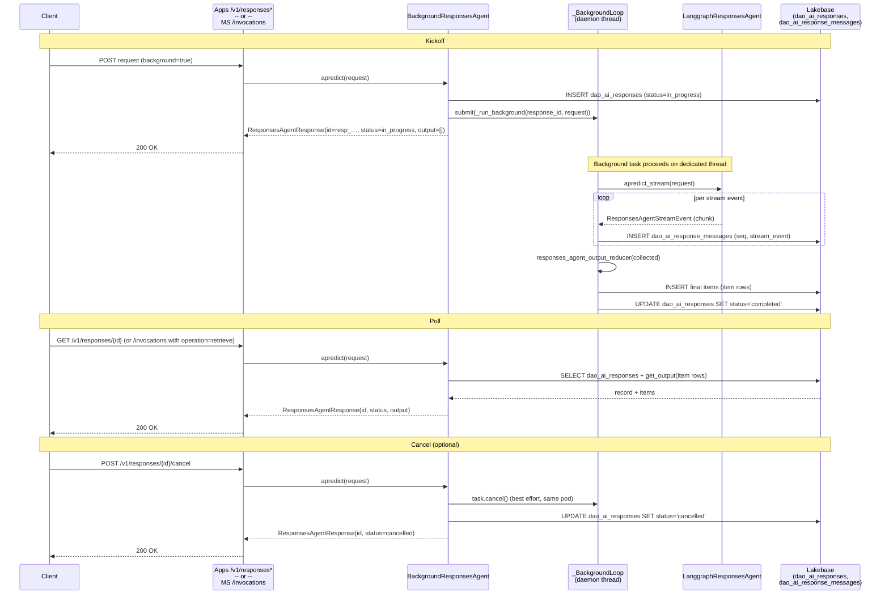
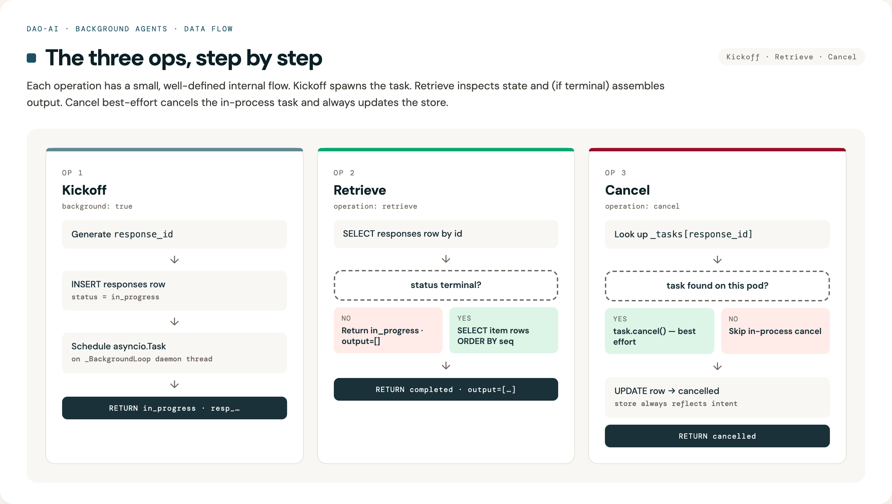
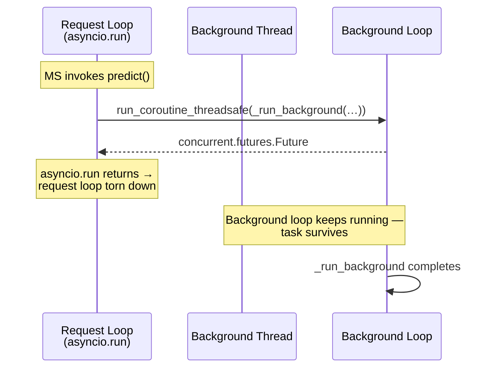

# Background Agents

## Overview

Background agents extend dao-ai with a **kickoff → poll → retrieve** flow so
agent runs can exceed Databricks' synchronous-request limits. It's an
opt-in, OpenAI Responses API–compatible layer that wraps any dao-ai
`ResponsesAgent`, persists progress to Lakebase, and runs on both
Databricks Apps and Databricks Model Serving with near-parity — the only
difference is that **SSE retrieve is Apps-only**, because Model Serving
can't mount custom streaming routes. Model Serving clients poll
non-streaming retrieve instead; both targets use the same
`BackgroundResponsesAgent` handler under the hood.

## Problem Solved

### Before (synchronous only)

```
User: "Research long-running agent infrastructure at Databricks"
→ POST /invocations (stream = false)
→ Worker thread runs the graph …
→ 5 minutes elapse
→ Model Serving kills the worker → 500 Internal Server Error ❌

User (from a Databricks App):
→ POST /invocations
→ 120 seconds elapse
→ DPAPI proxy cuts the HTTP connection → 504 Gateway Timeout ❌
```

**Why this hurts**: deep-research, multi-tool, or multi-agent workflows
routinely need 5–30 minutes. Databricks Model Serving workers time out at
~5 min, and Databricks Apps' DPAPI proxy terminates HTTP connections at
~120 s. Neither limit is configurable today.

### After (kickoff + poll)

```
User: "Research long-running agent infrastructure at Databricks"
→ POST /v1/responses  (background: true)
← 200 OK { id: "resp_abc", status: "in_progress", output: [] }  (<1 s)

Agent continues on a persistent daemon thread, writing stream events to
Lakebase as it runs (may take 30 minutes).

User polls every 1-2 seconds:
→ GET /v1/responses/resp_abc
← 200 OK { id: "resp_abc", status: "in_progress", output: [] }
…
→ GET /v1/responses/resp_abc
← 200 OK { id: "resp_abc", status: "completed", output: [ … ] } ✅
```

**Key properties**:
- **OpenAI-client compatible** on Apps (`client.responses.create(background=True)`
  + `client.responses.retrieve(id)` work unchanged).
- **Single agent implementation** — the same `LanggraphResponsesAgent`
  serves both the passthrough synchronous path and the background path;
  the background wrapper is transparent.
- **Survives the per-request event loop** — background work runs on a
  process-level daemon thread with its own persistent asyncio loop, so
  Model Serving's per-request `asyncio.run()` teardown can't cancel the
  task.
- **Stream events are persisted** and can be replayed with a cursor for
  stream-resumption on reconnect (Apps only).

## Architecture

### Component interaction diagram



### Two Lakebase tables

#### 1. `dao_ai_responses`

Stores **one row per kicked-off background request**.

```sql
CREATE TABLE dao_ai_responses (
    response_id     TEXT PRIMARY KEY,
    thread_id       TEXT NOT NULL,
    agent_task_id   TEXT,                  -- asyncio task name (same-pod only)
    status          TEXT NOT NULL CHECK (status IN
                      ('queued','in_progress','completed','failed','cancelled')),
    request_json    JSONB,                 -- audit snapshot of the original request
    error_json      JSONB,                 -- populated on 'failed'
    created_at      TIMESTAMPTZ NOT NULL DEFAULT NOW(),
    updated_at      TIMESTAMPTZ NOT NULL DEFAULT NOW(),
    completed_at    TIMESTAMPTZ
);

CREATE INDEX idx_dao_ai_responses_updated_at ON dao_ai_responses(updated_at);
```

**Purpose**: response-level state machine + audit trail.
**Storage**: ~1 KB per row (mostly request/error JSONB).

#### 2. `dao_ai_response_messages`

Stores **ordered events per response** — stream chunks during the run and
the final aggregated `output` items at completion.

```sql
CREATE TABLE dao_ai_response_messages (
    response_id      TEXT NOT NULL REFERENCES dao_ai_responses(response_id) ON DELETE CASCADE,
    sequence_number  INTEGER NOT NULL DEFAULT 0,
    item             JSONB,                -- final OutputItem (populated at completion)
    stream_event     JSONB,                -- individual ResponsesAgentStreamEvent (during run)
    created_at       TIMESTAMPTZ NOT NULL DEFAULT NOW(),
    PRIMARY KEY (response_id, sequence_number)
);
```

**Purpose**: streaming replay buffer + final output storage.
**Storage**: ~1–3 KB per row (per stream chunk or output item).

**Writer contract**: only the background task writes to either table; the
agent itself never reads from them. Pollers / retrieve endpoints only
read.

### Data flow — the three operations



### Wire protocol

The wrapper uses a single contract across both deployment targets:

| Operation | Apps route (sugar) | Model Serving route (canonical) |
|---|---|---|
| **Kickoff** | `POST /v1/responses` with body `background: true` | `POST /invocations` with body `background: true` |
| **Retrieve (non-stream)** | `GET /v1/responses/{id}` | `POST /invocations` with `custom_inputs: {operation: "retrieve", response_id}` |
| **Retrieve (stream)** | `GET /v1/responses/{id}?stream=true&cursor=N` | *Apps only — no custom SSE route on Model Serving* |
| **Cancel** | `POST /v1/responses/{id}/cancel` | `POST /invocations` with `custom_inputs: {operation: "cancel", response_id}` |

**Both targets resolve to the same `BackgroundResponsesAgent.apredict`
code path**; the Apps routes are thin FastAPI adapters that translate URL
segments into `custom_inputs` fields before delegating to the MLflow
`@invoke` handler.

## Configuration

Opt in on `AppModel.background` with a `BackgroundModel` mapping.

### Minimal

```yaml
memory:
  checkpointer:
    name: ckpt
    database: *lakebase_db   # required — background reuses a configured DatabaseModel

app:
  name: deep_research_dao
  # …
  background:
    database: *lakebase_db   # the Lakebase to persist responses/messages in
```

That's the minimum. When set, the wrapper mounts strict Responses API
routes on Apps and intercepts `/invocations` with `background=true` on
Model Serving.

### Full

```yaml
app:
  background:
    database: *lakebase_db            # required
    default_enabled: false            # if true, requests default to background=true
    max_duration_seconds: 1800        # hard cap per task; background task is cancelled past this
    poll_interval_seconds: 1.0        # server-side poll cadence during streaming retrieve
    responses_table_name: dao_ai_responses           # override if you need multi-tenant isolation
    messages_table_name:  dao_ai_response_messages
```

### Parameter reference

| Parameter | Default | Description |
|---|---|---|
| `database` | **required** | `DatabaseModel` ref — typically the same Lakebase used by `memory.checkpointer` |
| `default_enabled` | `false` | When `true`, requests without an explicit `background` flag are treated as background |
| `max_duration_seconds` | `1800` (30 min) | Upper bound on a single background run. The background task is cancelled and marked `failed` past this |
| `poll_interval_seconds` | `1.0` | Server-side poll cadence for streaming retrieve (`GET /v1/responses/{id}?stream=true`) |
| `responses_table_name` | `dao_ai_responses` | Override for multi-tenant isolation within a shared Lakebase |
| `messages_table_name` | `dao_ai_response_messages` | Same as above for the per-event rows |

## Inference payload examples

### Databricks Apps — strict OpenAI Responses API

#### Kickoff (non-streaming)

```bash
curl -X POST "$APP_URL/v1/responses" \
  -H "Authorization: Bearer $DATABRICKS_TOKEN" \
  -H "Content-Type: application/json" \
  -d '{
    "input": [
      {"role": "user", "content": "Research long-running agent infra at Databricks."}
    ],
    "background": true,
    "custom_inputs": {
      "configurable": {"thread_id": "research_demo_1"}
    }
  }'
```

**Response** (immediate, <1 s):

```json
{
  "id": "resp_a7f2d02fe9d4465d88b85230471641a7",
  "object": "response",
  "status": "in_progress",
  "output": [],
  "custom_outputs": {
    "background": {
      "response_id": "resp_a7f2d02fe9d4465d88b85230471641a7",
      "status": "in_progress",
      "thread_id": "research_demo_1",
      "error": null
    }
  }
}
```

#### Poll (non-streaming)

```bash
curl -X GET "$APP_URL/v1/responses/resp_a7f2d02fe9d4465d88b85230471641a7" \
  -H "Authorization: Bearer $DATABRICKS_TOKEN"
```

**Response** while running:

```json
{
  "id": "resp_a7f2d02fe9d4465d88b85230471641a7",
  "status": "in_progress",
  "output": [],
  "custom_outputs": { "background": { "status": "in_progress", … } }
}
```

**Response** at completion:

```json
{
  "id": "resp_a7f2d02fe9d4465d88b85230471641a7",
  "status": "completed",
  "output": [
    {
      "type": "message",
      "id": "msg_fcd9534c",
      "role": "assistant",
      "content": [
        {"type": "output_text", "text": "Here are 5 reasons…", "annotations": []}
      ],
      "status": "completed"
    }
  ],
  "custom_outputs": { "background": { "status": "completed", … } }
}
```

#### Retrieve (streaming) — Apps only

```bash
curl -N "$APP_URL/v1/responses/resp_…?stream=true&cursor=0" \
  -H "Authorization: Bearer $DATABRICKS_TOKEN"
```

SSE response — one `data:` line per persisted stream event:

```
data: {"type":"response.output_text.delta","delta":"Here","item_id":"msg_…","custom_outputs":{"background":{"response_id":"resp_…","status":"in_progress","cursor":1}}}

data: {"type":"response.output_text.delta","delta":" are","custom_outputs":{"background":{"status":"in_progress","cursor":2}}}
…
data: {"type":"response.in_progress","id":"resp_…","custom_outputs":{"background":{"status":"completed", …}}}
```

Stop reading when `custom_outputs.background.status` is terminal. To
resume after a dropped connection, pass the last seen
`custom_outputs.background.cursor` as the `cursor` query param.

#### Cancel

```bash
curl -X POST "$APP_URL/v1/responses/resp_…/cancel" \
  -H "Authorization: Bearer $DATABRICKS_TOKEN"
```

```json
{
  "id": "resp_…",
  "status": "cancelled",
  "output": [],
  "custom_outputs": { "background": { "status": "cancelled", … } }
}
```

### Databricks Model Serving — `/invocations` only

Model Serving can't mount custom FastAPI routes, so retrieve and cancel
ride on `custom_inputs.operation`.

#### Kickoff

```bash
curl -X POST "$DATABRICKS_HOST/serving-endpoints/$ENDPOINT/invocations" \
  -H "Authorization: Bearer $DATABRICKS_TOKEN" \
  -H "Content-Type: application/json" \
  -d '{
    "input": [{"role": "user", "content": "Research long-running agent infra."}],
    "background": true,
    "custom_inputs": {"configurable": {"thread_id": "research_demo_1"}}
  }'
```

Body is identical to Apps. Response likewise carries `id` +
`status=in_progress` + `custom_outputs.background`.

#### Poll

```bash
curl -X POST "$DATABRICKS_HOST/serving-endpoints/$ENDPOINT/invocations" \
  -H "Authorization: Bearer $DATABRICKS_TOKEN" \
  -H "Content-Type: application/json" \
  -d '{
    "input": [],
    "custom_inputs": {
      "operation": "retrieve",
      "response_id": "resp_a7f2d02fe9d4465d88b85230471641a7"
    }
  }'
```

Response shape is identical to the Apps retrieve (top-level `id`,
`status`, `output`).

#### Cancel

```bash
curl -X POST "$DATABRICKS_HOST/serving-endpoints/$ENDPOINT/invocations" \
  -H "Authorization: Bearer $DATABRICKS_TOKEN" \
  -H "Content-Type: application/json" \
  -d '{
    "input": [],
    "custom_inputs": {
      "operation": "cancel",
      "response_id": "resp_a7f2d02fe9d4465d88b85230471641a7"
    }
  }'
```

### Using the OpenAI Python client (Apps)

The Apps routes are OpenAI Responses API–compatible, so the stock OpenAI
client works unchanged:

```python
from openai import OpenAI

client = OpenAI(base_url=f"{APP_URL}/v1", api_key=DATABRICKS_TOKEN)

resp = client.responses.create(
    model="databricks-background",                 # ignored by the server
    input="Research background agent infra.",
    background=True,
    extra_body={"custom_inputs": {"configurable": {"thread_id": "demo"}}},
)
polled = client.responses.retrieve(resp.id)
client.responses.cancel(resp.id)
```

## How the background task survives

Databricks Model Serving calls `asyncio.run(agent.apredict(request))` per
request, which creates a fresh event loop, runs the coroutine, then tears
the loop down and cancels any pending tasks. A naive
`asyncio.create_task(_run_background(…))` inside the kickoff handler
would be killed before it could make progress.

**Fix**: the wrapper runs all background coroutines on a **process-level
daemon thread that owns a persistent `asyncio` loop**
(`dao_ai.background.agent._BackgroundLoop`). `asyncio.run()` teardown
only affects the request's loop; the daemon loop lives for the process's
lifetime and keeps spinning.



The Lakebase connection pool is also **event-loop-aware** — psycopg's
async pool can't be shared across loops, so
`AsyncPostgresPoolManager._pools` is keyed on
`(database.name, id(running_loop))`. The request loop and the background
loop each get their own pool.

## Connection-pool OAuth token refresh

Autoscaling Lakebase mints OAuth tokens with ~1 hour lifetime. Without
refresh, a pool built at startup eventually fails all new connections
with `password authentication failed`, and any session terminated
server-side (`AdminShutdown` during scale-to-zero) leaves a dead
connection in the pool.

Two mitigations are applied in `dao_ai.memory.postgres`:

1. **Callable `kwargs` provider** — `psycopg_pool>=3.2` supports a
   callable `kwargs` argument which is invoked every time the pool opens
   a new connection. The provider re-reads `DatabaseModel.connection_params`,
   which mints a fresh token each call.
2. **Pool-level `check=check_connection`** — every pooled connection is
   validated before being handed to a caller; dead sessions are discarded
   and a fresh one is opened with fresh credentials.
3. **`max_lifetime=45 min`** — conservative ceiling so connections are
   proactively recycled before token expiry. psycopg adds ±10 % jitter to
   avoid stampeding reconnects.

## Known limitations

| Limit | Why | Workaround |
|---|---|---|
| Max duration **~30 min** per task | OBO access tokens expire at ~1 h; shorter than that is safe without refresh gymnastics | For >30 min work, submit a Databricks Job; the 1DD spec calls this out explicitly |
| Cancel is **best-effort same-pod** | The `asyncio.Task` reference is kept in a process-local dict. If another pod receives the cancel request, only the store row is updated — the actual work continues on the originating pod until it completes or hits `max_duration_seconds` | Documented; the store always reflects the intended state |
| Streaming retrieve is **Apps-only** | Model Serving can't expose custom SSE routes; only Apps has a FastAPI app where `GET /v1/responses/{id}?stream=true` can be mounted | Poll non-stream on MS, or kick off on either target and retrieve from Apps |
| Cross-pod task recovery is **out of scope** | A task started on pod A that reaches `in_progress` but never completes (e.g., pod crashed) sits as `in_progress` in the DB forever | A sweeper that marks abandoned rows `failed` after `max_duration_seconds` is planned as a follow-up |

## Testing

### Unit tests

```bash
# 31 background-agent tests (agent routing + store + config + pool refresh)
uv run pytest tests/dao_ai/background/ -v
```

Covers:
- ✅ routing: kickoff / retrieve / cancel / passthrough
- ✅ background task aggregation via `responses_agent_output_reducer`
- ✅ streaming retrieve with cursor + bounded iterations
- ✅ store schema bootstrap + idempotency + cursor ordering
- ✅ pool `kwargs` provider re-resolves credentials per call
- ✅ config wiring: `BackgroundModel` defaults, `AppModel.background` field

### Live demo notebook

`notebooks/15_background_agents_demo.py` exercises every flow against
a deployed Apps + Model Serving pair:

1. Sync passthrough (Apps + MS)
2. Sync streaming (Apps + MS, via `stream: true` on `/invocations`)
3. Background kickoff + non-streaming poll (Apps + MS)
4. Background kickoff + streaming retrieve (Apps only)
5. Cancel (Apps + MS)
6. Cursor resume on dropped SSE connection (Apps)

Run it as a Databricks notebook, or inline from a workstation with:

```bash
export APP_URL=https://background-…
export MS_ENDPOINT=background_dao
export DATABRICKS_HOST=https://…
export DATABRICKS_TOKEN=$(databricks --profile X auth token | jq -r .access_token)
uv run python /tmp/run_notebook_inline.py   # strips MAGIC cells and execs the .py
```

## Troubleshooting

### Poll returns `in_progress` forever

**Symptom**: `GET /v1/responses/{id}` always returns `status=in_progress`
past the expected duration.

**Possible causes**:

1. **Task crashed silently on a different pod and no sweeper has run.**
   Check `dao_ai_responses.updated_at`: if it hasn't changed in >60 s,
   the background task is probably gone. The retrieve-stream path will
   eventually time out (`max_duration_seconds / poll_interval_seconds`
   iterations) and mark the row `failed` with
   `reason=retrieve_poll_exhausted`; non-stream polls should just wait.
2. **Wrong endpoint** — you polled the Apps route but the kickoff went
   to Model Serving (or vice versa). Both targets share a DB so the row
   exists in both; confirm via the `thread_id` you passed in
   `custom_inputs`.

**Debug**:

```sql
SELECT response_id, status, updated_at, completed_at, error_json
FROM dao_ai_responses
WHERE response_id = 'resp_…';

SELECT sequence_number, stream_event->>'type' AS event_type, created_at
FROM dao_ai_response_messages
WHERE response_id = 'resp_…'
ORDER BY sequence_number DESC
LIMIT 20;
```

### `status=failed` with `reason=timeout`

The background task exceeded `max_duration_seconds`. Either raise the
limit (up to the ~30 min practical ceiling) or simplify the prompt / tool
loop.

### `status=failed` with `password authentication failed`

Lakebase OAuth token expired *and* both the refresh path and the
connection-check failed. If you're seeing this in production:

1. Confirm the deployed wheel includes the
   `_make_kwargs_provider` + `check=check_connection` changes
   (`dao-ai` ≥ 0.1.56).
2. Confirm `max_lifetime` is set (check
   `dao_ai.memory.postgres._POOL_MAX_LIFETIME_SECONDS`).
3. As a last resort, restart the endpoint/app — the fresh process picks
   up fresh tokens.

### Apps deploys with `compute=ACTIVE, app=CRASHED`

The dao-ai CLI's start-before-deploy step can't reconcile this state. The
workaround is to invoke `databricks apps deploy <app>` directly — once
the app is back in `RUNNING`, subsequent `dao-ai deploy -t apps` calls
work normally.

## Best practices

1. **Always pass `configurable.thread_id`** — lets you trace a kickoff
   through the store and correlates with LangGraph checkpointer state if
   your agent uses it.
2. **Poll at ≥1 s cadence** — anything tighter just hammers the retrieve
   endpoint and the DB with no benefit. The server uses `poll_interval_seconds`
   for streaming retrieve; clients should mirror it for non-streaming.
3. **Use the streaming retrieve path for interactive UIs** — SSE avoids
   per-poll HTTP overhead and gives progressive rendering. Non-streaming
   poll is for batch/daemon consumers.
4. **Track the cursor** on streaming retrievers — reconnect with
   `?cursor=<last_seen>` so you don't re-render events you've already
   shown.
5. **Don't pin the serving workload to one pod**. The stateless retrieve
   path works across pods; only the cancel path is same-pod-only, and
   the DB update always happens regardless. If strict cross-pod cancel is
   critical, open a follow-up — it isn't today.
6. **Keep the background DB the same as the checkpointer DB** — both
   share a natural lifecycle. The pool-refresh fix + loop-aware keying in
   `AsyncPostgresPoolManager` handle the shared usage correctly.

## Summary

✅ **Problem Solved**: agent runs up to ~30 min on both Apps and Model Serving
✅ **OpenAI-compatible** on Apps (works with the stock Python client)
✅ **Uniform wire protocol** — same `custom_inputs` shape everywhere; Apps
routes are thin sugar
✅ **Background task survives** request-loop teardown via a persistent
daemon thread
✅ **Connection pool refreshes OAuth tokens** per new connection; dead
sessions discarded automatically
✅ **Cursor-based stream resumption** for reconnects (Apps)
✅ **35 unit tests + full notebook** cover every flow

## See also

- Example config: `examples/19_background_agents/deep_research.yaml`
- Full demo notebook: `notebooks/15_background_agents_demo.py`
- Implementation:
  - `src/dao_ai/background/agent.py` — wrapper + background loop
  - `src/dao_ai/background/store.py` — Lakebase schema + CRUD
  - `src/dao_ai/apps/server.py` — strict `/v1/responses*` route mounting
  - `src/dao_ai/memory/postgres.py` — pool refresh + connection check
- 1DD reference: Long Running Agent mini-1DD (Bryan Qiu, Dec 2025) — the
  design dao-ai follows here
