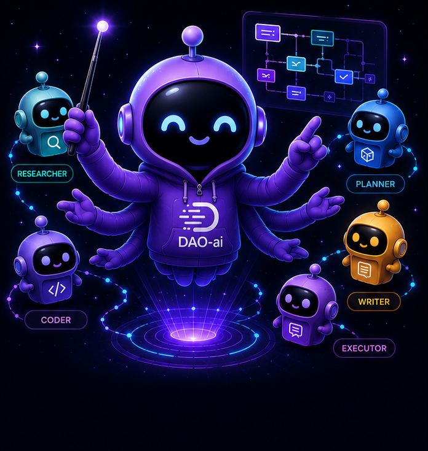
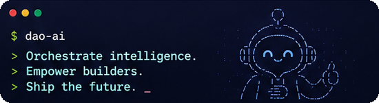
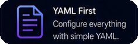
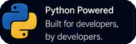
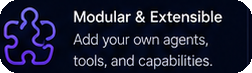
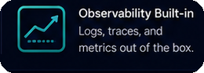

<p align="center">
  
  
</p>

<p align="center">
  
</p>

# DAO: Declarative Agent Orchestration

**Production-grade AI agents defined in YAML, powered by LangGraph, deployed on Databricks.**

<p align="center">
  
</p>

DAO is an **infrastructure-as-code framework** for building, deploying, and managing
multi-agent AI systems. Instead of writing boilerplate Python to wire up agents, tools,
and orchestration, you define everything declaratively in YAML configuration files.

```yaml
# Define an agent in 10 lines of YAML
agents:
  product_expert:
    name: product_expert
    model: *claude_sonnet
    tools:
      - *ai_search_tool
      - *genie_tool
    prompt: |
      You are a product expert. Answer questions about inventory and pricing.
```

<p align="center">
  
  
  
  
</p>

## Getting started

- [**Why DAO?**](why-dao.md) — what DAO is and how it compares to other platforms.
- [**Architecture**](architecture.md) — how DAO works under the hood.
- [**Key Capabilities**](key-capabilities.md) — 20 features for production agents.

## Reference

- [**Configuration Reference**](configuration-reference.md) — the complete YAML schema.
- [**CLI Reference**](cli-reference.md) — the `dao-ai` command-line interface.
- [**Python API**](python-api.md) — programmatic usage and customization.

## Guides

- [**Examples**](examples.md) — ready-to-use example configurations.
- [**MCP Server**](mcp_server.md) — expose a dao-ai agent as a single MCP tool.
- [**A2A Protocol**](a2a_protocol.md) — Google Agent2Agent endpoints on every Apps deployment.
- [**Background Agents**](background_agents.md) — kickoff / poll / cancel for multi-minute runs.
- [**Auditable Tool Invocations**](audit.md) — tamper-evident approval receipts and audit-trail queries.

## Companion projects

DAO has two companion repos that make it easier to learn and to author configs:

- [**DAO AI Workshop**](https://github.com/natefleming/dao-ai-workshop) — a self-paced,
  hands-on workshop that takes you from zero to a deployed, governed multi-agent system.
  Organized as **L100 → L200 → L300** with lectures and lab notebooks covering tool use,
  NL-to-SQL with Genie, vector search, memory, prompts + guardrails, and orchestration —
  all defined in YAML and running as a Databricks App. Start here if you're new to DAO.
- [**DAO AI Builder**](https://github.com/natefleming/dao-ai-builder) — a React web app
  that provides a graphical interface for creating and editing DAO configurations. Explore
  capabilities, learn the configuration structure with guided forms, and build agents
  without writing YAML by hand. It generates valid configurations that work seamlessly
  with this framework.
