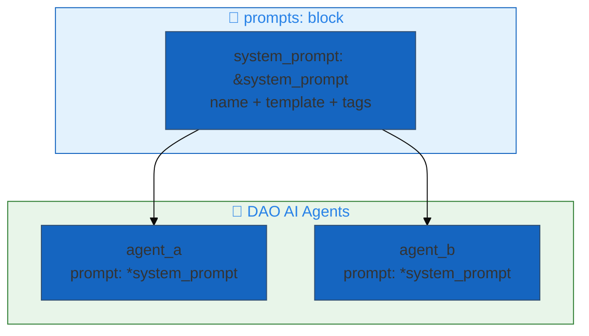

# 11. Prompt Engineering

**Reusable prompts as first-class config objects**

Define a prompt once and reference it from any number of agents (and guardrails
or supervisors) via YAML anchors. Prompt text lives inline in your config — there
is no external registry round-trip.

## Architecture Overview



## Examples

| File | Description |
|------|-------------|
| [`reusable_prompts.yaml`](./reusable_prompts.yaml) | Reusable inline prompts referenced via YAML anchors |

## Configuration

### Define Prompts

```yaml
prompts:
  system_prompt: &system_prompt
    schema: *retail_schema           # Optional Unity Catalog location (label only)
    name: retail_assistant_prompt    # Identifier used in logs and traces
    template: |
      You are a helpful retail assistant for a hardware store.

      Your responsibilities:
      - Answer product questions accurately
      - Check inventory when asked
      - Provide helpful recommendations

      Always be professional and courteous.
    tags:
      team: retail
```

### Use in Agent

```yaml
agents:
  retail_agent: &retail_agent
    name: retail_assistant
    model: *default_llm
    tools:
      - *search_tool
      - *inventory_tool
    prompt: *system_prompt           # ← Reference the shared prompt
```

## Prompt Template Variables

```yaml
prompts:
  parametric_prompt: &parametric_prompt
    name: retail_assistant
    template: |
      You are a {role} for {company_name}.

      Store locations: {store_locations}

      Current promotions: {promotions}

      Respond in {language}.
```

Variables are filled at runtime from the request `Context` (see `make_prompt`).

## Quick Start

```bash
# Validate prompt configuration
dao-ai validate -c examples/11_prompt_engineering/reusable_prompts.yaml

# Run with the configured prompts
dao-ai chat -c examples/11_prompt_engineering/reusable_prompts.yaml
```

## Best Practices

- Give each prompt a descriptive `name` — it surfaces in logs and MLflow traces.
- Define shared prompts once and reference them with anchors to avoid drift.
- Keep long prompt bodies in the `prompts:` block, out of agent definitions.

## Next Steps

- **08_guardrails/** - Reuse prompts for guardrail judges
- **13_orchestration/** - Apply to multi-agent systems
- **99_complete_applications/** - Production prompt management

## Related Documentation

- [Reusable Prompts](../../../docs/key-capabilities.md#9-reusable-prompts)
