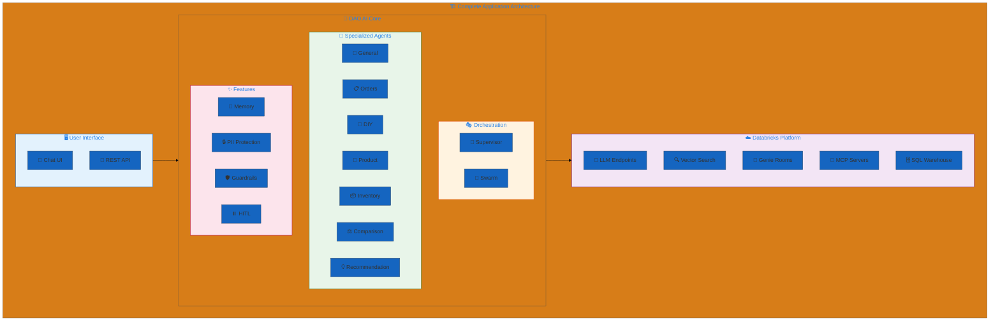
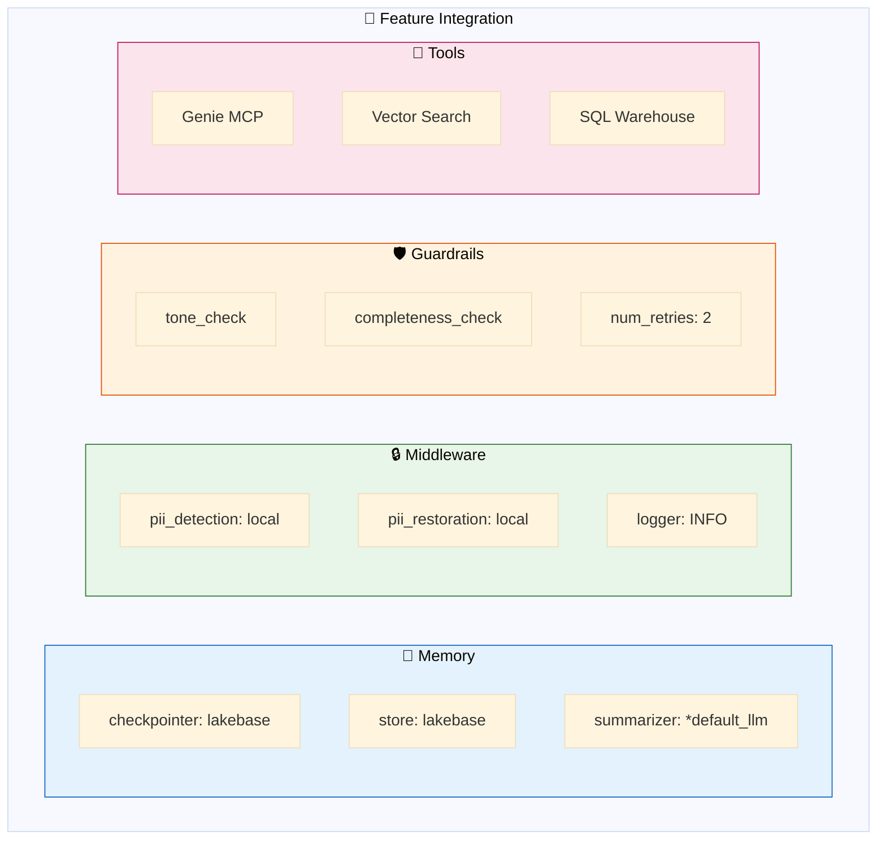
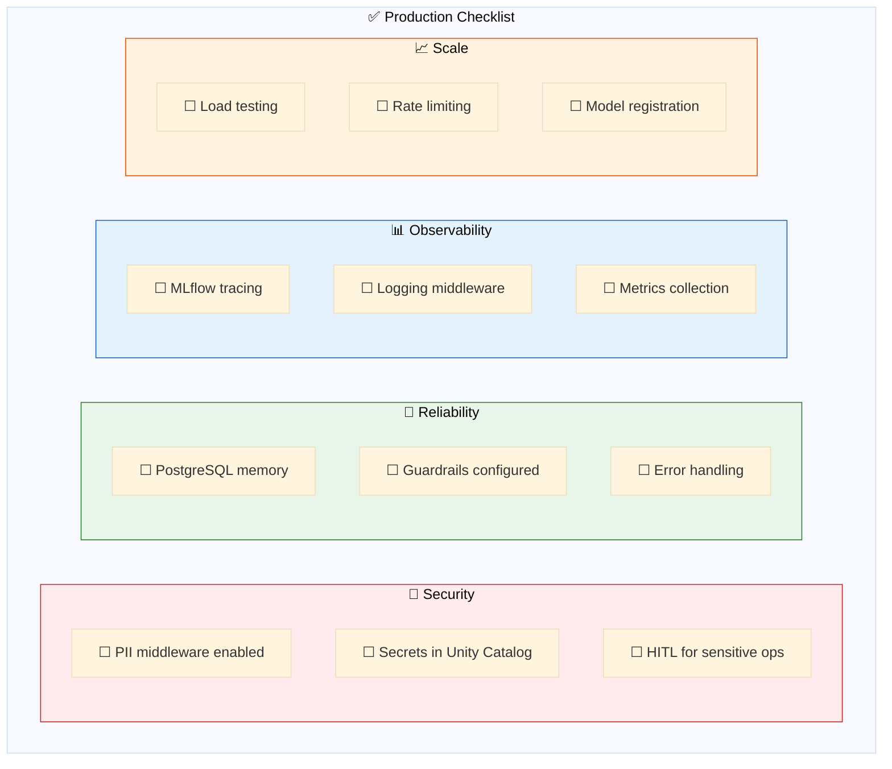
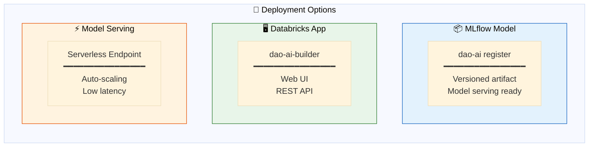
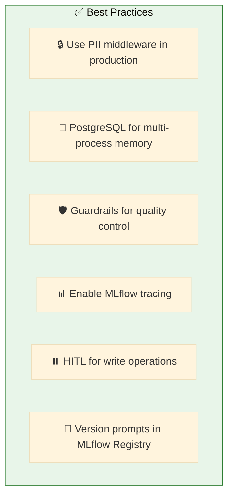

# 15. Complete Applications

**Production-ready examples combining multiple features**

End-to-end configurations demonstrating best practices for real-world deployments. Each
application lives in its own directory with a dedicated deep-dive README — this page is the
directory that links to all of them.

## Architecture Overview



## Applications

Every application below has its own deep-dive README (architecture diagrams, per-agent breakdown,
data plane, design rationale, deploy steps, and sample prompts). Start with the README, then open
the config.

| Application | Config(s) | Orchestration | Feature stack | Docs |
|---|---|---|---|---|
| **Brick Store** | [`brick_store.yaml`](./brick_store/brick_store.yaml) | 👔 Supervisor · 7 agents | Lakebase memory · Genie · Vector Search · OBO · guardrails + monitoring | [README](./brick_store/README.md) |
| **Commerce** | [`commerce_supervisor.yaml`](./commerce/commerce_supervisor.yaml) · [`commerce_swarm.yaml`](./commerce/commerce_swarm.yaml) | 👔 Supervisor / 🔁 Pipeline · 10–11 agents | Lakebase memory · 3× Vector Search · MCP · Unity AI Gateway · guardrails (B2B + B2C) | [supervisor](./commerce/commerce_supervisor.README.md) · [swarm](./commerce/commerce_swarm.README.md) |
| **Deep Research** | [`deep_research.yaml`](./deep_research/deep_research.yaml) | 🐝 Swarm · 6 agents | Genie · Tavily web search · tiered reasoning LLMs | [README](./deep_research/README.md) |
| **Executive Assistant** | [`executive_assistant.yaml`](./executive_assistant/executive_assistant.yaml) | 🤖 Single agent | Genie · Tavily web search | [README](./executive_assistant/README.md) |
| **Genie + Genie MCP** | [`genie_and_genie_mcp.yaml`](./genie_and_genie_mcp/genie_and_genie_mcp.yaml) | 👔 Supervisor · 2 agents | Native Genie tool vs. managed Genie **MCP** over the same space | [README](./genie_and_genie_mcp/README.md) |
| **Genie + Vector Search Hybrid** | [`genie_vector_search_hybrid.yaml`](./genie_vector_search_hybrid/genie_vector_search_hybrid.yaml) | 👔 Supervisor · 2 agents | Structured Genie/SQL path + unstructured Vector Search path | [README](./genie_vector_search_hybrid/README.md) |
| **Hardware Store** | [`hardware_store.yaml`](./hardware_store/hardware_store.yaml) · [`_instructed`](./hardware_store/hardware_store_instructed.yaml) · [`_swarm`](./hardware_store/hardware_store_swarm.yaml) · [`_lakebase`](./hardware_store/hardware_store_lakebase.yaml) | 👔 Supervisor / 🐝 Swarm · 5–7 agents | Vector Search · instructed retrieval (RRF + FlashRank) · Lakebase · MCP · guardrails · SQL tools + HITL | [README](./hardware_store/README.md) |
| **Loyalty Offer Personalization** | [`loyalty_offer_personalization.yaml`](./loyalty_offer_personalization/loyalty_offer_personalization.yaml) | 👔 Supervisor · 7 agents | Lakebase memory · Genie · Vector Search · 7 UC SQL functions incl. `ai_query` ranker | [README](./loyalty_offer_personalization/README.md) |
| **Procurement ↔ Supplier (A2A)** | [`procurement.yaml`](./procurement_supplier_a2a/procurement.yaml) · [`supplier.yaml`](./procurement_supplier_a2a/supplier.yaml) | 🔁 A2A pair · 2 apps | Google A2A protocol · cross-app calls · on-behalf-of-user identity forwarding | [README](./procurement_supplier_a2a/README.md) |
| **Quick Serve Restaurant** | [`quick_serve_restaurant.yaml`](./quick_serve_restaurant/quick_serve_restaurant.yaml) | 🐝 Swarm · single `barista` | Vector Search over menu · UC SQL functions · in-memory state | [README](./quick_serve_restaurant/README.md) |
| **Reservations System** | [`reservations_system.yaml`](./reservations_system/reservations_system.yaml) | 👔 Supervisor · 1 agent | Human-in-the-loop confirmation · in-memory checkpointer *(minimal demo)* | [README](./reservations_system/README.md) |
| **Sporting Goods Store — Merchandiser 360** | [`sporting_goods_store.yaml`](./sporting_goods_store/sporting_goods_store.yaml) · [`_slim`](./sporting_goods_store/sporting_goods_store_slim.yaml) | 👔 Supervisor · 7 agents | Lakebase memory · 2× Genie rooms · Vector Search · guardrails + monitoring | [README](./sporting_goods_store/README.md) |

**Orchestration legend:** 👔 Supervisor (hub-and-spoke routing) · 🐝 Swarm (peer handoffs) ·
🔁 Pipeline / A2A (staged or app-to-app).

## Feature Integration



## Production Checklist



## Configuration Structure

```yaml
# Complete Application Structure
schemas:
  retail_schema: &retail_schema           # Unity Catalog location

resources:
  models:
    default_llm: &default_llm             # Primary LLM (chat)
    judge_llm: &judge_llm                 # Guardrail evaluator
  vector_stores:
    products_store: &products_store       # Semantic search
  genie_rooms:
    retail_genie: &retail_genie           # Natural language SQL

prompts:
  tone_prompt: &tone_prompt               # Guardrail prompts
  agent_prompts: ...                      # Agent instructions

middleware:
  pii_detection: &pii_detection           # Input protection
  pii_restoration: &pii_restoration       # Output restoration
  logger: &logger                         # Audit logging

guardrails:
  tone_check: &tone_check                 # Response quality
  completeness_check: &completeness_check

tools:
  genie_tool: &genie_tool                 # Data queries
  vector_tool: &vector_tool               # Semantic search
  handoff_tools: ...                      # For swarm pattern

agents:
  general_agent: &general_agent         # General store inquiries
  orders_agent: &orders_agent           # Order tracking
  diy_agent: &diy_agent                 # DIY advice & tutorials
  product_agent: &product_agent         # Product details
  inventory_agent: &inventory_agent     # Stock levels
  comparison_agent: &comparison_agent   # Product comparisons
  recommendation_agent: &recommendation_agent  # Product suggestions

app:
  name: hardware_store_assistant
  agents:
    - *general_agent
    - *orders_agent
    - *diy_agent
    - *product_agent
    - *inventory_agent
    - *comparison_agent
    - *recommendation_agent
  orchestration:
    supervisor:                           # or swarm:
      model: *default_llm
      prompt: "Route to appropriate agent..."
      middleware: [*pii_detection, *pii_restoration]
    memory:
      checkpointer:
        type: postgres
        connection_string: "{{secrets/scope/postgres}}"
```

## Quick Start

Every application follows the same lifecycle. Point `-c` at any config above; use `-p` to select
your Databricks profile. Apps that ship a `data/` + `functions/` directory provision their infra
with `workflow up`; config-only apps use `agent up`.

```bash
# Validate any complete application
dao-ai validate -c examples/15_complete_applications/hardware_store/hardware_store.yaml

# Run in chat mode (local)
dao-ai chat -c examples/15_complete_applications/hardware_store/hardware_store.yaml -p DEFAULT

# Visualize the multi-agent architecture
dao-ai graph -c examples/15_complete_applications/hardware_store/hardware_store.yaml -o architecture.png

# Deploy — provision infra (Vector Search, Lakebase, Genie…) + deploy the agent
dao-ai workflow up -c examples/15_complete_applications/hardware_store/hardware_store.yaml -p DEFAULT

# Deploy a config-only app (no infra to provision)
dao-ai agent up -c examples/15_complete_applications/reservations_system/reservations_system.yaml -p DEFAULT
```

See each application's README for its exact provisioning path and verification steps.

## Deployment Options



## Best Practices



## Troubleshooting

| Issue | Solution |
|-------|----------|
| Memory not persisting | Check PostgreSQL connection |
| Slow responses | Review guardrail num_retries |
| Wrong agent routing | Improve supervisor prompt |
| PII leaking | Verify middleware order |

## Related Documentation

- [Architecture Overview](../../../docs/architecture.md)
- [Configuration Reference](../../../docs/configuration-reference.md)
- [Deployment Guide](../../../docs/deployment.md)
