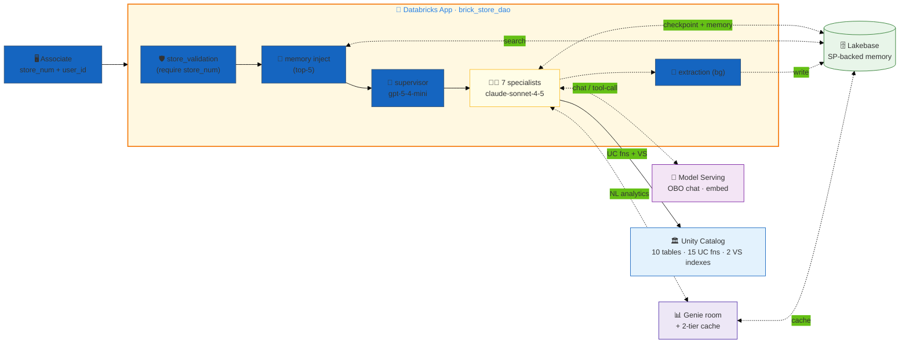
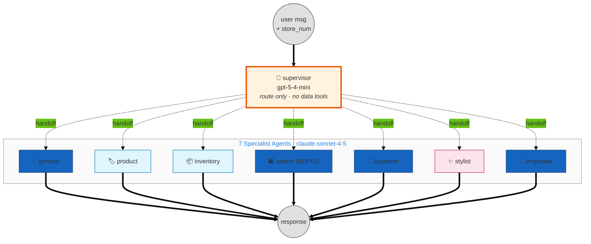
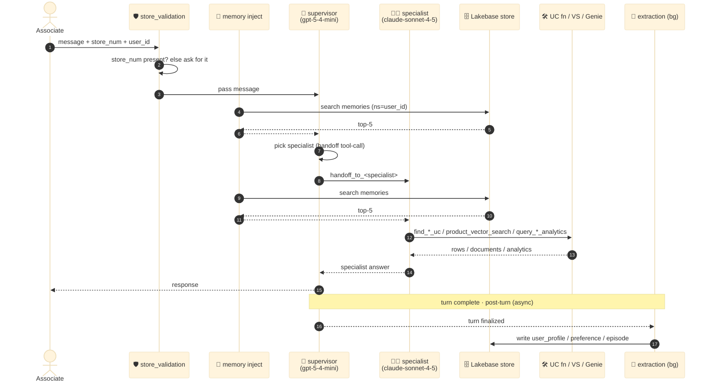
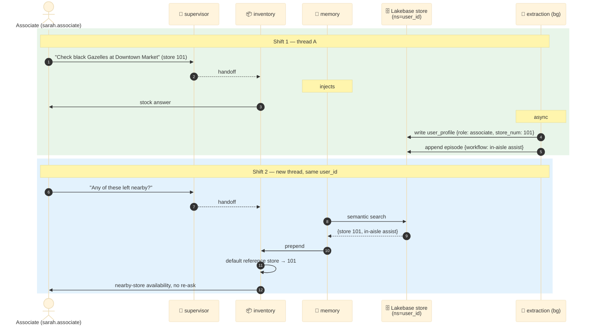

# Brick Store — In-Store Associate Companion

> **Multi-agent companion for the retail floor on dao-ai.** A **supervisor** routing coordinator fronts **7 specialist agents** covering the whole in-store experience — product lookup, real-time inventory + nearby-store checks, BOPIS pickups, customer appointment prep, personal styling, and manager-on-duty employee oversight. Lakebase-backed persistent memory learns each associate's role and workflow across sessions, a single Genie room powers ad-hoc analytics, and **on-behalf-of-user credentials** run every model, retriever, warehouse, and Genie call so the app respects the requester's own Unity Catalog grants.

| ✨ Feature | What this example shows |
|---|---|
| 👔 **Supervisor orchestration** | A dedicated routing coordinator (`supervisor`) that answers nothing itself — it reads the request and hands off to exactly one of 7 specialists via handoff tools. Hub-and-spoke: specialists return to the supervisor, not to each other. |
| 🧑‍💼 **On-behalf-of-user everywhere** | `on_behalf_of_user: true` on every LLM, vector store, warehouse, Genie room, and embedding call — so inventory, customer, and analytics reads resolve against the **associate's own** UC permissions. Only UC functions and Lakebase are SP-backed. |
| 🧠 **Persistent associate memory** | Lakebase checkpointer + namespaced store + background extraction of `user_profile` / `preference` / `episode`. `auto_inject: true` prepends the top-5 memories to each agent's prompt, so the companion learns an associate's store, shift, and workflow over time. |
| 📊 **Genie room, two doors** | One Genie space (`brickstore_genie_room`) exposed as **two tools** — `query_store_ops_analytics` and `query_employee_insights` — so the supervisor's routing heuristics cleanly separate store-ops analytics from team analytics. Backed by a two-tier cache (LRU + embedding-similarity). |
| 🔎 **Decomposed hybrid retrieval** | The `products` retriever runs HYBRID search with LLM query **decomposition** (≤3 subqueries, RRF fusion), an LLM reranker, and a `ms-marco-MiniLM` cross-encoder rerank — turning "black Adidas Gazelle size 10" into structured filters. |
| 📍 **Haversine nearby-store search** | `find_nearby_stores_inventory` computes great-circle distance from lat/long to find the closest stores that actually have the SKU in stock — the out-of-stock fallback path. |
| 🛡️ **Custom-field validation middleware** | `store_validation` requires a `store_num` on every turn before any agent runs — inventory, task, and customer lookups are all store-scoped. |
| 📈 **Production monitoring + guidelines** | `sample_rate: 1.0` with `safety` / `completeness` / `relevance_to_query` / `tool_call_efficiency` scorers plus three custom guideline groups (accuracy, tool-usage, professionalism). |
| 🚀 **One config → MS + Apps** | The same YAML deploys to Model Serving and Databricks Apps. OBO on 18 resources + 15 SP-backed UC fns + 1 Lakebase keeps the app under the Apps 20-resource budget. |

---

## Architecture

The system is built from a few interacting layers. Each layer below has a focused diagram; together they describe the full picture.

### 1. System layers

The top-level shape: client (an associate with a `store_num`) → app (validation middleware + memory injection + supervisor + 7 specialists) → the model, data, memory, and analytics planes. Everything except UC functions and Lakebase runs on the associate's own token.



**Key wiring details that are easy to miss:**
- **OBO is inverted vs. a typical dao-ai app.** Here almost everything is `on_behalf_of_user: true` — the chat/tool models, the embedding model, both vector stores, the warehouse, and the Genie room. The associate's forwarded token drives every read, so per-user UC grants are enforced end-to-end. The two exceptions are **UC functions** (SP-backed) and **Lakebase** (SP-backed) — see [Why these design choices](#why-these-design-choices).
- **UC functions are SP-backed on purpose.** `DatabricksFunctionClient` runs UC functions over Spark Connect serverless, and the OBO token forwarded by Model Serving does not carry the `databricks-connect` OAuth scope. With OBO the tools throw `PERMISSION_DENIED: required scopes: databricks-connect`. The SP path uses workspace credentials and works in both Model Serving and Apps.
- **The Genie room's cache lives in Lakebase.** The `context_aware_cache` embeds each question and does a `0.85`-similarity lookup before re-running Genie — so paraphrased analytics questions hit cache. That cache table shares the same Lakebase project as agent memory.

### 2. Orchestration topology

This is a classic **supervisor / hub-and-spoke**, not a pipeline. The supervisor is a pure router — it holds no data tools (only `app_info`) and is explicitly instructed to answer nothing itself. It picks one specialist per turn; the specialist does its tool work and returns.



**Wired in the YAML as:**
```yaml
app:
  agents: [*general, *orders, *product, *inventory, *customer, *stylist, *employee]
  orchestration:
    memory: *memory
    supervisor:
      model: *supervisor_llm          # gpt-5-4-mini — routing only
      tools: [*app_info_tool]          # no data tools by design
      prompt: |
        You are a routing coordinator ... You do NOT answer questions
        yourself ... You MUST hand off every request to one of: general,
        orders, product, inventory, customer, stylist, employee.
      middleware: [*store_validation]  # require store_num before routing
```

Each specialist advertises a `handoff_prompt` (e.g. inventory: *"Stock levels at this store, nearby-store availability, out-of-stock alternatives, or hold guidance."*) that the supervisor reads to pick the target.

### 3. Per-turn execution lifecycle

The full sequence for one associate turn. The validation middleware and background extraction never appear in the `agents:` block directly — dao-ai wires them in from `middleware:` and `memory.extraction`.



**Observations:**
- **The supervisor pays one LLM call to route**, on the fast `gpt-5-4-mini` endpoint. Specialists run the heavier `claude-sonnet-4-5` because they do the multi-step tool reasoning (resolve SKU → check stock → find nearby stores → synthesize).
- **Memory injection fires before every LLM call** (`auto_inject: true`, `auto_inject_limit: 5`) — it prepends a `## Memories` block sourced from a semantic search of the Lakebase store, namespaced by `user_id`.
- **Extraction is decoupled** (`background_extraction: true`) so it never blocks the reply. It uses the Claude `extraction_model` to distil the turn into `user_profile` / `preference` / `episode` records, with a `query_model` on the fast endpoint for search-query rephrasing.
- **`store_validation` gates the whole turn.** If `store_num` is missing, the middleware asks for it before any agent runs — inventory/task/customer lookups are store-scoped and meaningless without it. `user_id` is optional.

### 4. Persistent memory across shifts

Same `user_id`, new thread → the companion still knows the associate's store, role, and recent workflow. Lakebase is durable, so learning survives across sessions.



**Three memory schemas extracted automatically** (`extraction.schemas`), guided by instructions that tell the extractor to capture the associate's role (associate / manager / stylist / pickup-desk), their `store_num`, typical workflow, frequently-referenced customers/products/departments, and notable interactions (hold placements, prep sessions, BOPIS pickups, styling outcomes, overdue-task flags):

| Schema | Cardinality | Example contents |
|---|---|---|
| `user_profile` | 1 per user | `{role: "stylist", store_num: "101", workflow: "appointment prep"}` |
| `preference` | many per user | `{preferred_store: 101}`, `{preferred_shift: "morning"}` |
| `episode` | many per user | `{event: "styling_session", customer: "CUST-005", outcome: "3-look capsule"}` |

---

## Agents

All 7 specialists run `tool_calling_llm` (**databricks-claude-sonnet-4-5**, temp 0.1, with a self-referencing fallback). The supervisor runs `supervisor_llm` (**databricks-gpt-5-4-mini**, temp 0.1, 1024 tokens) and holds no data tools.

| # | Agent | Model | Tools | Role |
|---|---|---|---|---|
| — | `supervisor` | gpt-5-4-mini | `app_info` | Routing coordinator. Answers nothing; hands off to exactly one specialist. `store_validation` middleware attached. |
| 1 | `general` | claude-sonnet-4-5 | `current_time`, `find_store_details_by_location`, `find_store_by_number_uc`, `find_upcoming_customer_appointments_uc`, `get_customer_details_uc`, `query_store_ops_analytics` | Store info, hours, location, services; quick customer/appointment context; fallback + specialist deferral. |
| 2 | `orders` | claude-sonnet-4-5 | `current_time`, `get_customer_details_uc`, `query_store_ops_analytics` | BOPIS pickups, cross-channel order tracking, delivery scheduling. **Holds are narrative-only** (`HOLD-<store_id>-<yyyymmddhhmm>`) — never claims a row was written. |
| 3 | `product` | claude-sonnet-4-5 | `product_vector_search`, `find_product_by_sku_uc`, `find_product_by_upc_uc`, `query_store_ops_analytics` | Catalog lookup (SKU/UPC/description), comparisons, recommendations. Absorbs the "compare" + "recommend" roles. |
| 4 | `inventory` | claude-sonnet-4-5 | `find_inventory_by_sku_uc`, `find_inventory_by_upc_uc`, `find_store_inventory_by_sku_uc`, `find_store_inventory_by_upc_uc`, `find_nearby_stores_inventory_uc`, `product_vector_search` | Home-store stock, all-store stock, and Haversine nearby-store fallback when a SKU is out. |
| 5 | `customer` | claude-sonnet-4-5 | `find_upcoming_customer_appointments_uc`, `get_customer_details_uc`, `get_customer_preparation_summary_uc`, `product_vector_search`, `find_inventory_by_sku_uc` | Pre-visit prep — "who's coming in today and what should I have ready." Surfaces `requires_manager_greeting`; treats alerts/dietary/accessibility as sensitive. |
| 6 | `stylist` | claude-sonnet-4-5 | `get_customer_details_uc`, `get_customer_preparation_summary_uc`, `product_vector_search`, `find_store_inventory_by_sku_uc`, `find_personal_shopping_associates_uc` | Active styling sessions: build a 3-look capsule from prep-sheet preferences, confirm stock, find an available stylist. |
| 7 | `employee` | claude-sonnet-4-5 | `find_top_employees_by_department_uc`, `find_personal_shopping_associates_uc`, `find_employee_manager_uc`, `find_task_assignments_uc`, `query_employee_insights` | Manager-on-duty: top performers, task status/overdue, manager lookup, team-level analytics. |

**Model assignment rationale:**
- **`gpt-5-4-mini`** (`fast_llm` / `supervisor_llm` / `query_model` / `decomposition_llm`) — routing, memory-query rephrasing, and retrieval query decomposition. Fast, cheap, high tool-call fidelity.
- **`claude-sonnet-4-5`** (`tool_calling_llm` / `judge_llm` / `extraction_model`) — the specialists' multi-step reasoning, the offline eval judge, and background memory extraction.
- **`databricks-gte-large-en`** — embeddings for both vector-search indexes, the Lakebase memory store, and the Genie context-aware cache.

---

## Data plane

### Schema layout

Everything lands in `retail_consumer_goods.store_ops` (`${var.catalog}.${var.schema}`).

```
retail_consumer_goods.store_ops/
├── 📊 Core tables (via datasets:)
│   ├── products              ← VS source (long_description embedded); 40+ cols
│   ├── inventory             ← per-store on-hand, backstock, aisle, popularity
│   ├── dim_stores            ← store directory w/ lat/long (Haversine source)
│   ├── customers             ← profiles: tier, size/color/brand prefs, alerts…
│   ├── appointments          ← customer appointment scheduling
│   ├── employee_tasks        ← task assignments + 3 helper VIEWs
│   ├── employee_performance  ← monthly perf + 3 helper VIEWs
│   ├── managers              ← manager directory + lookup VIEW
│   └── (customers.sql also creates upcoming_customer_appointments + customer_preparation_summary VIEWs)
│
├── 🧪 Brand-rep demo tables (kept for Genie coverage)
│   └── customer_brand_profiles · product_performance · customer_feedback
│       · competitive_insights · sales_interactions
│
├── 🛠️ UC Functions (15 registered; 1 more present but unregistered)
│   ├── Product/inventory:  find_product_by_sku · find_product_by_upc
│   │                       find_inventory_by_sku · find_inventory_by_upc
│   │                       find_store_inventory_by_sku · find_store_inventory_by_upc
│   │                       find_store_by_number · find_nearby_stores_inventory
│   ├── Employee/customer:  find_top_employees_by_department
│   │                       find_personal_shopping_associates · find_employee_manager
│   │                       find_task_assignments · find_upcoming_customer_appointments
│   │                       get_customer_details · get_customer_preparation_summary
│   └── (present, not wired: extract_store_numbers.sql)
│
└── 🔍 VS Indexes (2) — STANDARD endpoint dbdemos_vs_endpoint, gte-large-en embeddings
    ├── product_description_index ← source: products.long_description  (HYBRID + decomposition + rerank)
    ├── store_details_indexed     ← source: dim_stores.store_details_text  (ANN)
```

### Synthetic data overview

Data is committed as static `*.sql` DDL + `*_data.sql` seed files — no runtime generation.

| Table | Rows (seed) | Notes |
|---|---|---|
| `products` | ~14 | Apparel / footwear / accessories / electronics / home goods. Deep column set (SKU, UPC, brand, department, category, color, size, base_price, `long_description` for VS). Brands include Adidas, Nike, Lululemon. |
| `inventory` | ~31 | Per-store on-hand quantity, warehouse backstock, retail amount, popularity, aisle location. |
| `dim_stores` | ~158 | Store directory with `latitude`/`longitude` (drives Haversine nearby-store search), hours, type, departments. Named stores like Downtown Market (101), Marina Market (102), Mission Market (103). |
| `customers` | ~5 | Rich profiles: tier, style/size/color/brand preferences, lifetime spend, satisfaction, upcoming appointment, and sensitive fields (`dietary_restrictions`, `accessibility_needs`, `customer_alerts`). Uses ids like `CUST-005`. |
| `appointments` | ~5 | Customer appointment scheduling: type, date/time, store, stylist, status. |
| `employee_tasks` | ~19 | Task assignments (store, employee, type, priority, status, due, overdue flag) + `employee_daily_tasks` / `task_performance_metrics` / `manager_task_overview` views. |
| `employee_performance` | ~23 | Monthly sales achievement, task completion, satisfaction, attendance, by department + `top_*` views. Uses ids like `EMP-016`. |
| `managers` | ~9 | Manager directory: contact info, department, comms prefs, schedule + `manager_employee_lookup` view. |
| `brand_rep_demo_*` | ~48 tuples / 5 tables | Brand-rep training tables (`customer_brand_profiles`, `product_performance`, `customer_feedback`, `competitive_insights`, `sales_interactions`) kept for Genie analytics coverage. |

**Two representative UC functions:**
- `find_nearby_stores_inventory(reference_store_id, sku[], max_results)` — joins `dim_stores` + `inventory`, computes **Haversine great-circle miles** from the reference store's lat/long, and returns the closest stores that carry the SKU in stock. This is the inventory agent's out-of-stock fallback.
- `get_customer_preparation_summary(customer_id[])` — returns sizes, colors, brand preferences, accessibility needs, hours-until-appointment, and a `requires_manager_greeting` flag for the customer/stylist prep workflow.

---

## Why these design choices?

### Why supervisor / hub-and-spoke instead of a pipeline?

The in-store workflows are **independent, single-shot intents** — "is this in stock," "who's coming in," "who's my top performer." There's no fixed multi-stage sequence to model, so a linear pipeline would be a poor fit. A supervisor that reads the request and routes to one specialist keeps each agent focused and makes "add a specialist" a one-line change to the `agents:` list plus a `handoff_prompt`.

### Why on-behalf-of-user on almost everything?

An in-store companion reads **customer PII, employee performance, and store analytics**. Running those reads on the associate's own token means Unity Catalog enforces per-user grants end-to-end — a floor associate and a manager-on-duty see exactly what their own permissions allow, with no app-level access logic to maintain. That's why the LLMs, embeddings, both vector stores, the warehouse, and the Genie room are all `on_behalf_of_user: true`.

### …except UC functions and Lakebase — why?

- **UC functions** run over Spark Connect serverless via `DatabricksFunctionClient`, and the OBO token forwarded by Model Serving lacks the `databricks-connect` OAuth scope — so OBO functions fail with `PERMISSION_DENIED: required scopes: databricks-connect`. SP-backed functions use workspace credentials and work in both Model Serving and Apps.
- **Lakebase** is agent *memory* — it must persist across users and sessions under one stable identity, so it's SP-backed by design. (See the vault note on the OBO/`databricks-connect` scope gap.)

This also keeps the app under the **Apps 20-resource budget**: 15 SP-backed UC functions + 1 Lakebase = 16, with the OBO-flagged models/stores/warehouse/Genie resolved via the runtime user credential rather than counting against the budget.

### Why expose one Genie room as two tools?

`query_store_ops_analytics` and `query_employee_insights` point at the **same** `brickstore_genie_room`, but the two tool descriptions give the supervisor sharper routing signal: store-ops/sales/inventory/BOPIS trends vs. team/performance/task analytics. It's the routing heuristic that benefits, not the data.

### Why the two-tier Genie cache?

Genie calls are relatively slow and metered. The `lru_cache` (exact-match, TTL 1h, capacity 100) catches repeated questions; the `context_aware_cache` embeds the question and does a `0.85`-cosine lookup (TTL 24h) so **paraphrased** questions ("how did 101 do last week" vs "show me store 101's weekly numbers") also hit cache. Both invalidate on empty results so a transient miss isn't cached forever.

### Why decomposition + double rerank on the product retriever?

Floor language is messy — "black Adidas Gazelle size 10" is a filter query, not a semantic one. The `decomposition_llm` splits it into ≤3 subqueries and extracts structured filters (`brand_name=ADIDAS`, `merchandise_class=FOOTWEAR`, `color=BLACK`, `size=10`), fused with RRF. An LLM reranker then applies constraint priorities, and a `ms-marco-MiniLM-L-12-v2` cross-encoder does the final precision pass. The `dim_stores` retriever, by contrast, is plain ANN — store-name search doesn't need the machinery.

### Why narrative-only holds and notifications?

There's no write-side tool for placing holds or sending stylist notifications. The prompts (and the monitoring guidelines) make the agents **draft** a `HOLD-<store_id>-<yyyymmddhhmm>` confirmation or a notification message and tell the user to act — never claim a row was inserted. This keeps the demo honest about what the data plane actually supports.

---

## Deploy

### Prerequisites

- **Profile**: `DEFAULT` (or your equivalent) configured via `databricks configure`
- **Secret scope**: `retail_consumer_goods` with keys `RETAIL_AI_DATABRICKS_CLIENT_ID`, `RETAIL_AI_DATABRICKS_CLIENT_SECRET`, and `RETAIL_AI_DATABRICKS_HOST`
- **Service principal**: the SP behind those secrets has `USE_CATALOG` / `USE_SCHEMA` / `SELECT` / `EXECUTE` on `retail_consumer_goods.store_ops`
- **Vector Search endpoint**: `dbdemos_vs_endpoint` exists (or change `endpoint.name` in both vector stores)
- **Genie space + Warehouse**: `parameters.genie_space_id` and `parameters.warehouse_id` point at a real Genie space and serverless SQL warehouse (or let `GenieRoomModel.create()` provision the space on first run and paste the id back)
- **Lakebase**: project `retail-consumer-goods` (`parameters.lakebase_project`) available

### Validate + provision + deploy

```bash
# Validate first (catches schema, anchor, and graph-construction errors)
DATABRICKS_CONFIG_PROFILE=DEFAULT uv run dao-ai validate \
  -c examples/15_complete_applications/brick_store/brick_store.yaml

# Provision data + UC fns + VS indexes + Genie, then deploy MS + App in one shot
uv run dao-ai workflow up \
  -c examples/15_complete_applications/brick_store/brick_store.yaml \
  -p DEFAULT \
  --mode apps
```

`workflow up` provisions the Lakebase project, creates `retail_consumer_goods.store_ops` + the 10 dataset tables (and their helper views), registers the 15 UC functions, builds the 2 Delta-Sync VS indexes on the shared endpoint, wires the Genie room, then registers the Model Serving endpoint (`brick_store_dao`) and launches the Databricks App (`brick_store_dao`).

### Verify

```bash
# Tables + functions created
databricks --profile DEFAULT tables list retail_consumer_goods.store_ops

# Lakebase project ONLINE
databricks --profile DEFAULT database list-database-instances | grep retail-consumer-goods

# App running
databricks --profile DEFAULT apps get brick_store_dao
```

---

## Sample prompts

All prompts below come **verbatim from `examples.yaml`**. Each turn carries `custom_inputs.configurable.user_id` and `store_num` (the `store_validation` middleware requires `store_num`). Personas in the examples: `sarah.associate`, `maria.stylist`, `marcus.associate` (brand rep), and `sf.customer` / `sf.employee` / `sf.manager`. Stores: Downtown Market (101), Marina Market (102), Mission Market (103).

### `product` — catalog lookup, comparison, recommendation

| Prompt | Persona · store | Expected route |
|---|---|---|
| *"Can you tell me about the Adidas Gazelle Classic Sneakers? What's the price and available colors?"* | sf.customer · 101 | supervisor → **product** (`product_vector_search`) |
| *"Can you tell me about SKU ADI-GAZ-001?"* | sf.customer · 101 | supervisor → **product** (`find_product_by_sku_uc`) |
| *"Can you compare Adidas Gazelle (SKU: ADI-GAZ-001) and Adidas Samba (SKU: ADI-SMB-001) sneakers?"* | sf.customer · 101 | supervisor → **product** |
| *"Can you recommend sneakers similar to Adidas Gazelle? I like retro suede styles."* | sf.customer · 101 | supervisor → **product** |

### `inventory` — stock at home store, all stores, and nearby fallback

| Prompt | Persona · store | Expected route |
|---|---|---|
| *"Hey Assistant, can you check if we have Adidas Gazelle sneakers in black at our Downtown Market location?"* | sarah.associate · 101 | supervisor → **inventory** (`find_store_inventory_by_sku_uc`) |
| *"How many Adidas Samba Classic Sneakers do you have in stock across all San Francisco stores?"* | sf.customer · 101 | supervisor → **inventory** (`find_inventory_by_sku_uc`) |
| *"Assistant, can you check which nearby stores have black Gazelles in stock?"* | sarah.associate · 101 | supervisor → **inventory** (`find_nearby_stores_inventory_uc`) |
| *"The Adidas Gazelle in black is out of stock. What would you recommend that's similar?"* | sf.customer · 101 | supervisor → **inventory** / **product** |

### `customer` + `stylist` — appointment prep and active styling

| Prompt | Persona · store | Expected route |
|---|---|---|
| *"Show me everything I need to know about Victoria Chen."* | maria.stylist · 101 | supervisor → **customer** (`get_customer_details_uc`) |
| *"I have a styling appointment with Victoria Sterling today. Help me prepare."* | maria.stylist · 101 | supervisor → **stylist** (`get_customer_preparation_summary_uc`) |
| *"Victoria is here for her appointment. She's looking at sneakers but seems unsure. What should I recommend?"* | maria.stylist · 101 | supervisor → **stylist** |
| *"What upcoming appointments do we have for customer CUST-001 at our San Francisco stores?"* | sf.employee · 101 | supervisor → **customer** (`find_upcoming_customer_appointments_uc`) |

### `orders` — BOPIS and order tracking

| Prompt | Persona · store | Expected route |
|---|---|---|
| *"Assistant, can you place a hold on black Gazelles, size 10, at Marina Market for this customer?"* | sarah.associate · 101 | supervisor → **orders** (narrative `HOLD-…`) |
| *"When will my online order of Adidas Samba sneakers arrive at the Marina Market? Order number is 12345."* | sf.customer · 102 | supervisor → **orders** |

### `employee` — manager-on-duty

| Prompt | Persona · store | Expected route |
|---|---|---|
| *"Who are the top performing employees in the Footwear department at our San Francisco stores?"* | sf.manager · 101 | supervisor → **employee** (`find_top_employees_by_department_uc`) |
| *"Who is the manager for employee EMP-016 at the Downtown Market store?"* | sf.employee · 101 | supervisor → **employee** (`find_employee_manager_uc`) |
| *"Which personal shopping associates are available for sneaker styling appointments in San Francisco?"* | sf.employee · 101 | supervisor → **employee** (`find_personal_shopping_associates_uc`) |

### `general` + Genie analytics

| Prompt | Persona · store | Expected route |
|---|---|---|
| *"What are your store hours and location for the Downtown Market in San Francisco?"* | sf.customer · 101 | supervisor → **general** (`find_store_details_by_location`) |
| *"Find me BrickMart stores in San Francisco that carry Adidas footwear."* | sf.customer · 101 | supervisor → **general** |
| *"Show me how Nike Air Max products perform at our store."* | marcus.associate · 101 | supervisor → **product** / **general** (`query_store_ops_analytics`) |
| *"What do customers say when they choose Adidas over Nike?"* | marcus.associate · 101 | supervisor → Genie analytics |

---

## File layout

```
brick_store/
├── README.md                         # this file
├── brick_store.yaml                  # dao-ai config (parameters → app)
├── examples.yaml                     # sample conversation flows (prompt source)
├── data/                             # DDL + seed data
│   ├── products.sql + product_data.sql
│   ├── inventory.sql + inventory_data.sql
│   ├── dim_stores.sql + dim_stores_data.sql
│   ├── customers.sql + customers_data.sql          # + 2 prep VIEWs
│   ├── appointments.sql + appointments_data.sql
│   ├── employee_tasks.sql + employee_tasks_data.sql          # + 3 VIEWs
│   ├── employee_performance.sql + employee_performance_data.sql   # + 3 VIEWs
│   ├── managers.sql + managers_data.sql            # + 1 VIEW
│   ├── task_assignments.sql
│   └── brand_rep_demo_tables.sql / _data.sql / _queries.sql / _validation.sql
└── functions/                        # UC SQL functions
    ├── find_product_by_sku.sql            find_product_by_upc.sql
    ├── find_inventory_by_sku.sql          find_inventory_by_upc.sql
    ├── find_store_inventory_by_sku.sql    find_store_inventory_by_upc.sql
    ├── find_store_by_number.sql           find_nearby_stores_inventory.sql
    ├── find_top_employees_by_department.sql
    ├── find_personal_shopping_associates.sql
    ├── find_employee_manager.sql          find_task_assignments.sql
    ├── find_upcoming_customer_appointments.sql
    ├── get_customer_details.sql           get_customer_preparation_summary.sql
    └── extract_store_numbers.sql          # present, not registered in YAML
```

---

## Related dao-ai patterns referenced

- **Supervisor orchestration** — `examples/13_orchestration/` supervisor patterns
- **Lakebase memory + extraction** — `examples/15_complete_applications/hardware_store_lakebase.yaml`
- **Genie tool + context-aware cache** — Genie `type: genie` tools with `lru_cache` + `context_aware_cache`
- **Decomposed hybrid retrieval** — `retrievers.*.instructed.decomposition` + `rerank`
- **On-behalf-of-user auth** — `on_behalf_of_user` flags across models, stores, warehouse, Genie
- **Custom-field validation middleware** — `dao_ai.middleware.create_custom_field_validation_middleware`
- **Commerce Swarm (pipeline sibling)** — `examples/15_complete_applications/commerce/commerce_supervisor.README.md`
