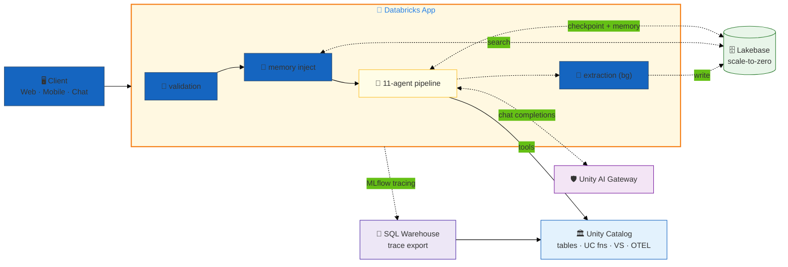
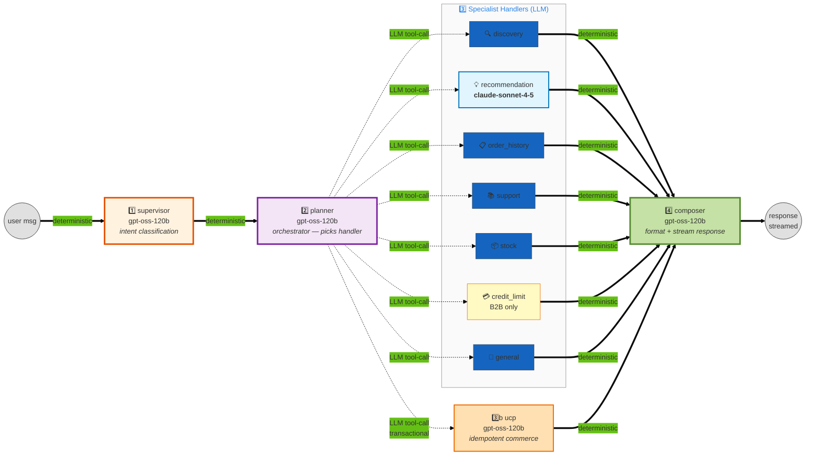
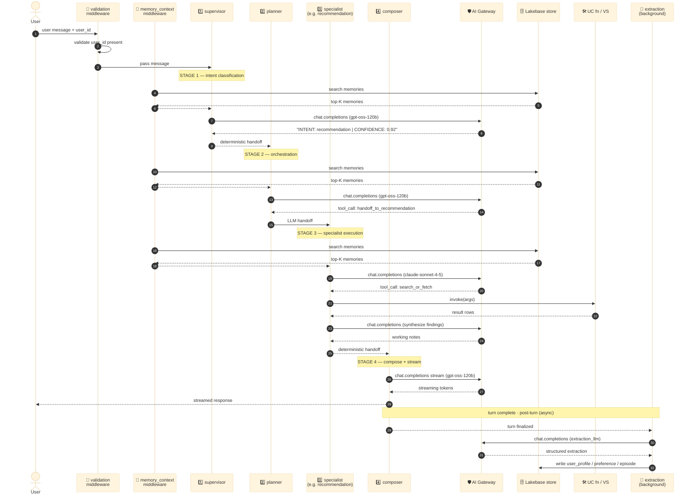
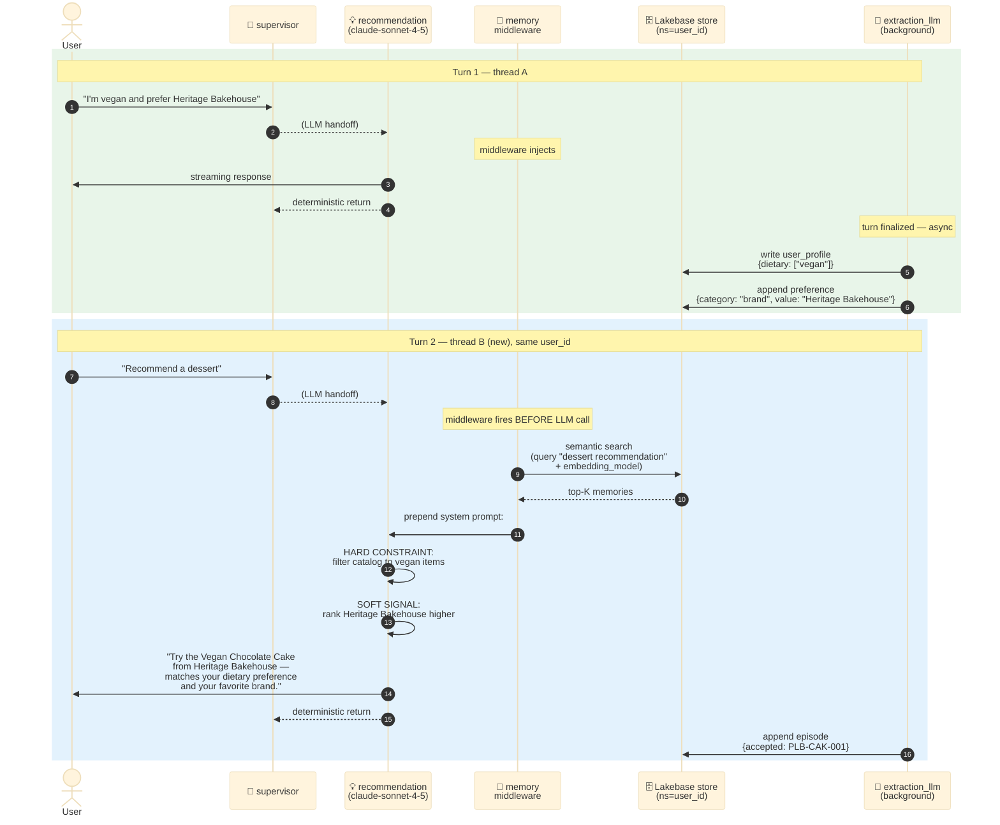
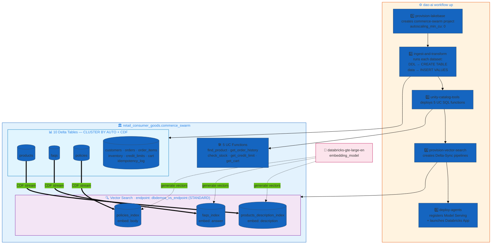
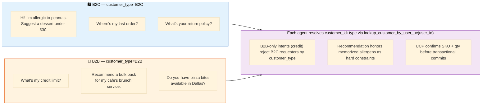

# Commerce Swarm — LangGraph Commerce Agent (B2B + B2C)

> **Reference implementation of the LangGraph Commerce Agent v2.1 architecture on dao-ai.** An 11-agent **pipeline** (supervisor → planner → specialist → composer) serving both consumer (B2C) and foodservice (B2B) traffic, with hyper-personalization driven by Lakebase-backed long-term memory and Unity AI Gateway routing on every model call.

| ✨ Feature | What this example shows |
|---|---|
| 🔁 **Pipeline orchestration** | Linear stages: `supervisor → planner → handler/ucp → composer`. Stage transitions are **deterministic** (no LLM call); planner→handler is **LLM-routed** (planner picks one target). Specialists hand off **directly to composer**, not back to supervisor — no hub-and-spoke. |
| 🧠 **Hyper-personalization** | Lakebase checkpointer + store + background extraction of `user_profile` / `preference` / `episode` schemas. `MemoryContextMiddleware` auto-injects memories into every handler's system prompt before each LLM call |
| 🛡️ **Unity AI Gateway** | `ai_gateway: true` on every model (chat, extraction, query, embedding) — uniform governance, usage tracking, rate-limit pooling |
| 🎯 **Mixed-model assignment** | `gpt-oss-120b` for fast routing/lookups + memory extraction + memory-search query optimization; `claude-sonnet-4-5` for reasoning-heavy recommendation + eval |
| 💸 **Lakebase scale-to-zero** | `autoscaling_min_cu: 0`, `suspend_timeout_seconds: 600` — zero idle cost, ~few-second cold-start when traffic resumes |
| 📊 **Three VS indexes** | Delta-Sync TRIGGERED over `products` / `faqs` / `policies` on a single shared endpoint. CDF on source tables drives incremental sync |
| 🔁 **UCP idempotency** | `idempotency_log` table backs idempotent commerce/payment commands |
| 📍 **UC trace_location** | Traces persist to OTEL tables via SQL warehouse export — required for Databricks Apps (default control-plane trace storage host is unreachable from Apps containers) |
| 🚦 **Validation middleware** | `customer_validation` wraps every agent — refuses to invoke without `user_id` |
| 🔒 **No OBO** | Stable SP authentication everywhere — `on_behalf_of_user: false` on Lakebase, embedding model, vector stores |

---

## Architecture

The system is built from five interacting layers. Each layer below has a focused diagram, and together they describe the full picture.

### 1. System layers

The top-level shape: client → app (with validation + memory middleware + 11-agent pipeline) → AI Gateway, Lakebase, Unity Catalog. Traces flow out via a SQL warehouse to UC OTEL tables.



**Key wiring details that are easy to miss:**
- The `🧠 memory inject` block is the `MemoryContextMiddleware` (`dao_ai.middleware.memory_context`) that fires **before every LLM call**, not just on `recommendation`. It does a semantic search against the Lakebase `store` using `query_model` (gpt-oss-120b) for query rephrasing + `embedding_model` (gte-large-en) for vector similarity, and prepends a `## Memories` section to the agent's system prompt.
- The `💾 extraction` block runs **after** each turn (`background_extraction: true`) so it never blocks the response. It uses `extraction_llm` (gpt-oss-120b — explicitly separate so foreground inference doesn't compete with extraction for Sonnet capacity).
- The `📍 SQL Warehouse` is **required** for Databricks Apps because Apps containers cannot reach the default control-plane trace storage endpoint. Without `trace_location`, traces are silently dropped.

### 2. Pipeline topology

The orchestration is a linear **pipeline** with branching only at one point (planner → handler) and convergence at one point (handler → composer). Stage transitions that have a single valid next-stage are **deterministic** (no LLM call needed). Only planner→handler uses LLM tool-call routing, because that's the only stage where a decision needs to be made.



**Wired in the YAML as:**
```yaml
swarm:
  default_agent: *supervisor
  handoffs:
    supervisor:
    - agent: *planner
      is_deterministic: true             # → planner, always
    planner:                             # → exactly one of 8 (LLM tool-call)
    - *discovery
    - *recommendation
    - *order_history
    - *support
    - *stock
    - *credit_limit
    - *general
    - *ucp
    discovery:
    - agent: *composer
      is_deterministic: true             # → composer, always
    # ... same shape for every other specialist
    composer: []                         # terminal — no outbound edges
```

**This is a pipeline, not a hub-and-spoke.** The supervisor is just the *first stage* of every turn — it does NOT serve as a routing hub. Specialists hand off directly to the composer. The only LLM-routing decision is at the planner stage (which handler to invoke).

### 3. Per-turn execution lifecycle

This is the *full* sequence of what happens on a single user turn across all four pipeline stages. The middleware layers and background extraction are critical to understanding the actual data flow — they don't appear in the YAML directly, but `dao-ai` wires them in automatically when `memory.extraction` is present.



**Observations:**
- **Four LLM calls on the foreground path** (supervisor, planner, specialist, composer). The two deterministic handoffs (supervisor→planner and specialist→composer) are state-machine edges — no Gateway call, no token cost. Only one routing decision is paid for in tokens: planner→specialist.
- **Memory injection happens before every LLM call** — that's the `MemoryContextMiddleware`. `supervisor_auto_inject: false` would disable it for supervisor only; currently the YAML keeps it enabled across all four stages.
- **Specialists have a clean handoff contract**: read upstream messages, do their tool work, leave well-formed working notes for the composer. They never directly stream to the user — that's the composer's job.
- **Extraction is decoupled from the response path** — it sits behind a queue and runs even if the user has closed the connection. Its trace shows up as a separate span branch.

### 4. Hyper-personalization across threads

The middleware + extraction wiring means users get persistent learning *across* threads (and across sessions, since Lakebase is durable). Same `user_id`, new thread → memories still apply.



**Three memory schemas extracted automatically in the background:**

| Schema | Cardinality | Example contents |
|---|---|---|
| `user_profile` | 1 per user (singleton, overwrite) | `{first_name: "Maya", customer_type: "B2C", dietary: ["vegan"], channel: "mobile"}` |
| `preference` | many per user (append) | `{category: "brand", value: "Heritage Bakehouse"}`, `{category: "price_band", value: "premium"}` |
| `episode` | many per user (append) | `{situation: "complaint", topic: "thawed_arrival", resolution: "replacement_sent"}` |

The `recommendation` handler treats memorized **dietary restrictions as hard constraints** — it will never suggest a product that conflicts with a stored allergen — and **brand/category affinity as soft signals** for ranking.

### 5. Data provisioning + Vector Search sync

When you run `dao-ai workflow up`, this five-stage DAG executes inside a Databricks Job. Stages 2–4 populate UC; stage 5 deploys the App that uses them.



**Wiring notes:**
- All 10 tables get `delta.enableChangeDataFeed = true` so VS sync, downstream consumers, and audit queries all work incrementally.
- Three VS indexes share the **same endpoint** (`dbdemos_vs_endpoint`) — separate endpoints would be wasteful here. The endpoint is reused from `dbdemos`; change `endpoint.name` in the YAML to point at a different one if needed.
- Embedding is **managed-embedding** style (Delta-Sync provides the source column → endpoint embeds + writes index). No separate embedding job to manage.
- `TRIGGERED` ingest mode (not `CONTINUOUS`) because the source data is batch-loaded once at deploy. Switch to `CONTINUOUS` for live-updated catalogs.

### 6. B2C vs B2B persona routing

`user_id` is the **authenticated Databricks identity** (an email). The Commerce Swarm internal `customer_id` (`C0042` for B2C, `B0007` for B2B) is resolved at runtime by the `lookup_customer_by_user_uc(user_id)` UC function, which also returns `customer_type` ∈ {`B2C`, `B2B`}. Specialist agents gate B2C/B2B behavior off `customer_type`. Memories sharpen the persona further over time (e.g. a B2B account is known to prefer specific suppliers).



---

## Agents

| Stage | # | Agent | Model | Tools | Role |
|---|---|---|---|---|---|
| 1️⃣ | 1 | `supervisor` | gpt-oss-120b | — | Intent classification only. Emits `INTENT: <label> \| CONFIDENCE: <x>`. Deterministic handoff to planner. |
| 2️⃣ | 2 | `planner` | gpt-oss-120b | — | Orchestrator. Reads supervisor's intent label and invokes one handoff tool to route to the right specialist. Persona rules baked in (B2C redirect for credit, clarification routing). |
| 3️⃣ | 3 | `discovery` | gpt-oss-120b | `product_search` (VS), `find_product_uc` | Semantic product search and SKU/ID lookup. |
| 3️⃣ | 4 | `recommendation` | **claude-sonnet-4-5** | `product_search`, `get_order_history_uc` | Personalized suggestions. Synthesizes memory + order history + catalog. Hard constraints from dietary memories. |
| 3️⃣ | 5 | `order_history` | gpt-oss-120b | `get_order_history_uc` | Order tracking, shipping/delivery status. |
| 3️⃣ | 6 | `support` | gpt-oss-120b | `faq_search` (VS), `policy_search` (VS) | Policy and FAQ Q&A. Prefers FAQ for short answers; falls back to policy for formal detail. |
| 3️⃣ | 7 | `stock` | gpt-oss-120b | `check_stock_uc`, `find_product_uc` | Inventory across distribution locations with ATP (available-to-promise) calculation. |
| 3️⃣ | 8 | `credit_limit` | gpt-oss-120b | `get_credit_limit_uc` | B2B-only credit availability + payment terms. The planner routes B2C requesters here only by mistake; handler explains the B2B-only constraint. |
| 3️⃣b | 9 | `ucp` | gpt-oss-120b | `get_cart_uc`, `find_product_uc` | Idempotent commerce executor. MCP-ready for Commercetools / Stripe / Adyen wiring. |
| 3️⃣ | 10 | `general` | gpt-oss-120b | — | Greetings, brand questions, small talk, and the receiving stage for clarification flows. |
| 4️⃣ | 11 | `composer` | gpt-oss-120b | — | Terminal node. Reads upstream specialist's working notes, formats and streams the final customer-facing response. |

**Model assignment rationale:**
- **`gpt-oss-120b`** — strong tool-call fidelity, low latency, low cost. Right for triage, structured lookups, idempotent commerce, memory extraction, and memory-query rephrasing.
- **`claude-sonnet-4-5`** — multi-step reasoning over memory + history + catalog. Right for the one handler (`recommendation`) where response quality moves the needle on conversion, plus the offline judge LLM (`judge_llm`).
- **AI Gateway routing on every endpoint** (chat, extraction, query, embedding) — uniform governance, usage tracking, rate-limit pooling, PII guardrails.

---

## Data plane

### Schema layout

```
retail_consumer_goods.commerce_swarm/
├── 📊 Tables (10) — all Delta with CLUSTER BY AUTO + CDF
│   ├── products              ← VS source (description embedded)
│   ├── customers             ← B2C + B2B (loyalty_tier or null)
│   ├── orders                ← FK customers.customer_id
│   ├── order_items           ← FK orders.order_id + products.product_id
│   ├── inventory             ← FK products.product_id, 3 locations
│   ├── credit_limits         ← FK customers.customer_id (B2B subset)
│   ├── cart                  ← multi-row carts
│   ├── faqs                  ← VS source (answer embedded)
│   ├── policies              ← VS source (body embedded)
│   └── idempotency_log       ← UCP audit (populated at runtime)
│
├── 🛠️ UC Functions (5)
│   ├── find_product(sku_or_id)
│   ├── get_order_history(customer_id, row_limit)
│   ├── check_stock(sku)
│   ├── get_credit_limit(customer_id)
│   └── get_cart(customer_id)
│
└── 🔍 VS Indexes (3) — Delta-Sync TRIGGERED, shared endpoint dbdemos_vs_endpoint
    ├── products_description_index ← source: products.description
    ├── faqs_index                 ← source: faqs.answer
    └── policies_index             ← source: policies.body
```

### Synthetic data overview

| Table | Rows | Notes |
|---|---|---|
| `products` | 40 | Specialty foodservice catalog — frozen desserts, bakery, toppings, pizza, custom decorating, plant-based, catering, seasonal, B2B-bulk. Detailed human-readable descriptions for VS recall. |
| `customers` | 200 | 150 B2C + 50 B2B accounts across 16 US cities |
| `orders` | 600 | 12-month rolling history, status distribution: delivered 60% / shipped 15% / confirmed 10% / placed 8% / cancelled 4% / returned 3% |
| `order_items` | ~2,000 | FK-consistent line items, B2B baskets larger than B2C |
| `inventory` | 120 | 40 SKUs × 3 distribution locations (Buffalo, Dallas, LA) |
| `credit_limits` | 50 | B2B-only; Net30 dominant, Net60/COD subset |
| `cart` | ~120 | Active multi-row carts for recent shoppers |
| `faqs` | 18 | Curated across shipping / returns / account / products / b2b / payment |
| `policies` | 8 | Formal docs: returns, shipping, privacy, b2b terms, credit, food safety, pricing, damaged-items |
| `idempotency_log` | 0 | Empty at deploy; UCP writes idempotency rows at runtime |

Data is FK-consistent and deterministic (seeded random). Generated once, committed as static `*_data.sql` files — no runtime generation.

---

## Why these design choices?

### Why a pipeline, not a hub-and-spoke supervisor?

The reference architecture is a **linear flow**: classify intent → orchestrate → execute → respond. A hub-and-spoke supervisor pattern would force every specialist to return to the supervisor (wasting one LLM call per turn) and would obscure the four-stage structure that the diagram makes explicit. The pipeline shape mirrors the diagram directly — every stage has exactly one job and hands off downstream.

### Why deterministic handoffs at supervisor→planner and specialist→composer?

Each of those edges has **exactly one valid next stage**, so asking an LLM "where to next?" is wasted tokens. `is_deterministic: true` turns it into a state-machine edge — no Gateway call, no token cost, predictable trace shape. The only edge that genuinely needs LLM routing is planner→specialist, where the planner picks one of 8 targets based on the supervisor's intent label.

### Why a separate supervisor *and* planner if they're both LLM calls?

**Separation of concerns.** Supervisor is pure classification (intent label + confidence). Planner is pure routing (intent → handler). Both can be evolved independently:
- Supervisor could become a cheaper/faster model, or a fine-tuned classifier
- Planner could become deterministic (intent→handler is a fixed mapping) and skip the LLM call entirely

Keeping them combined would couple those evolutions. The diagram explicitly separates them, and dao-ai's stage-aware tracing makes the boundary observable for free.

### Why does the composer exist instead of having each specialist stream directly?

Three reasons:
- **Single streaming contract**: the composer is the only node that streams to the user, which simplifies the SSE / Responses-API wiring on the App side
- **Consistent style**: the composer formats *every* response, so tone and citation patterns stay uniform across handlers
- **Cheaper streaming**: gpt-oss-120b streams faster than Claude Sonnet, so even when `recommendation` does heavy Sonnet reasoning, the user-facing tokens come back at gpt-oss speed

### Why mixed models?

`gpt-oss-120b` is fast and has strong tool-call fidelity. Right for the 8 handlers that mostly classify-then-call-a-tool. `claude-sonnet-4-5` shines at multi-step reasoning that needs to weigh constraints + history + personalization — exactly what `recommendation` does. Spending the Claude budget where it produces the biggest quality lift is more efficient than uniformly applying Sonnet everywhere.

### Why route memory extraction through its own model alias?

`extraction_llm` is wired to gpt-oss-120b so background extraction doesn't compete with foreground inference for `reasoning_llm` (Claude) capacity. Same model under the hood but a separate alias documents the intent and lets you flip it independently later (e.g. to a cheaper / faster model if extraction throughput becomes a bottleneck).

### Why Lakebase scale-to-zero?

Demo and customer-POC apps are idle most of the time. `autoscaling_min_cu: 0` removes idle baseline cost entirely. The ~few-second cold-start on first query is acceptable for non-production workloads and disappears within the warm-up window for any real customer engagement.

### Why three Vector Search indexes instead of one?

Mixing product descriptions, FAQ answers, and policy bodies into a single index hurts recall — the semantic spaces are too different. Separating them lets each handler hit a focused index with higher precision. The cost is three Delta-Sync pipelines instead of one (acceptable; they share the same endpoint).

---

## Deploy

### Prerequisites

- **Profile**: `fevm` (or your equivalent Databricks profile) configured via `databricks configure`
- **Secret scope**: `retail_consumer_goods` exists with keys `RETAIL_AI_DATABRICKS_CLIENT_ID` and `RETAIL_AI_DATABRICKS_CLIENT_SECRET`
- **Service principal**: Has `READ` on the secret scope, and `USE_CATALOG` / `USE_SCHEMA` / `SELECT` / `EXECUTE` on the target catalog
- **Vector Search endpoint**: `dbdemos_vs_endpoint` exists (or change the `endpoint.name` in the YAML)
- **SQL Warehouse ID**: Update `parameters.warehouse_id` to point at your serverless warehouse if the default is wrong

### Provision + deploy

```bash
# Validate first (catches schema, anchor, and graph-construction errors)
DATABRICKS_CONFIG_PROFILE=fevm uv run dao-ai validate \
  -c examples/15_complete_applications/commerce/commerce_swarm.yaml

# Deploy + provision everything in one shot
uv run dao-ai workflow up \
  -c examples/15_complete_applications/commerce/commerce_swarm.yaml \
  -p fevm \
  --mode apps
```

The deploy executes the 5-stage DAG shown in section 5 above:
1. Provision the Lakebase `commerce-swarm` project (scale-to-zero configured)
2. Create `retail_consumer_goods.commerce_swarm` schema + 10 tables + load synthetic data
3. Create 5 UC functions
4. Create 3 Delta-Sync VS indexes on the shared endpoint
5. Register the Model Serving endpoint + deploy the Databricks App (`commerce_swarm_dao`)

### Verify

```bash
# Tables created
databricks --profile fevm tables list retail_consumer_goods.commerce_swarm

# Lakebase project ONLINE
databricks --profile fevm database list-database-instances | grep commerce-swarm

# App running
databricks --profile fevm apps get commerce_swarm_dao
```

---

## Sample prompts

The prompts below are **live-validated against the deployed FEVM Databricks App** (`agent-commerce-super-dao`) on 2026-07-06. For every row the app was invoked over `/invocations`, the response text captured, the MLflow trace pulled via `mlflow.get_trace(trace_id)`, and the spans walked to confirm (a) the specialist agent that handled it, (b) the tools it called, and (c) that the response body contains the expected signal. See [Reproduce this validation](#reproduce-this-validation) below for the exact `curl` + Python snippet.

### Personas

Each test sets `custom_inputs.user_id` to a real seeded email. `lookup_customer_by_user` resolves the SSO email to an internal `customer_id` and drives B2C-vs-B2B routing:

| Persona | `user_id` | Resolves to | Notes |
|---|---|---|---|
| **B2C** | `ethan.iqbal18@example.com` | `C0019` — B2C, `baker_hobbyist` segment, platinum tier | Six delivered orders + a live five-item cart |
| **B2B** | `buyer37@southerncomfortdiners.example.com` | `B0038` — B2B, hospitality segment | Nine orders + a Net30 credit line ($1,000 limit / $608.91 available) |

Prompts marked persona **Any** work with either.

### Prompts by agent

Each entry declares: the prompt, the persona used, whether the demand is on **structured** data (UC functions) or **unstructured** data (Vector Search), the tool spans expected in the trace, and the routing observed live.

#### `discovery` — product search (unstructured VS + structured lookup)

| # | Prompt | Persona | Data path | Tools called | Route observed |
|---|---|---|---|---|---|
| 1 | *"Show me your vegan cake options."* | B2C | Unstructured (VS) | `product_search` | supervisor → planner → **discovery** → composer |
| 2 | *"What plant-based desserts do you carry?"* | B2C | Unstructured (VS) | `product_search` | supervisor → planner → **discovery** → composer |
| 3 | *"Look up product FRZ-CAKE-001."* | B2C | Structured (UC fn) | `find_product` | supervisor → planner → **discovery** → composer |

#### `recommendation` — personalized, memory-aware suggestions

| # | Prompt | Persona | Data path | Tools called | Route observed |
|---|---|---|---|---|---|
| 4 | *"I'm allergic to peanuts — please recommend a dessert under $30."* | B2C | Structured + Unstructured | `product_search` (respects allergen guardrail via injected memory) | supervisor → planner → **recommendation** → composer *(occasional cold-start flake: retry once if the first turn returns an empty response)* |
| 5 | *"Suggest something based on my past orders."* | B2C | Structured + Unstructured | `lookup_customer_by_user`, `get_order_history` | supervisor → planner → **recommendation** → composer |
| 6 | *"Recommend a bulk pack for a weekend brunch service."* | B2B | Unstructured (VS) | `product_search` (prefers bulk / B2B SKUs) | supervisor → planner → **recommendation** → composer |

#### `order_history` — order tracking

| # | Prompt | Persona | Data path | Tools called | Route observed |
|---|---|---|---|---|---|
| 7 | *"Where's my last order?"* | B2C | Structured | `lookup_customer_by_user`, `get_order_history` | supervisor → planner → **order_history** → composer |
| 8 | *"Show me my last three orders."* | B2C | Structured | `lookup_customer_by_user`, `get_order_history` | supervisor → planner → **order_history** → composer |
| 9 | *"What's the status of order O000234?"* | B2B | Structured | `lookup_customer_by_user`, `get_order_history` | supervisor → planner → **order_history** → composer |

#### `support` — FAQs & policies (unstructured VS)

| # | Prompt | Persona | Data path | Tools called | Route observed |
|---|---|---|---|---|---|
| 10 | *"What's your return policy?"* | B2C | Unstructured (VS · policies) | `policy_search` | supervisor → planner → **support** → composer |
| 11 | *"How long does shipping take?"* | B2C | Unstructured (VS · faqs) | `faq_search` | supervisor → planner → **support** → composer |
| 12 | *"How do I open a B2B foodservice account?"* | B2B | Unstructured (VS · faqs) | `faq_search` | supervisor → planner → **support** → composer |

#### `stock` — ATP across distribution centers

| # | Prompt | Persona | Data path | Tools called | Route observed |
|---|---|---|---|---|---|
| 13 | *"Is FRZ-CAKE-001 in stock in Dallas?"* | B2C | Structured | `check_stock` | supervisor → planner → **stock** → composer |
| 14 | *"How much PLB-CAK-001 do we have across all locations?"* | B2C | Structured | `check_stock` | supervisor → planner → **stock** → composer |
| 15 | *"What's the available-to-promise for PIZ-PIZ-001 in Los Angeles?"* | B2B | Structured | `check_stock` | supervisor → planner → **stock** → composer |

#### `credit_limit` — B2B credit line & payment terms

| # | Prompt | Persona | Data path | Tools called | Route observed |
|---|---|---|---|---|---|
| 16 | *"What's my available credit right now?"* | B2B | Structured | `lookup_customer_by_user`, `get_credit_limit` | supervisor → planner → **credit_limit** → composer |
| 17 | *"What are my payment terms?"* | B2B | Structured | `lookup_customer_by_user`, `get_credit_limit` | supervisor → planner → **credit_limit** → composer |
| 18 | *"What's my credit limit?"* | B2C | Structured | `lookup_customer_by_user` | supervisor → planner → **credit_limit** → composer *(observed: routes to `credit_limit`, which resolves the account, sees B2C, and safely explains that credit lines are B2B-only — no `get_credit_limit` call)* |

#### `ucp` — idempotent commerce (cart, checkout)

| # | Prompt | Persona | Data path | Tools called | Route observed |
|---|---|---|---|---|---|
| 19 | *"Add 5 cases of FRZ-CAKE-002 to my cart."* | B2B | Structured | `lookup_customer_by_user`, `find_product` | supervisor → planner → **ucp** → composer |
| 20 | *"What's in my cart right now?"* | B2C | Structured | `get_cart` | supervisor → planner → **ucp** → composer |
| 21 | *"Please place the order."* | B2B | Structured | `get_cart` | supervisor → planner → **ucp** → composer *(chain the two prompts above in the same session so the cart isn't empty)* |

#### `general` — greetings, brand Q&A, no tools

| # | Prompt | Persona | Data path | Tools called | Route observed |
|---|---|---|---|---|---|
| 22 | *"Who are you and what can you help me with?"* | Any | None | — | supervisor → planner → **general** → composer |
| 23 | *"Are you a real person or an AI assistant?"* | Any | None | — | supervisor → planner → **general** → composer |
| 24 | *"Hi there!"* | Any | None | — | supervisor → planner → **general** → composer |

### Reproduce this validation

**Invoke the app.** The Databricks App exposes `/invocations` on the URL returned by `databricks apps get`:

```bash
APP_URL=$(databricks apps get commerce_super_dao -p fevm --output json | jq -r .url)
TOKEN=$(databricks auth token -p fevm | jq -r .access_token)

curl -sS "$APP_URL/invocations" -X POST \
  -H "Authorization: Bearer $TOKEN" \
  -H "Content-Type: application/json" \
  --data '{
    "input":[{"role":"user","content":"Show me your vegan cake options."}],
    "custom_inputs":{"user_id":"ethan.iqbal18@example.com"}
  }' | jq
```

The response body contains `custom_outputs.trace_id` (format `trace:/<experiment>/<uuid>`).

**Inspect the MLflow trace.** Traces persist to UC OTEL tables and are read through a SQL warehouse:

```python
import mlflow, os
os.environ["MLFLOW_TRACING_SQL_WAREHOUSE_ID"] = "d58e5fb998498840"  # any SQL warehouse in FEVM
mlflow.set_tracking_uri("databricks")

trace = mlflow.get_trace("<trace_id_from_custom_outputs>")
for span in trace.data.spans:
    print(f"{span.span_type:11s} {span.name}")
```

What to look for:

* the **specialist agent** span — one of `discovery`, `recommendation`, `order_history`, `support`, `stock`, `credit_limit`, `ucp`, `general`;
* the expected **TOOL** spans — UC functions appear as `retail_consumer_goods__commerce_swarm__<function_name>` (for example `retail_consumer_goods__commerce_swarm__find_product`); Vector Search retrievers appear as `product_search`, `faq_search`, `policy_search`;
* the **memory** spans — `search_memory` and `search_user_profile` inject stored user preferences (allergens, brand affinity, tier) ahead of each specialist LLM call, and drive the personalized behavior in prompts 4–6 and 20.

---

## File layout

```
commerce/                                        # shared use-case dir
├── commerce_supervisor.README.md                # this file
├── commerce_swarm.README.md                     # swarm variant
├── commerce_supervisor.yaml                      # dao-ai config (this variant)
├── commerce_swarm.yaml                           # dao-ai config (swarm variant)
├── data/                    # DDL + seed data (10 tables × 2 files) — shared
│   ├── products.sql + products_data.sql
│   ├── customers.sql + customers_data.sql
│   ├── orders.sql + orders_data.sql
│   ├── order_items.sql + order_items_data.sql
│   ├── inventory.sql + inventory_data.sql
│   ├── credit_limits.sql + credit_limits_data.sql
│   ├── cart.sql + cart_data.sql
│   ├── faqs.sql + faqs_data.sql
│   ├── policies.sql + policies_data.sql
│   └── idempotency_log.sql                       # DDL only — empty at deploy
└── functions/               # 5 UC SQL functions — shared
    ├── find_product.sql
    ├── get_order_history.sql
    ├── check_stock.sql
    ├── get_credit_limit.sql
    └── get_cart.sql
```

---

## Related dao-ai patterns referenced

- **Swarm orchestration** — `examples/13_orchestration/swarm_pattern.yaml`
- **Deterministic handoffs** — `examples/13_orchestration/deterministic_handoff_pattern.yaml`
- **Lakebase memory** — `examples/15_complete_applications/hardware_store_lakebase.yaml`
- **AI Gateway** — `examples/01_getting_started/ai_gateway.yaml`
- **A2A protocol pair** — `examples/15_complete_applications/procurement_supplier_a2a/`
