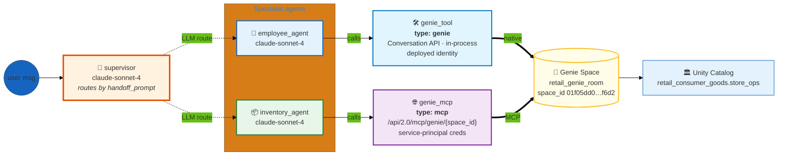

# Genie & Genie MCP — Two Paths to the Same Genie Space

> **Side-by-side reference for the two ways a dao-ai agent can reach Databricks Genie: the native `type: genie` tool (in-process Conversation API) vs. `type: mcp` (Genie's managed MCP server).** A supervisor routes between an `employee_agent` (Genie tool) and an `inventory_agent` (Genie MCP), *both wired to the same Genie space* — so the only variable is the transport.

| ✨ Feature | What this example shows |
|---|---|
| 🔀 **Two Genie transports, one space** | `employee_agent` uses `type: genie` (native, in-process); `inventory_agent` uses `type: mcp` against `…/api/2.0/mcp/genie/{space_id}`. Both resolve `retail_genie_room` (same `space_id`). |
| 👔 **Supervisor orchestration** | A single supervisor LLM routes each turn to one of two specialists based on their `handoff_prompt` descriptions. Hub-and-spoke, not a pipeline. |
| 🛠️ **First-class `genie` tool** | The employee path is `type: genie` — typed fields, no boilerplate. Talks to Genie over the Conversation API in-process using the deployed identity. |
| 🌐 **Managed Genie MCP** | The inventory path is `type: mcp` with a `genie_room` — dao-ai builds the managed MCP URL and calls Genie as an external MCP tool, authenticated with an explicit service principal. |
| 🔑 **Explicit SP creds on the MCP leg only** | `genie_mcp` wires `client_id` / `client_secret` / `workspace_host` from the `retail_consumer_goods` secret scope. The `genie` tool leg needs none — it rides the serving/App identity. |
| 🧩 **Config-only, no assets to provision** | No `data/` or `functions/` dir. The Genie space and its underlying tables are **prerequisites**, not created by deploy. `dao-ai agent up` just registers + serves. |
| 🤖 **Uniform model** | `databricks-claude-sonnet-4` for both specialists and the supervisor router; `on_behalf_of_user: false` everywhere. |

---

## Architecture

The supervisor fans out to two specialists. The interesting part is what happens *below* each specialist: identical intent (ask Genie a question against the retail space), two completely different call paths.



### The two transports, contrasted

Both legs answer the *same kind of question* against the *same Genie space*. What differs is how the SQL round-trip is made and who authenticates it.

| | 🛠️ `genie_tool` (employee_agent) | 🌐 `genie_mcp` (inventory_agent) |
|---|---|---|
| **YAML type** | `function.type: genie` | `function.type: mcp` |
| **How dao-ai wires it** | First-class `type: genie` with a `genie_room` | Builds `https://{host}/api/2.0/mcp/genie/{space_id}` and registers it as an MCP tool |
| **Where it runs** | In-process inside the agent; Genie **Conversation API** | Out-of-process call to Databricks' **managed Genie MCP server** |
| **Auth** | Deployed identity (App / serving SP); no creds in config | Explicit service principal — `client_id` / `client_secret` / `workspace_host` from the `retail_consumer_goods` secret scope |
| **Extra config** | Just `genie_room` | `genie_room` **+** three secret-backed credentials |
| **Reaches** | `retail_genie_room` → `space_id 01f05dd0…f6d2` | Same `retail_genie_room` → same `space_id` |

**Why both are in one example:** it isolates the transport. Because the Genie space is held constant, any difference you observe in traces, latency, or auth failures is attributable to the tool type — nothing else.

---

## Agents

| # | Agent | Model | Tool | Genie transport | Role |
|---|---|---|---|---|---|
| 1 | `employee_agent` | claude-sonnet-4 | `genie_tool` | **native** (`type: genie`) | Employee performance, task assignments, daily activities, workforce management. |
| 2 | `inventory_agent` | claude-sonnet-4 | `genie_mcp` | **MCP** (`type: mcp`) | Inventory levels, stock, product availability, reordering. |

The **supervisor** (`orchestration.supervisor`, `fast_llm` = claude-sonnet-4) reads each specialist's `handoff_prompt` and routes a turn to whichever one matches the user's intent. The specialists' prompts (`employee_prompt`, `inventory_prompt`) are registered in Unity Catalog under `retail_consumer_goods.store_ops` and instruct each agent to "use the genie tool to query the … database" — the routing target, not the transport, is what the supervisor decides.

The employee prompt names the tables it expects Genie to know about: `employee_daily_tasks`, `employee_performance`, and `employee_tasks` in `retail_consumer_goods.store_ops`. These must already be modeled in the Genie space.

---

## Why these design choices?

### Why point both agents at the *same* Genie space?
This example is a **transport comparison**, not a functional demo. Holding the space, the model, and the catalog constant means the `genie` vs. `mcp` distinction is the only independent variable — ideal for teaching which to reach for and for eyeballing the difference in MLflow trace spans.

### Why `type: genie` for one and `type: mcp` for the other?
- **`type: genie`** is the low-friction default: typed fields, one `genie_room` reference, no credentials, runs in-process over the Conversation API. Reach for it when the agent lives inside a dao-ai app that already has an identity.
- **`type: mcp`** is the interop path: it calls Genie through Databricks' *managed MCP server*, so the exact same capability is exposed the way any MCP-speaking client would consume it. Reach for it when you want MCP semantics (external clients, uniform tool surface, cross-system reuse) or need to pin a specific service principal.

### Why does only the MCP leg carry service-principal credentials?
The managed Genie MCP server is an external endpoint (`…/api/2.0/mcp/genie/{space_id}`), so the agent must present credentials to it — here a service principal pulled from the `retail_consumer_goods` secret scope. The native `genie` tool runs inside the agent process and uses the deployed identity (the App or serving service principal), so no extra secrets are declared.

### Why no `data/` or `functions/` directory?
Nothing here is a created asset. The Genie space (`01f05dd0…f6d2`) and its backing tables are **prerequisites** you point the config at. That is why deploy uses `dao-ai agent up` (register + serve) rather than `dao-ai workflow up` (which is for examples that also provision tables, UC functions, and Vector Search indexes).

---

## Deploy

### Prerequisites

- **Profile**: `DEFAULT` (or your equivalent) configured via `databricks configure`.
- **Genie space**: `space_id 01f05dd06c421ad6b522bf7a517cf6d2` exists and can answer questions about the `retail_consumer_goods.store_ops` employee/inventory tables. Override `parameters.genie_space_id` to use your own.
- **Underlying tables**: The employee/inventory tables the Genie space is built on already exist in `retail_consumer_goods.store_ops` (override `parameters.catalog` / `parameters.schema` as needed).
- **Secret scope** (for the MCP leg): `retail_consumer_goods` scope holds `RETAIL_AI_DATABRICKS_CLIENT_ID`, `RETAIL_AI_DATABRICKS_CLIENT_SECRET`, and `RETAIL_AI_DATABRICKS_HOST`. The service principal must have `CAN RUN` on the Genie space and `SELECT` on its tables.

### Provision + deploy

```bash
# Validate first (catches schema, anchor, and graph-construction errors)
DATABRICKS_CONFIG_PROFILE=DEFAULT uv run dao-ai validate \
  -c examples/15_complete_applications/genie_and_genie_mcp/genie_and_genie_mcp.yaml

# Generate + deploy + start the Databricks App (default --mode apps)
uv run dao-ai agent up \
  -c examples/15_complete_applications/genie_and_genie_mcp/genie_and_genie_mcp.yaml \
  -p DEFAULT
```

`agent up` registers the MLflow model (`retail_consumer_goods.store_ops.genie_and_genie_mcp_dao`), deploys the bundle, links the trace destination, and launches the App (`genie_and_genie_mcp_dao`). The model serving endpoint is named `dao_pepsi_genie_demo`; all `users` are granted `CAN_QUERY`.

### Verify

```bash
# App running
databricks --profile DEFAULT apps get genie_and_genie_mcp_dao

# Inspect the Genie MCP tool the inventory_agent will call
uv run dao-ai mcp tools \
  -c examples/15_complete_applications/genie_and_genie_mcp/genie_and_genie_mcp.yaml \
  -p DEFAULT
```

---

## Sample prompts

> ⚠️ **Illustrative only.** These are the examples embedded in each agent's `handoff_prompt` in the config — they show the *kind* of question that routes to each specialist. They are not validated against live data, and the exact answers depend on your Genie space's contents.

**Routes to `employee_agent` → `genie_tool` (native Genie):**
- "What tasks are assigned to John today?"
- "Show me employee performance metrics."
- "How is Sarah performing?"
- "Who completed the most tasks this week?"

**Routes to `inventory_agent` → `genie_mcp` (Genie MCP):**
- "What's the current inventory level?"
- "Do we have product X in stock?"
- "Show me low stock items."
- "What products need reordering?"

To confirm the transport split, pull the MLflow trace for a turn and check the tool span: the employee turn shows a `genie_tool` / Conversation-API span; the inventory turn shows an MCP tool span hitting `…/api/2.0/mcp/genie/{space_id}`.

---

## File layout

```
genie_and_genie_mcp/
├── README.md                    # this file
└── genie_and_genie_mcp.yaml     # dao-ai config — the whole example
```

No `data/` or `functions/` — the Genie space and its tables are prerequisites, not created assets.

---

## Related dao-ai patterns referenced

- **First-class `genie` tool** — `reference/dao_ai_first_class_tool_types`
- **Managed MCP tool types** (`genie` / `sql` / `vector-search` / `functions`) — `McpFunctionModel.mcp_url` in `src/dao_ai/config.py`
- **Supervisor orchestration** — other `examples/13_orchestration/` supervisor configs
- **Secret-backed service-principal auth** — `variables:` block with `scope` / `secret` options
