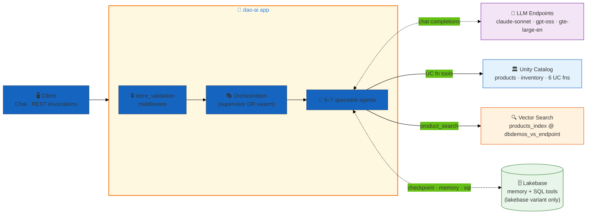
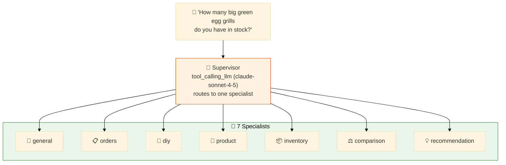
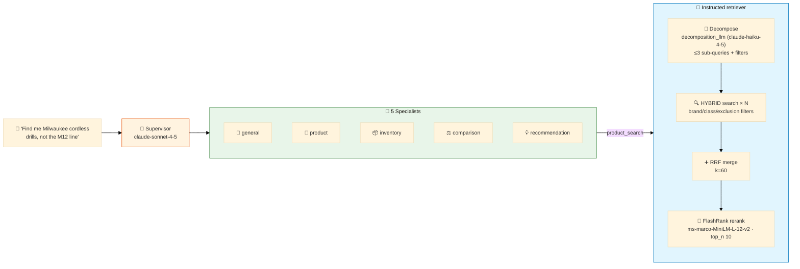
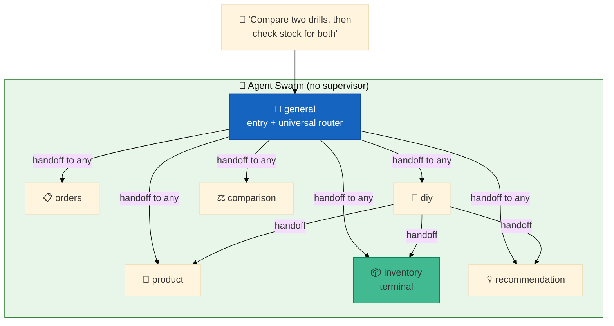
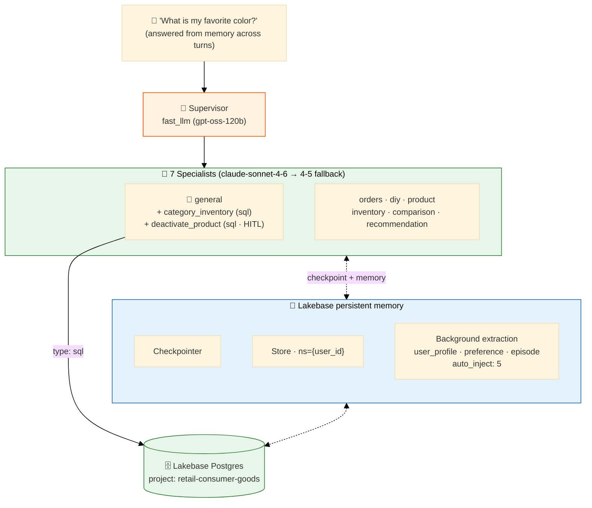

# Hardware Store — one retail assistant, four orchestration patterns

> **A home-improvement / hardware-store customer-service assistant, shipped as FOUR dao-ai config variants over a single shared data plane.** Every variant answers the same kinds of shopper questions (products, inventory, comparisons, DIY, orders) against the same two Unity Catalog tables, the same six UC SQL functions, and the same Vector Search index. What changes between variants is *how the agents are wired together* — a plain supervisor, an instructed-retrieval supervisor, a peer-to-peer swarm, and a Lakebase-backed persistent-memory supervisor. Pick the variant that matches the capability you want to demo; the data underneath never moves.

| ✨ Feature | Where it shows up |
|---|---|
| 👔 **Supervisor routing** | `hardware_store.yaml` — a routing LLM picks one of 7 specialists per turn |
| 🎯 **Instructed retrieval** | `hardware_store_instructed.yaml` — query decomposition → RRF merge → FlashRank rerank |
| 🐝 **Swarm handoffs** | `hardware_store_swarm.yaml` — agents hand off peer-to-peer, no central router |
| 🧠 **Lakebase persistent memory** | `hardware_store_lakebase.yaml` — checkpointer + store + background memory extraction |
| 🔁 **Fallback LLM chains** | `hardware_store_lakebase.yaml` — `claude-sonnet-4-6 → claude-sonnet-4-5` |
| ⚡ **Mixed-model assignment** | `hardware_store_lakebase.yaml` — `gpt-oss-120b` supervisor + `claude` workers |
| 🗄️ **`type: sql` Lakebase tools** | `hardware_store_lakebase.yaml` — parameterized SQL with HITL approval + signed audit |
| 📍 **MS trace persistence to UC** | `hardware_store.yaml` — service principal + experiment + `trace_location` |

---

## Variant comparison

| Variant | Config file | Orchestration | Agents | Distinctive feature |
|---|---|---|---|---|
| **Baseline supervisor** | `hardware_store.yaml` | 👔 Supervisor | 7 | Full Model-Serving trace persistence to UC (service principal + pinned experiment + `trace_location`); `llm_judge` guardrail defined |
| **Instructed retrieval** | `hardware_store_instructed.yaml` | 👔 Supervisor | 5 | Instructed retriever: HYBRID search + LLM query decomposition (3 sub-queries) + RRF (k=60) merge + FlashRank (`ms-marco-MiniLM-L-12-v2`) rerank; adds a fast Haiku decomposition LLM |
| **Swarm** | `hardware_store_swarm.yaml` | 🐝 Swarm | 7 | Peer-to-peer handoffs (no supervisor); `general` is entry + universal router, `inventory` is terminal; in-memory checkpointer + store |
| **Lakebase memory** | `hardware_store_lakebase.yaml` | 👔 Supervisor | 7 | Lakebase persistent checkpointer + store + background memory extraction (`user_profile`/`preference`/`episode`); fallback LLM chain; mixed models; `type: sql` tools with HITL + audit |

All four resolve to the same catalog/schema default: **`retail_consumer_goods.hardware_store`**.

---

## Architecture

Every variant is built from the same layers: a client hits the app, requests flow through validation middleware into an orchestration layer over 5–7 specialist agents, and the agents reach into Databricks (LLM endpoints, Vector Search, UC functions). The pieces that *differ* per variant are the orchestration layer and the memory/trace wiring — those are broken out in the per-variant topology subsections below.

### Shared system layers



**Shared across all four variants:**
- `store_validation` middleware (`dao_ai.middleware.create_custom_field_validation_middleware`) requires `store_num` on every request; `user_id` is optional. In the supervisor variants it wraps the supervisor; in the swarm it is applied swarm-wide so *every* agent enforces it.
- The `vector_search` tool (`product_vector_search_tool`) hits `products_index`, and the six UC functions back the SKU/UPC lookup tools.
- Every variant deploys the same two Delta tables and six UC functions (see [Data plane](#data-plane)).

### Baseline supervisor topology (`hardware_store.yaml`)



The routing LLM reads each agent's `handoff_prompt` and dispatches one specialist per turn. This variant is the only one wired for **Model-Serving trace persistence**: it pins a `service_principal` (client id/secret from the `retail_consumer_goods` secret scope), an existing MLflow `experiment.id`, and a `trace_location` that materializes the four OTEL Delta tables under the schema via a SQL warehouse. It also *defines* an `llm_judge` guardrail (though agents leave `guardrails: []`, so it is available to attach, not active by default).

### Instructed-retrieval topology (`hardware_store_instructed.yaml`)



This variant swaps the plain ANN retriever for an **instructed** one. The `product_search` tool takes a natural-language query, uses a fast Haiku model to decompose it into up to 3 filtered sub-queries (few-shot examples teach brand/category/exclusion filter translation), runs them as HYBRID searches, merges with Reciprocal Rank Fusion (`rrf_k: 60`), then reranks the merged set with a local FlashRank cross-encoder (`ms-marco-MiniLM-L-12-v2`) down to `top_n: 10`. It drops the `orders` and `diy` agents — this variant is focused on retrieval quality for product discovery, comparison, and recommendation. A `products_retriever_standard` (plain ANN) is also defined for side-by-side comparison but is not attached to a tool.

### Swarm topology (`hardware_store_swarm.yaml`)



There is no central router. `create_swarm()` gives each agent handoff tools built from the target agents' `handoff_prompt`s. Handoff wiring in the YAML:

- **`general`** (entry point, `default_agent`): `handoffs.general` is null → can hand off to **any** agent. It is the universal triage router.
- **`diy`**: can hand off only to `product`, `inventory`, and `recommendation` — a focused DIY → product-info → stock → suggestion workflow.
- **`inventory`**: `handoffs.inventory: []` → **terminal** agent, no outbound handoffs; it completes the conversation.
- Every other agent (unlisted) can hand off to any agent by default.

Memory here is **in-memory** (a `default_checkpointer` and `default_store` with no `database` block → type inferred as memory), namespaced by `{user_id}`. `store_validation` is applied swarm-wide.

### Lakebase-memory topology (`hardware_store_lakebase.yaml`)



This is the production-grade variant. The supervisor runs on the cheap/fast `gpt-oss-120b`; the seven workers run on `claude-sonnet-4-6` with an automatic fallback to `claude-sonnet-4-5` if the primary endpoint errors. A Lakebase (`retail-consumer-goods`) project backs both the checkpointer and the long-term store, and a **background memory-extraction** pass distills each turn into three structured schemas (`user_profile`, `preference`, `episode`), auto-injecting up to 5 relevant memories into agent prompts. The `general` agent additionally gets two first-class `type: sql` tools that run parameterized statements against Lakebase Postgres (details in [Data plane](#data-plane)).

---

## Agents

All variants draw from the same roster of specialist agents. Each agent's `prompt` opens with the `{user_id}` / `{store_num}` context block and a "use tools first" instruction; each `handoff_prompt` tells the router/swarm when to pick it.

| Agent | Role | Tools (baseline / lakebase) | In variants |
|---|---|---|---|
| **general** | General store info, policies, hours, services | `vector_search` (+ `category_inventory`, `deactivate_product` in lakebase; **none** in swarm) | all 4 |
| **orders** | Order tracking, delivery, cancellations, returns | none (no tools assigned) | baseline, swarm, lakebase |
| **diy** | How-to guidance, project & tool advice | `vector_search` | baseline, swarm, lakebase |
| **product** | Single-product details, specs, pricing | `find_product_by_sku_uc`, `find_product_by_upc_uc`, `vector_search` | all 4 |
| **inventory** | Stock levels, availability (terminal in swarm) | `find_inventory_by_sku_uc`, `find_inventory_by_upc_uc`, `vector_search` | all 4 |
| **comparison** | Side-by-side comparison of 2+ products | `vector_search`, `find_product_by_sku_uc` | all 4 |
| **recommendation** | Tailored product suggestions | `vector_search` | all 4 |

**Per-variant roster differences:**
- **Baseline / swarm / lakebase** ship all 7 agents.
- **Instructed** ships only 5 — it drops `orders` and `diy` to focus on retrieval-quality use cases (product, inventory, comparison, recommendation, general).
- **Swarm** gives `general` an empty tool list (`tools: []`) — it is pure triage/router and hands off to a tool-carrying specialist.
- **Lakebase** attaches the two `type: sql` tools to `general` only.
- The instructed variant's `vector_search` tool is named `product_search` and is backed by the instructed retriever; the other three use the plain ANN retriever.

---

## Data plane

**The data plane is identical across all four variants** — the same two Delta tables, six UC SQL functions, and one Vector Search index in **`retail_consumer_goods.hardware_store`**. Only the lakebase variant adds a *separate* Lakebase Postgres store on top (for memory + its two SQL tools).

### Schema layout

```
retail_consumer_goods.hardware_store/
├── 📊 Tables (2) — Delta, CLUSTER BY AUTO + enableChangeDataFeed
│   ├── products      ← VS source (description embedded); loaded from products.snappy.parquet
│   └── inventory     ← FK products.product_id;            loaded from inventory.snappy.parquet
│
├── 🛠️ UC Functions (6) — all READS SQL DATA, take ARRAY<STRING> keys
│   ├── find_product_by_sku(sku[])              → product rows
│   ├── find_product_by_upc(upc[])              → product rows
│   ├── find_inventory_by_sku(sku[])            → inventory joined to products
│   ├── find_inventory_by_upc(upc[])            → inventory joined to products
│   ├── find_store_inventory_by_sku(store, sku[]) → store-scoped inventory
│   └── find_store_inventory_by_upc(store, upc[]) → store-scoped inventory
│
└── 🔍 VS Index (1) — Delta-Sync on shared endpoint dbdemos_vs_endpoint (STANDARD)
    └── products_index ← source: products.description, primary_key product_id
```

### Table schemas

**`products`** — master catalog, `product_id BIGINT` PK:

| Column | Type | Notes |
|---|---|---|
| `product_id` | BIGINT | PK |
| `sku` | STRING | 5–8 alphanumeric internal code |
| `upc` | STRING | 12-digit barcode |
| `brand_name` | STRING | e.g. Milwaukee, DeWalt, Makita, Craftsman, Black+Decker, Ryobi, Bosch, Stanley, Husky |
| `product_name` | STRING | display name (often includes model numbers) |
| `merchandise_class` | STRING | e.g. Power Tools, Hand Tools, Paint, Plumbing, Electrical, Lumber, Hardware, Outdoor |
| `class_cd` | STRING | subcategory code |
| `description` | STRING | **embedded** into `products_index` |

**`inventory`** — stock + pricing + location, `inventory_id BIGINT` PK, `product_id` FK → `products`:

| Column | Type | Notes |
|---|---|---|
| `inventory_id` | BIGINT | PK |
| `product_id` | BIGINT | FK → products |
| `store` | STRING | store identifier |
| `store_quantity` | INT | on-hand at store |
| `warehouse` | STRING | backup warehouse id |
| `warehouse_quantity` | INT | on-hand at warehouse |
| `retail_amount` | DECIMAL(11,2) | price |
| `popularity_rating` | STRING | high/medium/low |
| `department` | STRING | store department |
| `aisle_location` | STRING | physical aisle |
| `is_closeout` | BOOLEAN | clearance flag |

Data is shipped as static Snappy parquet (`products.snappy.parquet`, `inventory.snappy.parquet`) and loaded at deploy against the `.sql` DDL — no runtime generation. The UC-function `test:` blocks exercise known keys (`sku: "00176279"`, `upc: "0017627748017"`, `store: "35048"`), so those values exist in the seed data.

### UC functions

All six are thin, safe `READS SQL DATA` table functions that accept `ARRAY<STRING>` keys (so an agent can batch multiple SKUs/UPCs in one call) and return typed rows. The `find_inventory_*` variants join `inventory` to `products` so the agent gets brand/name alongside stock; the `find_store_inventory_*` variants add a `store` filter for location-scoped lookups. The base config's tools only expose the four non-store functions; all six are deployed via `unity_catalog_functions:` in every variant.

### Lakebase Postgres store (lakebase variant only)

The lakebase variant adds a `retail_database` (Lakebase project `retail-consumer-goods`, SP auth, `on_behalf_of_user: false`) that backs the memory checkpointer/store *and* two `type: sql` tools:

- **`category_inventory`** — a read tool: `SELECT product_name, on_hand FROM inventory WHERE store_num = %(store_num)s AND category = %(category)s`. The LLM supplies `category`; `store_num` is bound server-side from the runtime `Context` (never exposed to the model). Demonstrates mixed LLM/context parameter sourcing.
- **`deactivate_product`** — a *mutating* tool: `UPDATE products SET active = false WHERE product_id = %(product_id)s`, guarded by `human_in_the_loop` (approve/reject) and an `audit` block that writes a signed receipt (identity + args + `trace_id`) to `audit_receipts`.

> These two tools target **Lakebase Postgres tables** (`inventory` with `store_num`/`category`/`on_hand`, `products` with an `active` flag), which are a different, illustrative schema from the UC Delta `products`/`inventory` above. They demonstrate the `type: sql` tool surface (parameter binding, HITL, audit) rather than querying the shared Delta plane.

---

## Why these design choices?

### Why four variants over one data plane?

Because the interesting variation in an agentic app is *orchestration and retrieval*, not the data. Holding the catalog, functions, and index fixed lets you compare patterns apples-to-apples: the same "how many Big Green Egg grills are in stock?" question exercises supervisor routing, swarm handoffs, instructed retrieval, and persistent memory without changing a single row. It also keeps deploy cost down — provision the data once, then stand up whichever agent topology you want to show.

### When would I pick each?

- **`hardware_store.yaml` (baseline supervisor)** — the default starting point. Clean hub-and-spoke routing, all 7 agents, and it is the reference for **getting MLflow traces to persist to Unity Catalog** from a Model-Serving endpoint (service principal + pinned experiment + `trace_location`). Start here, then layer on capabilities.
- **`hardware_store_instructed.yaml` (instructed retrieval)** — when **search quality** is the story. Decomposition + RRF + FlashRank meaningfully improves recall/precision on messy natural-language product queries with brand/category/exclusion intent ("Milwaukee cordless drills, not the M12 line"). Pick it for retrieval-heavy demos; it deliberately trims to 5 agents.
- **`hardware_store_swarm.yaml` (swarm)** — when you want to show **peer-to-peer collaboration** without a central router, or model a fixed workflow (DIY → product → inventory → recommendation) with a terminal agent. Good for illustrating handoff mechanics and autonomous agent behavior.
- **`hardware_store_lakebase.yaml` (Lakebase memory)** — the **production-shaped** variant. Persistent cross-session memory, background extraction, mixed-model cost control (cheap supervisor, capable workers), fallback chains for reliability, and governed mutating SQL with HITL + audit. Pick it when the demo needs to *remember* the user and survive endpoint hiccups.

### Why a fast supervisor + capable workers (lakebase)?

`gpt-oss-120b` is fast and cheap and only has to make a routing decision, so it drives the supervisor. The seven workers do the reasoning and tool work, so they get `claude-sonnet-4-6`. Spending the Claude budget where response quality matters — and only there — is more efficient than uniform Sonnet everywhere.

### Why a fallback LLM chain (lakebase)?

`tool_calling_llm` lists `fallbacks: [claude-sonnet-4-5]` under `claude-sonnet-4-6`. If the primary endpoint errors or is unavailable, the worker automatically retries on the fallback — reliability without changing agent code. (Per the config comment, the supervisor was intentionally reverted to `gpt-oss-120b` after an orchestration change made the earlier "multiple tool calls not supported" issue impossible to recur.)

### Why in-memory for swarm but Lakebase for the memory variant?

The swarm variant is demonstrating **handoff topology**, so it uses the zero-dependency in-memory checkpointer/store — nothing to provision. The lakebase variant is demonstrating **durable personalization**, which requires a real Postgres store so memories survive across threads and sessions.

---

## Deploy

Same commands for every variant — just change `-c <file>`. Set your Databricks profile once (the vault convention is `DEFAULT`).

### Validate

```bash
# Baseline supervisor
uv run dao-ai validate -c examples/15_complete_applications/hardware_store/hardware_store.yaml

# Instructed retrieval
uv run dao-ai validate -c examples/15_complete_applications/hardware_store/hardware_store_instructed.yaml

# Swarm
uv run dao-ai validate -c examples/15_complete_applications/hardware_store/hardware_store_swarm.yaml

# Lakebase memory
uv run dao-ai validate -c examples/15_complete_applications/hardware_store/hardware_store_lakebase.yaml
```

### Chat / visualize locally

```bash
# Interactive chat against any variant
uv run dao-ai chat -c examples/15_complete_applications/hardware_store/hardware_store_swarm.yaml

# Render the multi-agent graph to an image
uv run dao-ai graph -c examples/15_complete_applications/hardware_store/hardware_store.yaml -o hardware_store_architecture.png
```

### Deploy + provision

```bash
# Provision data + functions + VS index, register the model, launch the app
uv run dao-ai workflow up \
  -c examples/15_complete_applications/hardware_store/hardware_store.yaml \
  -p DEFAULT
```

`workflow up` provisions the shared data plane (creates the two tables and loads the parquet, deploys the six UC functions, creates the `products_index` Delta-Sync index on `dbdemos_vs_endpoint`), then registers the model and deploys the app. The lakebase variant additionally provisions the `retail-consumer-goods` Lakebase project for memory + SQL tools.

### Prerequisites

- **Profile**: `DEFAULT` (or equivalent) via `databricks configure`.
- **Vector Search endpoint**: `dbdemos_vs_endpoint` exists, or change `endpoint.name` in the config.
- **SQL Warehouse**: the baseline variant's `parameters.warehouse_id` (`d1be2f7fe7faacb1`) must point at a serverless warehouse for the OTEL trace-table DDL; override with `--param warehouse_id=...`.
- **Secret scope** (baseline + lakebase): `retail_consumer_goods` scope with keys `RETAIL_AI_DATABRICKS_CLIENT_ID` / `RETAIL_AI_DATABRICKS_CLIENT_SECRET` for the pinned service principal.
- Model endpoints are parameterized — override any default without editing the file, e.g. `--param llm=databricks-claude-sonnet-4-5`.

---

## Sample prompts

These are the exact examples shipped in [`examples.yaml`](./examples.yaml). Each sets `custom_inputs.configurable` to `thread_id: "1"`, `user_id: john_smith`, `store_num: 87887` (the `diy` example uses `store_num: 123`).

| Example key | Prompt | Exercises |
|---|---|---|
| `general_example` | *"Can you answer this general question about your billing process?"* | **general** agent |
| `orders_example` | *"Can you give me an update on my order. The order number is 12345"* | **orders** agent |
| `diy_example` | *"Can you tell me how to fix a leaky faucet?"* | **diy** agent (`store_num: 123`) |
| `product_example` | *"Can you give me information about the Big Green Egg grill?"* | **product** agent |
| `inventory_example` | *"How many big green egg grills do you have in stock?"* | **inventory** agent |
| `comparison_example` | *"Can you compare items with product ids 14523 and 25163"* | **comparison** agent |
| `recommendation_example` | *"Can you a stain color to go with my beige lawn furniture?"* | **recommendation** agent |
| `product_image_example` | *"Can you give me information about this item?"* + `doritos_upc.png` | product agent, **image/UPC input** |
| `comparison_image_example` | *"Can you compare these items?"* + `doritos_upc.png`, `lays_upc.png` | comparison agent, **multi-image input** |
| `favorite_color_is` | *"My favorite color is red?"* | **memory write** (swarm/lakebase) |
| `what_is_my_favorite_color` | *"What is my favorite color?"* | **memory recall** (swarm/lakebase) |

The `favorite_color_is` → `what_is_my_favorite_color` pair is the memory smoke test: run them in sequence on the same `user_id`/`thread_id` and the second should recall the answer from the first (in-memory for the swarm variant, durable Lakebase for the lakebase variant).

The `input_example` blocks in the configs offer variant-flavored one-liners too — e.g. the instructed variant's *"Find me Milwaukee cordless drills, not the M12 line"* showcases exclusion-filter decomposition.

---

## File layout

```
hardware_store/                              # shared use-case dir — 4 variants, one data plane
├── README.md                                # this file
├── hardware_store.yaml                      # 👔 baseline supervisor + MS trace persistence
├── hardware_store_instructed.yaml           # 🎯 instructed retrieval (decomp + RRF + FlashRank)
├── hardware_store_swarm.yaml                # 🐝 peer-to-peer swarm + in-memory store
├── hardware_store_lakebase.yaml             # 🧠 supervisor + Lakebase memory + fallback + sql tools
├── examples.yaml                            # sample prompts (source of the table above)
├── data/                                    # shared Delta tables — DDL + parquet
│   ├── products.sql   + products.snappy.parquet
│   └── inventory.sql  + inventory.snappy.parquet
└── functions/                               # shared UC SQL functions (6)
    ├── find_product_by_sku.sql
    ├── find_product_by_upc.sql
    ├── find_inventory_by_sku.sql
    ├── find_inventory_by_upc.sql
    ├── find_store_inventory_by_sku.sql
    └── find_store_inventory_by_upc.sql
```

---

## Related dao-ai patterns referenced

- **Supervisor orchestration** — the baseline and lakebase variants; see also `examples/13_orchestration/`
- **Swarm orchestration + handoffs** — `hardware_store_swarm.yaml`; `examples/13_orchestration/swarm_pattern.yaml`
- **Instructed retrieval (decomposition + RRF + rerank)** — `hardware_store_instructed.yaml`
- **Lakebase persistent memory + background extraction** — `hardware_store_lakebase.yaml`; parallels the commerce swarm memory model in `examples/15_complete_applications/commerce/`
- **`type: sql` tools with HITL + audit** — `hardware_store_lakebase.yaml`
- **MS trace persistence to UC** — `hardware_store.yaml` (`service_principal` + `experiment` + `trace_location`)
- **Sibling complete applications** — `commerce/`, `sporting_goods_store/`, `procurement_supplier_a2a/`