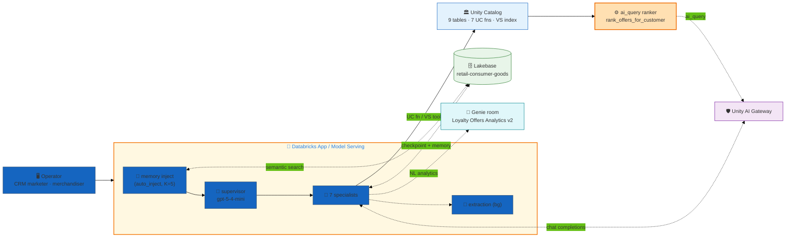
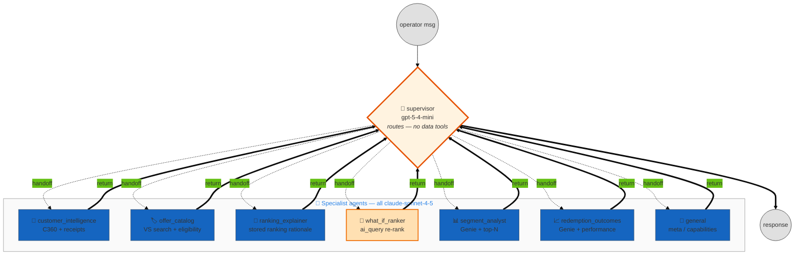
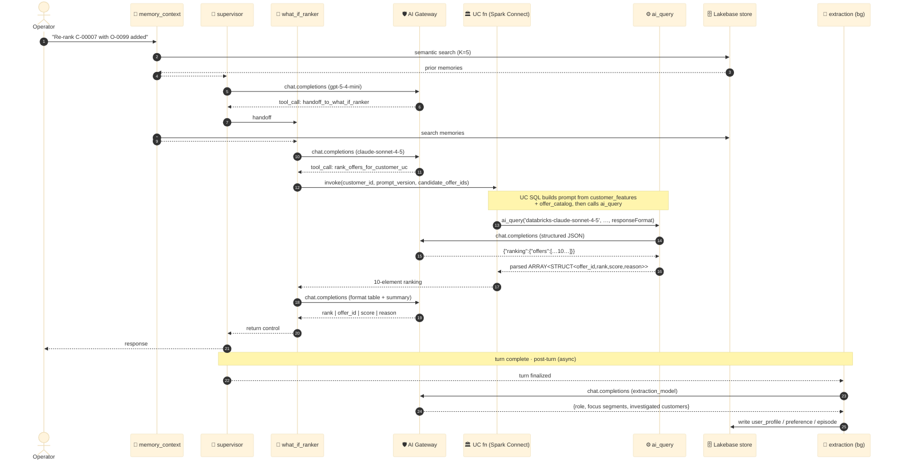
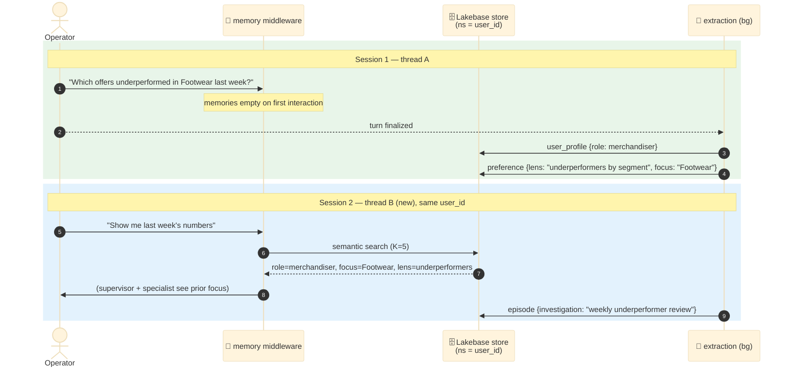
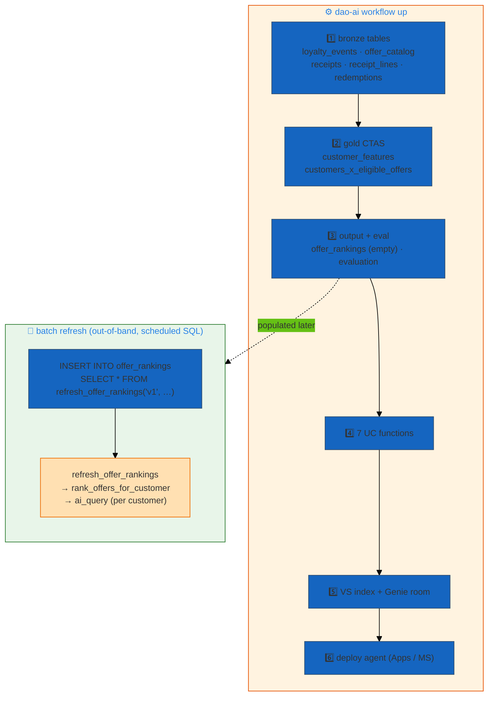

# Loyalty Offer Personalization — Receipt-Driven Offer Ranking Companion

> **A supervisor-routed operator companion for loyalty/CRM marketers and merchandisers who investigate, explain, and re-run LLM-ranked offer assignments across a ~40M-customer loyalty program.** Seven specialist agents sit behind a routing supervisor, backed by a Customer 360 built from receipts, an `ai_query`-powered offer ranker that is the *single source of truth* for the personalization prompt, a vector retriever over the offer catalog, a Genie room for cross-segment analytics, and Lakebase persistent memory that learns each operator's investigative habits.

| ✨ Feature | What this example shows |
|---|---|
| 🧭 **Supervisor routing** | A dedicated `fast_llm` supervisor reads each request and hands off to exactly one of 7 specialists via handoff tools. Specialists return control to the supervisor — a **hub-and-spoke** topology, not a pipeline. One handoff per turn; multi-specialist requests are chained across returns. |
| 🎯 **`ai_query` ranker as single source of truth** | `rank_offers_for_customer(...)` builds the personalization prompt inline and calls `ai_query('databricks-claude-sonnet-4-5', … responseFormat=STRUCT<…>)`. The **same UC function** powers the real-time what-if agent, the batch refresh job, and any external scoring surface — edit the prompt once, every surface picks it up. |
| 🧠 **Lakebase persistent memory** | Reuses the existing `retail-consumer-goods` Lakebase project for checkpointer + namespaced store + background extraction of `user_profile` / `preference` / `episode`. Learns each operator's segments, repeat-investigated customers, and preferred analytical lenses. |
| 🔍 **Instructed vector retriever** | Hybrid VS over `offer_catalog.description` with LLM query-decomposition (brand/category/discount/season filters lifted from natural language), LLM rerank, and a `ms-marco` cross-encoder rerank on top. |
| 💬 **One Genie room, two tool faces** | A single Genie space is exposed under two tool names (`query_segment_analytics`, `query_redemption_outcomes`) so the supervisor's routing heuristics can distinguish segment analytics from redemption outcomes. LRU + context-aware (semantic) caching on both. |
| 🛡️ **Unity AI Gateway** | `ai_gateway: true` on every chat endpoint — uniform governance, usage tracking, rate-limit pooling. Sonnet primary with a Sonnet-4-6 fallback. |
| 🎛️ **Mixed-model assignment** | `gpt-5-4-mini` for routing, query decomposition, rerank, and memory-query rephrasing; `claude-sonnet-4-5` for the 7 tool-calling specialists, memory extraction, the eval judge, and the `ai_query` ranker itself. |
| 🔒 **SP-backed everywhere it matters** | UC functions run SP-backed because `rank_offers_for_customer` calls `ai_query` via Spark Connect and the OBO token lacks the databricks-connect scope. Chat models are SP-backed so eager client construction at Model-Serving load time doesn't fail without a user token. |
| 📦 **20-resource budget discipline** | 7 UC fns + 1 Lakebase + 1 VS + 1 Genie + 3 dedup'd LLMs. Deliberate omissions (`refresh_offer_rankings` batch fn, `receipts`/`receipt_lines`/`customers_x_eligible_offers` from Genie) documented inline to stay under the Databricks Apps resource cap. |
| 🚀 **Dual deploy target** | The same config deploys to **Model Serving** (`--mode model_serving`) and **Databricks Apps** (`--mode apps`) — one `workflow up` per target. |

---

## Architecture

The system is built from a few interacting layers. Each diagram below is focused; together they describe the full picture.

### 1. System layers

Client → App (routing supervisor + memory middleware + 7 specialists) → AI Gateway, Lakebase, Unity Catalog (tables, UC functions, VS index), and the Genie room. The `ai_query` ranker is inside UC — the agents invoke it as a UC-function tool, and a batch job invokes it out-of-band.



**Wiring details that are easy to miss:**
- The `⚙️ ai_query ranker` is a **UC SQL function**, not a Python tool. When the `what_if_ranker` agent calls `rank_offers_for_customer_uc`, Unity Catalog runs the SQL, which itself issues `ai_query('databricks-claude-sonnet-4-5', …)` back through the gateway. So a single agent turn can cascade into a second, server-side LLM call inside the warehouse.
- The **Genie room is one physical space** but shows up as two tools. Both point at `*loyalty_genie_room`; the descriptions differ so the supervisor routes "top-N by segment" to `segment_analyst` and "did offer X lift redemption" to `redemption_outcomes`.
- Memory injection (`auto_inject: true`) fires **before** each specialist LLM call, prepending up to 5 stored memories; background extraction runs **after** the turn so it never blocks the response.

### 2. Supervisor topology

This is a **hub-and-spoke supervisor**, not a linear pipeline. The supervisor holds no data tools (only `app_info`) — its sole job is to emit exactly one `handoff_to_<specialist>` tool call. Specialists do their tool work and return control to the supervisor; multi-specialist requests are handled by chaining handoffs across returns.



**Wired in the YAML as `app.orchestration`:**
```yaml
app:
  agents:                       # the 7 specialists
  - *general
  - *customer_intelligence
  - *offer_catalog
  - *ranking_explainer
  - *what_if_ranker
  - *segment_analyst
  - *redemption_outcomes
  orchestration:
    memory: *memory             # Lakebase checkpointer + store + extraction
    supervisor:
      model: *fast_llm          # gpt-5-4-mini — routing only
      tools: [*app_info_tool]   # deliberately no data tools
      prompt: |
        ... emit exactly ONE handoff tool call per response ...
```

The supervisor prompt is explicit: **one handoff per response.** For a request like *"pull C-00007's profile AND explain why O-0001 should rank top-3,"* it routes to `customer_intelligence` first; when that specialist returns, the supervisor issues the next handoff to `ranking_explainer` with the prior result already in the conversation.

### 3. Per-turn execution lifecycle

The full sequence of a single operator turn — including the `ai_query` cascade that makes the what-if ranker distinctive.



**Observations:**
- The what-if turn produces **three foreground LLM calls**: the supervisor route, the specialist's tool-selection call, and the specialist's formatting call — plus a **fourth server-side LLM call** inside `ai_query`. That nested call is where the actual ranking happens.
- `rank_offers_for_customer` quotes the LLM's `reason` strings **verbatim**; the specialist prompt forbids editing them. The eval `factual_grounding` guideline enforces the same for stored rankings.
- Extraction is decoupled from the response path — it runs even if the operator closes the connection, and shows up as a separate span branch.

### 4. Personalization across sessions

Same `user_id`, new thread → the operator's investigative habits still apply. Extraction captures the operator's role, focus segments, repeat-investigated customers, and preferred analytical lenses.



**Three memory schemas extracted in the background** (`extraction.schemas`): `user_profile`, `preference`, `episode`. The extraction instructions target the operator's role (loyalty/CRM marketer, merchandiser, category manager, data scientist), the segments/categories they focus on, customers they investigate repeatedly, offer ids they reference often, and notable what-if runs or flagged offers.

### 5. Data provisioning + ranking refresh

`dao-ai workflow up` runs a provisioning DAG inside a Databricks Job: create the schema, load the 9 datasets (5 bronze + 2 gold CTAS + 1 output + 1 eval), create the 7 UC functions, provision the VS index and Genie room, then deploy the agent. The `offer_rankings` output table is **empty at deploy** — it is populated out-of-band by the batch refresh.



**Notes:**
- `customer_features` and `customers_x_eligible_offers` are **`CREATE OR REPLACE TABLE AS`** (CTAS) — their `*_data.sql` files are no-ops (`SELECT 1`); the DDL itself computes the rows from bronze. Dataset order matters: bronze first, then the gold tables that join over them.
- The batch refresh is a scheduled `INSERT` (see `refresh_offer_rankings.sql` header). For 40M customers, shard by `customer_id % N` and run shards in parallel; the fn filters to customers with `eligible_offer_count >= 10`.
- VS index (`offer_catalog_index`) syncs from `offer_catalog.description` on the shared `dbdemos_vs_endpoint`. `offer_catalog` and `offer_rankings` carry `delta.enableChangeDataFeed = true`.

---

## Agents

All seven specialists run on `claude-sonnet-4-5` (`*tool_calling_llm`, with a `claude-sonnet-4-6` fallback); the supervisor runs on `gpt-5-4-mini` (`*fast_llm`).

| # | Agent | Model | Tools | Role |
|---|---|---|---|---|
| — | `supervisor` | gpt-5-4-mini | `app_info` | Routing coordinator. No data tools. Emits exactly one `handoff_to_<specialist>` per turn; chains multi-specialist requests across returns. |
| 1 | `customer_intelligence` | claude-sonnet-4-5 | `get_customer_features_uc`, `get_recent_receipts_uc`, `query_segment_analytics` | Customer 360: profile (tier, RFM, brand/category prefs, price tolerance, redemption history) + recent receipts. Calls the two UC fns **in parallel**. |
| 2 | `offer_catalog` | claude-sonnet-4-5 | `offer_catalog_search` (VS), `check_offer_eligibility_uc` | Search the catalog by natural-language description (brand/category/discount/season) and check whether a customer is eligible for a specific offer. |
| 3 | `ranking_explainer` | claude-sonnet-4-5 | `get_offer_ranking_uc`, `get_customer_features_uc` | Explain a **stored** ranking: surface the LLM's per-offer `reason`/`score` verbatim, tie it back to concrete C360 features. Pulls features in parallel. |
| 4 | `what_if_ranker` | claude-sonnet-4-5 | `rank_offers_for_customer_uc`, `get_customer_features_uc` | Run a **fresh** LLM ranking now — optionally with a custom candidate pool. This is the surface that triggers the `ai_query` cascade. |
| 5 | `segment_analyst` | claude-sonnet-4-5 | `query_segment_analytics` (Genie), `top_offers_by_segment_uc` | Cross-segment analytics: top-N customers/offers, brand mix by tier, segment-level aggregates. UC fn for canned top-N, Genie for ad-hoc. |
| 6 | `redemption_outcomes` | claude-sonnet-4-5 | `query_redemption_outcomes` (Genie), `top_offers_by_segment_uc` | Post-hoc performance: did rankings drive redemption, which offers over/under-performed vs their rank position, lapsed-member behavior. |
| 7 | `general` | claude-sonnet-4-5 | `current_time`, `app_info` | Meta-questions, capability discovery, time-relative queries. Hands substantive requests back for routing. |

**Model assignment rationale:**
- **`gpt-5-4-mini`** (`fast_llm`) — routing, VS query-decomposition, VS rerank, and memory-query rephrasing. Fast, cheap, strong tool-call fidelity for structured triage work.
- **`claude-sonnet-4-5`** (`tool_calling_llm`) — the 7 specialists (multi-step reasoning over features + rankings + analytics), background memory extraction, the eval judge, and the `ai_query` ranker prompt. `claude-sonnet-4-6` is the declared fallback.
- **AI Gateway on every chat endpoint** — uniform governance, usage tracking, rate-limit pooling.

---

## Data plane

### Schema layout

```
retail_consumer_goods.loyalty_offers/
├── 📊 Bronze tables (5) — synthetic, seeded-random via range()
│   ├── loyalty_events        ← member lifecycle: ENROLL / TIER_CHANGE / VISIT …
│   ├── offer_catalog         ← 100 active offers (VS source: description)
│   ├── receipts              ← receipt headers (channel, basket_total, on_promo)
│   ├── receipt_lines         ← line items (sku, brand, category, discount)
│   └── redemptions           ← past redemptions (brand-biased to cohort top brand)
│
├── 🥇 Gold tables (2) — CREATE OR REPLACE TABLE AS (CTAS), no seed rows
│   ├── customer_features             ← Customer 360, one row/customer (RFM, prefs,
│   │                                    price_tolerance, redemption history)
│   └── customers_x_eligible_offers   ← per-customer candidate pool (≤30 offers,
│                                        tier + spend + validity filtered)
│
├── 📤 Output + eval (2)
│   ├── offer_rankings        ← EMPTY at deploy; filled by refresh_offer_rankings.
│   │                            ranking = ARRAY<STRUCT<offer_id,rank,score,reason>>
│   └── evaluation            ← 25 eval payloads
│
├── 🛠️ UC Functions (7)
│   ├── get_customer_features(customer_id)
│   ├── get_recent_receipts(customer_id, days)
│   ├── check_offer_eligibility(customer_id, offer_id)
│   ├── get_offer_ranking(customer_id, prompt_version)         ← reads stored ranking
│   ├── top_offers_by_segment(segment, window_days)
│   ├── rank_offers_for_customer(customer_id, prompt_version,  ← ⚙️ ai_query ranker
│   │                            candidate_offer_ids)
│   └── refresh_offer_rankings(prompt_version, model_endpoint) ← batch; NOT a tool
│
└── 🔍 VS index (1) — offer_catalog_index on dbdemos_vs_endpoint (STANDARD)
    └── source: offer_catalog.description (HYBRID search, num_results=40)
```

### Synthetic data overview

| Table | Rows | Notes |
|---|---|---|
| `loyalty_events` | ~10K enroll + ~20% tier-change | 10K customers `C-00001..C-10000`, enrolled 6mo–5yr ago. The `10000` in the DDL is the scaling knob. |
| `offer_catalog` | 100 | 10 named brands (Nike, Adidas, Lululemon, Patagonia, REI, Levis, GAP, JCrew, BananaRepublic, Puma) + `ALL_BRANDS` catalog-wide. Categories: Footwear, Activewear, Outerwear, Denim, Apparel-Tops/Bottoms, Accessories. Each offer carries `margin_class` (A/B/C), `discount_kind`, `eligibility_json`, validity window, `seasonal_tag`. |
| `receipts` | ~60K | `range(60000)` — ~6/customer over 18mo, channels STORE/ONLINE/APP, 35% on-promo. |
| `receipt_lines` | ~60K | One line/receipt; brand biased by `customer_id % 10` cohort so top-brand aggregations are realistic. |
| `redemptions` | ~15K | `range(15000)` — offer choice biased toward the cohort's top brand, so redemption history *correlates with* brand preference — the key signal the ranker should learn. |
| `customer_features` | ~10K (CTAS) | One row/customer: `loyalty_tier`, RFM (`visits_90d`, `aov`, `total_lifetime_spend`), `price_tolerance_score`, `top_brands`/`top_categories`, `redemptions_90d`, `promo_response_rate`. `avoided_*` arrays are empty placeholders. |
| `customers_x_eligible_offers` | ~10K (CTAS) | Per-customer eligible pool, capped at 30, affinity-sorted (brand → category → offer). Feeds the batch ranker. |
| `offer_rankings` | 0 at deploy | Partitioned by `prompt_version`. Populated by the batch refresh. |
| `evaluation` | 25 | Eval payloads for the MLflow eval run. |

Data is deterministic (seeded `rand()` calls) and generated in-warehouse — no external data files, no runtime generation.

### The `ai_query` ranker (single source of truth)

`rank_offers_for_customer(customer_id, prompt_version, candidate_offer_ids)` is the heart of the app. It:

1. Pulls the customer's `customer_features` row and the attributes of the candidate offers (from `offer_catalog`, filtered by `array_contains`).
2. Serializes both to JSON and builds a `<task>/<customer_profile>/<candidate_offers>` prompt **inline in SQL**.
3. Calls `ai_query('databricks-claude-sonnet-4-5', <prompt>, responseFormat => 'STRUCT<ranking: STRUCT<offers: ARRAY<STRUCT<offer_id, rank, score, reason>>>>', modelParameters => (temperature 0.1, max_tokens 1500))`.
4. Parses the structured JSON back into `ARRAY<STRUCT<offer_id: STRING, rank: INT, score: DOUBLE, reason: STRING>>` (exactly `least(size(candidates), 10)` elements). Each `reason` is one sentence citing the specific customer feature that drove the rank.

Because the prompt lives inline in this one function, **three surfaces share the exact same ranking logic**: the `what_if_ranker` agent (real-time, single customer), `refresh_offer_rankings(...)` (batch, all eligible customers via a JOIN over `customers_x_eligible_offers`), and any external real-time scoring endpoint. Edit the function → every surface updates. `refresh_offer_rankings` is intentionally **not** registered as an agent tool (it's the offline batch entrypoint), which also saves a slot against the Apps 20-resource cap.

---

## Why these design choices?

### Why a supervisor hub-and-spoke instead of a pipeline?

Operators ask heterogeneous questions ("who is this customer?", "why this ranking?", "re-run it", "how did it perform?"). There's no fixed linear flow — the right specialist depends entirely on intent. A routing supervisor that dispatches to one of seven specialists and lets them return matches that reality. The one-handoff-per-turn rule keeps traces clean and makes multi-specialist requests explicit (chained across returns) rather than letting the supervisor fan out uncontrollably.

### Why put the ranking prompt in a UC function calling `ai_query` instead of in the agent?

**Single source of truth across three surfaces.** The batch refresh (nightly, 40M customers), the interactive what-if agent, and any external scoring endpoint must produce identical rankings, or "why was this ranked here?" stops being answerable. Putting the prompt inline in one SQL function guarantees that. It also pushes the heavy per-customer LLM call into the warehouse where it can be sharded and scheduled, instead of into the agent runtime.

### Why one Genie room exposed as two tools?

A single space over `customer_features` + `redemptions` + `offer_catalog` + `offer_rankings` covers both analytics use cases. But the supervisor routes better when the *tool descriptions* are specialized: `query_segment_analytics` for cross-segment aggregates, `query_redemption_outcomes` for performance/lift. Two named tool faces over one room gives sharp routing without a second Genie resource.

### Why are receipts and the candidate-pool table hidden from Genie?

`receipts`/`receipt_lines` are the raw transactional source already aggregated into `customer_features`; exposing them adds little to cross-segment analytics and burns resource slots. `customers_x_eligible_offers` is an intermediate candidate pool consumed by the ranker, not an analytics surface. Dropping all three keeps the app under the Databricks Apps 20-resource budget (7 UC fns + 1 Lakebase + 1 VS + 1 Genie + 3 dedup'd LLMs).

### Why SP-backed functions and models (not OBO)?

`rank_offers_for_customer` calls `ai_query` via Spark Connect, and the on-behalf-of-user token lacks the `databricks-connect` scope — so it must be SP-backed. The other UC fns are SP-backed for consistency. Chat models are SP-backed because dao-ai eagerly constructs chat clients during graph build, and at Model-Serving load time there is no user token — OBO models fail with `model_serving_user_credentials auth: Unable to authenticate`. The vector store and embedding model *do* use OBO, since retrieval carries the caller's identity.

### Why an instructed retriever with decomposition + double rerank?

Operators describe offers in natural language ("high-discount outerwear this winter"). The instructed retriever lifts structured filters (`brand`, `category`, `discount_pct >=`, `seasonal_tag`) from the query text via `fast_llm` decomposition (up to 3 subqueries, RRF fusion `k=60`), then reranks — first an LLM rerank keyed on the customer's brand/category affinity and price tolerance, then a `ms-marco-MiniLM-L-12-v2` cross-encoder. The result is high-precision catalog search without the operator writing filters.

### Why mixed models?

`gpt-5-4-mini` is fast and cheap — right for routing, query decomposition, rerank, and memory rephrasing, which are all high-frequency and structured. `claude-sonnet-4-5` earns its cost on the specialists' multi-step reasoning and the ranking prompt where output quality drives the whole app. Spending the Sonnet budget where it moves the needle beats applying it uniformly.

---

## Deploy

### Prerequisites

- **Profile**: `DEFAULT` (or your equivalent) configured via `databricks configure`.
- **Secret scope**: `retail_consumer_goods` with `RETAIL_AI_DATABRICKS_CLIENT_ID`, `RETAIL_AI_DATABRICKS_CLIENT_SECRET`, and `RETAIL_AI_DATABRICKS_HOST`.
- **Service principal**: `retail_consumer_goods_sp` with `READ` on the scope and `USE_CATALOG` / `USE_SCHEMA` / `SELECT` / `EXECUTE` on the target catalog.
- **Lakebase project**: the existing `retail-consumer-goods` project (reused for memory — not created by this app).
- **Vector Search endpoint**: `dbdemos_vs_endpoint` exists (or change `endpoint.name`).
- **Genie parent path**: `genie_parent_path` folder exists in the workspace. The room is provisioned on first deploy (SP-backed); pass `--param genie_space_id=<id>` to reuse an existing space.
- **SQL Warehouse**: override `--var warehouse_id=<id>` for your workspace (default `d58e5fb998498840`).

### Validate

```bash
DATABRICKS_CONFIG_PROFILE=DEFAULT uv run dao-ai validate \
  -c examples/15_complete_applications/loyalty_offer_personalization/loyalty_offer_personalization.yaml
```

### Provision + deploy

This app ships `data/` + `functions/`, so use **`workflow up`** (it provisions the schema, tables, UC functions, VS index, and Genie room before deploying the agent — `agent up` does **not** provision). The same config targets both Model Serving and Databricks Apps; run one command per target:

```bash
# Deploy to Model Serving
uv run dao-ai workflow up \
  -c examples/15_complete_applications/loyalty_offer_personalization/loyalty_offer_personalization.yaml \
  -p DEFAULT --mode model_serving

# Deploy to Databricks Apps
uv run dao-ai workflow up \
  -c examples/15_complete_applications/loyalty_offer_personalization/loyalty_offer_personalization.yaml \
  -p DEFAULT --mode apps
```

After the first deploy, populate the rankings out-of-band so `ranking_explainer` and `redemption_outcomes` have data:

```sql
INSERT INTO retail_consumer_goods.loyalty_offers.offer_rankings
SELECT * FROM retail_consumer_goods.loyalty_offers.refresh_offer_rankings('v1', 'databricks-claude-sonnet-4-5');
```

### Verify

```bash
# Tables + functions created
databricks --profile DEFAULT tables list retail_consumer_goods loyalty_offers

# Model Serving endpoint READY
databricks --profile DEFAULT serving-endpoints get loyalty_offers_dao

# App running
databricks --profile DEFAULT apps get loyalty_offers_dao

# Iterate interactively
uv run dao-ai chat -c .../loyalty_offer_personalization.yaml -p DEFAULT
```

---

## Sample prompts

These come directly from `examples.yaml`. Each sets `custom_inputs.configurable.user_id` (e.g. `loyalty_marketer_01`, `merchandiser_01`) so memory namespaces per operator, and a `thread_id`.

#### `customer_intelligence` — Customer 360
- *"Tell me about customer C-00007. Pull their profile and recent purchases."*
- *"Who is C-00042 and what brands do they actually buy?"*

#### `offer_catalog` — catalog search + eligibility
- *"Find Nike running shoe offers that are still active and apply to Silver-tier members."*
- *"Show me high-discount offers (30% or more off) for outerwear this fall."*
- *"Is customer C-00007 eligible for offer O-0099?"*

#### `ranking_explainer` — explain a stored ranking
- *"Why was offer O-0007 ranked first for customer C-00007?"*
- *"What was the lowest-ranked offer for C-00100 and why?"*

#### `what_if_ranker` — fresh `ai_query` re-rank
- *"Add offer O-0099 to the candidate pool for C-00007 and re-rank."*
- *"Re-rank for customer C-00007 using their currently eligible offers."*

#### `segment_analyst` — cross-segment analytics
- *"Which 10 customers were most active in Footwear last 90 days?"*
- *"Which loyalty tier saw the highest redemption rate on offer O-0011?"*
- *"Brand mix by loyalty tier for the last 90 days?"*

#### `redemption_outcomes` — post-hoc performance
- *"Did the winter coat sale O-0083 lift redemption among lapsed members?"*
- *"Which offers underperformed last week relative to their ranking position?"*

#### `general` / routing
- *"What can you help me do as a loyalty marketer?"*

#### Chained / multi-specialist (supervisor chains handoffs across returns)
- *"Pull C-00007's profile and explain why offer O-0001 should rank in their top 3."*
- *"Build me a list of the top 5 customers most likely to redeem outerwear next month, and show their stored rankings."*

The app's default `input_example` is: *"Tell me about customer C-00007 and explain why offer O-0007 was ranked first for them."*

---

## File layout

```
loyalty_offer_personalization/
├── README.md                              # this file
├── loyalty_offer_personalization.yaml     # dao-ai config (994 lines)
├── examples.yaml                          # demo prompts (one per specialist)
├── data/                                  # 9 datasets — DDL + data pairs
│   ├── loyalty_events.sql       + _data.sql   # bronze: member lifecycle
│   ├── offer_catalog.sql        + _data.sql   # bronze: 100 offers (VS source)
│   ├── receipts.sql             + _data.sql   # bronze: ~60K receipt headers
│   ├── receipt_lines.sql        + _data.sql   # bronze: line items
│   ├── redemptions.sql          + _data.sql   # bronze: ~15K redemptions
│   ├── customer_features.sql    + _data.sql   # gold CTAS: Customer 360
│   ├── customers_x_eligible_offers.sql + _data.sql  # gold CTAS: candidate pool
│   ├── offer_rankings.sql       + _data.sql   # output: empty at deploy
│   └── evaluation.sql           + _data.sql   # 25 eval payloads
└── functions/                             # 7 UC SQL functions
    ├── get_customer_features.sql
    ├── get_recent_receipts.sql
    ├── check_offer_eligibility.sql
    ├── get_offer_ranking.sql              # reads stored ranking
    ├── top_offers_by_segment.sql
    ├── rank_offers_for_customer.sql       # ⚙️ ai_query ranker — single source of truth
    └── refresh_offer_rankings.sql         # batch refresh (not an agent tool)
```

---

## Related dao-ai patterns referenced

- **Supervisor orchestration** — `app.orchestration.supervisor` in this config; contrast the pipeline variant in `examples/15_complete_applications/commerce/commerce_supervisor.README.md`.
- **Lakebase memory** — `examples/15_complete_applications/hardware_store_lakebase.yaml`.
- **Instructed / decomposing retriever** — the `retrievers.offer_catalog_retriever.instructed` block here.
- **`ai_query` in a UC function** — `functions/rank_offers_for_customer.sql`.
- **Genie tool** — `examples/` Genie-room patterns; one room, two tool faces here.
- **AI Gateway** — `examples/01_getting_started/ai_gateway.yaml`.
</content>
</invoke>
