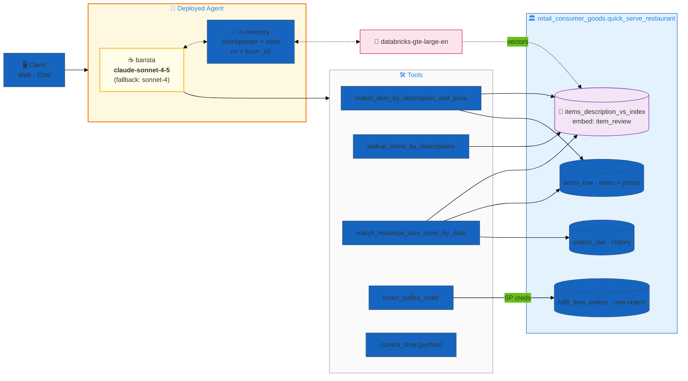
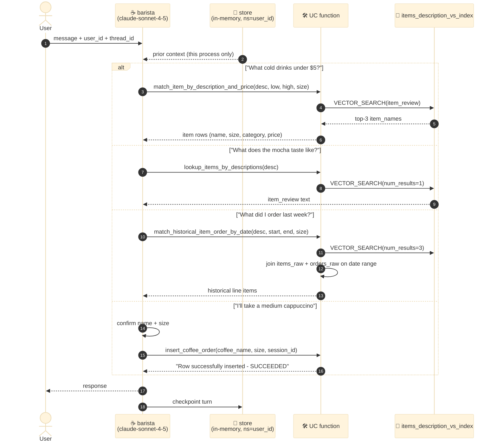
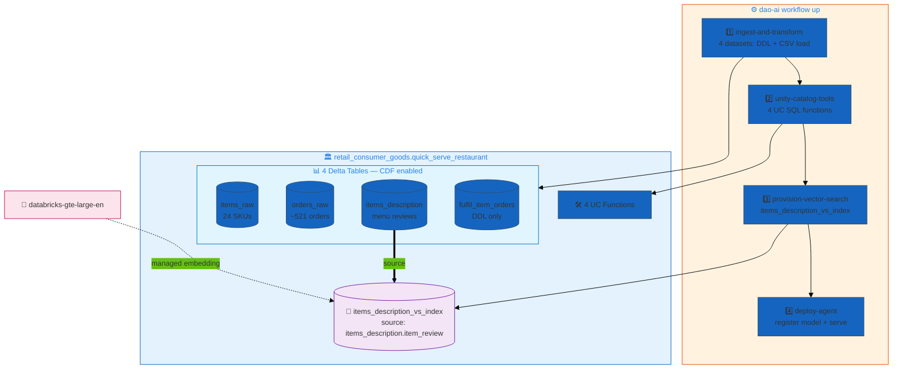

# Quick-Serve Restaurant — ☕ Coffee-Shop Barista Agent

> **A single-agent order-management assistant for a specialty coffee shop, built on dao-ai.** One `barista` agent — running `claude-sonnet-4-5` — discovers menu items by semantic search, describes drinks, processes orders, and pulls a customer's order history. Menu recall is powered by a single Vector Search index over human-written item reviews, and every data operation is a Unity Catalog SQL function the agent calls as a tool.

| ✨ Feature | What this example shows |
|---|---|
| 🐝 **Single-agent swarm** | `orchestration.swarm` with **one** agent (`barista`) as the `default_agent`. The swarm shape is used, but there is exactly one node — no multi-agent routing, no handoffs. The cleanest possible dao-ai app. |
| 🔎 **Vector Search over the menu** | One Delta index (`items_description_vs_index`) embeds the `item_review` column with `databricks-gte-large-en`. All three retrieval UC functions call `VECTOR_SEARCH(...)` directly inside SQL. |
| 🛠️ **UC-function tools** | Four `unity_catalog` tools (recommend / describe / order-history / place-order) plus one `python` tool (`current_time`). Tool docstrings live in the SQL `COMMENT`s — the LLM reads them verbatim to decide when to call each. |
| 🧠 **In-memory conversation state** | `checkpointer` + `store` are declared with **no database backend** (`type inferred as memory`). State lives for the life of the serving process, namespaced by `{user_id}`. The store's semantic layer uses the same `gte-large-en` embedding. |
| 🔐 **SP-backed order writes** | `insert_coffee_order` runs Python inside UC and needs a `WorkspaceClient`, so it takes `host` / `client_id` / `client_secret` as `partial_args` sourced from the `retail_consumer_goods` secret scope. The read-only tools are SP-backed by the serving identity. |
| ⚙️ **Data + functions provisioned by dao-ai** | `datasets:` (4 tables) and `unity_catalog_functions:` (4 SQL DDL files) are deployed by `dao-ai workflow up` — this app owns its schema end-to-end. |
| 🧪 **Built-in evaluation** | `evaluation:` block wires a `judge_llm` (`claude-sonnet-4-5`, temp 0.5) over a 25-example eval set written to `retail_consumer_goods.quick_serve_restaurant.evaluation`. |

> **Not present here** (called out so you don't go looking): no MCP tools, no Postgres/Lakebase-backed persistence (the `PGHOST`/`PGPORT`/`PGDATABASE` variables are declared but the memory config binds to neither), no multi-agent orchestration, and no `ai_gateway: true` on the models.

---

## Architecture

### 1. System shape

A client talks to one deployed agent. The `barista` calls UC-function tools, which in turn hit either the menu Vector Search index or the raw Delta tables. Conversation state is kept in-process.



**Wiring details that are easy to miss:**
- The three read tools (`match_item_by_description_and_price`, `lookup_items_by_descriptions`, `match_historical_item_order_by_date`) all resolve names through the **same** VS index — `VECTOR_SEARCH(...)` is embedded *inside* the SQL function body, then joined back to `items_raw` / `orders_raw` for price, size, and history. The agent never queries Vector Search directly; it goes through UC.
- `insert_coffee_order` is the only **write** path. It's a Python UC function that opens a `WorkspaceClient(host, client_id, client_secret)`, finds the "Shared Endpoint" warehouse by name, and `INSERT`s into `fulfil_item_orders`. Those three credentials come in as `partial_args` from the `retail_consumer_goods` secret scope — that's why the app declares `RETAIL_AI_DATABRICKS_*` environment vars.
- Memory is **not durable**. `default_checkpointer` and `default_store` have no `database:` block, so dao-ai infers the in-memory type. Restart the endpoint → conversation state resets.

### 2. Per-turn execution

A single agent means a single LLM node. Every turn is: inject in-memory context → LLM decides which UC tool(s) to call → synthesize → respond.



**Observations:**
- **One LLM call per reasoning step** — there is no supervisor / planner / composer split. The barista prompt itself contains the routing logic ("Use `match_item_by_...` when customers ask for recommendations…").
- `thread_id` arrives as `custom_inputs.configurable.thread_id`; the prompt surfaces it as **Session ID** and passes it into `insert_coffee_order` as `session_id`, so each fulfilled order is tagged with the conversation it came from.
- `user_id` drives the memory `namespace` (`namespace: "{user_id}"`) so different callers get isolated stores — but only within the process lifetime.

### 3. Data provisioning DAG

`dao-ai workflow up` stages a job that creates the schema, loads the 4 datasets, deploys the 4 UC functions, builds the VS index, then deploys the agent.



**Notes:**
- The VS index's **source table is `items_description`**, not `items_raw`. It embeds the long-form `item_review` narrative (great semantic recall), and the retrieval functions join the returned `item_name` back to `items_raw` for structured fields like price and size.
- `fulfil_item_orders` ships as **DDL only** — it's empty at deploy and populated at runtime by `insert_coffee_order`.
- All source tables set `delta.enableChangeDataFeed = true` so the index can sync incrementally.

---

## Agents

| # | Agent | Model | Tools | Role |
|---|---|---|---|---|
| 1 | `barista` | **claude-sonnet-4-5** (`temperature: 0.1`, `max_tokens: 8192`, fallback → `claude-sonnet-4`) | `match_item_by_description_and_price`, `lookup_items_by_descriptions`, `match_historical_item_order_by_date`, `insert_coffee_order`, `current_time` | The whole app. Discovers menu items, describes drinks, checks prices by range/size, processes orders, and retrieves order history. Routing logic lives inside the `barista_prompt`. |

**Model assignment:** `tool_calling_llm` (Claude Sonnet 4.5 at low temperature) is used for the agent because the whole job is high-fidelity tool selection + argument construction — pick the right UC function and fill `low_price` / `high_price` / `size` correctly. The `judge_llm` used by `evaluation:` is the same model at a higher temperature (0.5) for diverse scoring. Embeddings use `databricks-gte-large-en`.

**Prompt design:** `barista_prompt` is a first-class `prompts:` object (registered to `retail_consumer_goods.quick_serve_restaurant.barista_prompt`) rather than an inline string. It maps each customer intent to a specific tool, and hard-codes UX rules: always confirm **size** before ordering (pricing varies by size), use price-range filters when the customer states a budget, and follow up after every answer. `{user_id}` and `{thread_id}` are templated in at the top.

---

## Data plane

### Schema layout

```
retail_consumer_goods.quick_serve_restaurant/
├── 📊 Tables (4) — all Delta with CDF
│   ├── items_raw            ← 24 SKU rows (menu + price + size + category)
│   ├── orders_raw           ← ~521 historical order line items
│   ├── items_description    ← per-item long-form reviews (VS source)
│   └── fulfil_item_orders   ← DDL only; new orders written at runtime
│
├── 🛠️ UC Functions (4)
│   ├── match_item_by_description_and_price(description, low_price, high_price, size)
│   ├── lookup_items_by_descriptions(description)          → item_review
│   ├── match_historical_item_order_by_date(description, start, end, size)
│   └── insert_coffee_order(host, client_id, client_secret, coffee_name, size, session_id)
│
└── 🔎 VS Index (1) — endpoint: dbdemos_vs_endpoint (STANDARD)
    └── items_description_vs_index ← source: items_description.item_review · pk: item_name
```

### Synthetic data overview

| Table | Rows | Notes |
|---|---|---|
| `items_raw` | 24 | 14 distinct drinks/snacks across **3 categories** — Hot Drinks (14 rows), Cold Drinks (8), Snacks (2). Sizes: Medium / Large, or `N/A` for single-size items (Espresso, Flat White, sandwiches). Prices $2.15–$5.60. |
| `orders_raw` | ~521 | 2024 order history keyed by `item_id`, with `quantity`, `cust_name`, and `in_or_out` (dine-in `in` vs takeout `out`). |
| `items_description` | 14 items | Long-form narrative reviews (flavor / texture / aroma / origin) — the corpus embedded for menu semantic search. CSV is `multiLine` with `"`-escaping. |
| `fulfil_item_orders` | 0 at deploy | `uuid`, `coffee_name`, `size`, `order_timestamp` (default `current_timestamp()`), `session_id`. Written by `insert_coffee_order`. |

**Menu snapshot:** Cappuccino, Latte, Flat White, Caramel Macchiato, Espresso, Mocha, White Mocha, Hot Chocolate (Hot Drinks); Cold Coffee, Cold Mocha, Iced Tea, Lemonade (Cold Drinks); Ham & Cheese and Salami & Mozzarella sandwiches (Snacks).

---

## Why these design choices?

### Why a single-agent "swarm" instead of just an agent?

`orchestration.swarm` with one `default_agent` is the simplest valid dao-ai app: it exercises the full serving + memory + tool machinery without any routing complexity. It's the natural starting point before you add specialists — bolt on a `menu` agent and an `orders` agent later and the swarm shape already supports handoffs. Here, all the "routing" is prompt-internal, which keeps the whole app in one readable place.

### Why embed reviews, not menu rows?

`items_raw` is structured (name, SKU, size, price) — perfect for exact filters, terrible for "something sweet and cold." `items_description` holds paragraph-length flavor/texture/aroma text, which is what gives semantic search real recall on vague customer language. The retrieval functions get the best of both: `VECTOR_SEARCH` over reviews to find the *right item names*, then a SQL join back to `items_raw` for the *exact price and size*.

### Why put Vector Search inside SQL functions?

Wrapping `VECTOR_SEARCH(...)` in a UC function means the agent's tool surface is plain SQL functions with rich `COMMENT` docstrings — no bespoke retriever tool to configure, and price/size filtering happens in the same query as the semantic match. The `match_item_by_description_and_price` function filters `BETWEEN low_price AND high_price` and `item_size ILIKE size` right alongside the vector hit.

### Why is `insert_coffee_order` the only tool with credentials?

Reads run under the serving identity automatically. But the write path needs to run arbitrary Python (`WorkspaceClient` → `statement_execution`) inside UC, so it needs an explicit service-principal token. Those `host` / `client_id` / `client_secret` args are marked "automatically provided by the system context. Do not ask customers for this value." in the SQL comments and are injected via `partial_args` from the secret scope — the LLM never sees or fills them.

### Why in-memory state instead of Lakebase?

For a demo / workshop app, per-process memory is enough to show multi-turn context and per-user namespacing without provisioning a database. The Postgres variables (`PGHOST`, `PGPORT`, `PGDATABASE`) are declared so the config can be upgraded to a durable Lakebase checkpointer/store by adding a `database:` block — but as shipped, restarting the endpoint clears state. (See the `hardware_store_lakebase` example for the durable variant.)

---

## Deploy

### Prerequisites

- **Profile**: `DEFAULT` (or your equivalent) configured via `databricks configure`
- **Secret scope**: `retail_consumer_goods` with `RETAIL_AI_DATABRICKS_CLIENT_ID`, `RETAIL_AI_DATABRICKS_CLIENT_SECRET`, `RETAIL_AI_DATABRICKS_HOST` (backing `insert_coffee_order`)
- **Vector Search endpoint**: `dbdemos_vs_endpoint` exists (or change `resources.vector_stores.*.endpoint.name`)
- **SQL Warehouse**: a warehouse whose name contains `Shared Endpoint` (the `insert_coffee_order` Python looks it up by name); the config also pins `warehouse_id: 148ccb90800933a1` — update to your own

### Validate + deploy

```bash
# Validate first (schema + anchors + graph construction)
DATABRICKS_CONFIG_PROFILE=DEFAULT uv run dao-ai validate \
  -c examples/15_complete_applications/quick_serve_restaurant/quick_serve_restaurant.yaml

# Provision data + functions + VS index, then deploy the agent.
# Use `workflow up` (not `agent up`) because this app OWNS datasets: + unity_catalog_functions:.
uv run dao-ai workflow up \
  -c examples/15_complete_applications/quick_serve_restaurant/quick_serve_restaurant.yaml \
  -p DEFAULT
```

The config declares a Model Serving target — `app.registered_model` = `retail_consumer_goods.quick_serve_restaurant.quick_serve_restaurant_dao` and `app.endpoint_name` = `coffee_shop_agent_dao`, with `CAN_QUERY` granted to `users`. Choose the deploy target at the CLI:

```bash
# Databricks App (default)
uv run dao-ai agent up -c .../quick_serve_restaurant.yaml -p DEFAULT

# Model Serving endpoint (coffee_shop_agent_dao)
uv run dao-ai agent up -c .../quick_serve_restaurant.yaml --mode model_serving -p DEFAULT
```

> `agent up` deploys the agent only. Run `workflow up` first (or once) so the schema, tables, UC functions, and VS index exist.

### Verify

```bash
# Tables + functions created
databricks --profile DEFAULT tables list retail_consumer_goods quick_serve_restaurant
databricks --profile DEFAULT functions list retail_consumer_goods quick_serve_restaurant

# Endpoint (if deployed to Model Serving)
databricks --profile DEFAULT serving-endpoints get coffee_shop_agent_dao
```

---

## Sample prompts

Straight from [`examples.yaml`](./examples.yaml) — each sets `custom_inputs.configurable.thread_id` + `user_id`:

| Intent | Prompt | `user_id` | Tool expected |
|---|---|---|---|
| **Menu recommendation** | *"What cold coffee drinks do you have under $5?"* | `sarah_jones` | `match_item_by_description_and_price` (desc=cold coffee, high_price=5.0) |
| **Item description** | *"What does your caramel macchiato taste like? I want to know more about it before ordering."* | `mike_chen` | `lookup_items_by_descriptions` |
| **Place order** | *"I'd like to order a medium cappuccino please."* | `alex_rodriguez` | `insert_coffee_order` (coffee_name=Cappuccino, size=Medium) |
| **Order history** | *"What coffee orders did I place last week? I want to see my order history."* | `emma_wilson` | `match_historical_item_order_by_date` |

The config's `input_example` uses a simpler probe: *"How much is a green tea?"* with `user_id: my_user_id`.

Invoke a deployed endpoint:

```bash
databricks --profile DEFAULT serving-endpoints query coffee_shop_agent_dao --json '{
  "input": [{"role": "user", "content": "What cold coffee drinks do you have under $5?"}],
  "custom_inputs": {"configurable": {"thread_id": "1", "user_id": "sarah_jones"}}
}'
```

---

## File layout

```
quick_serve_restaurant/
├── README.md                          # this file
├── quick_serve_restaurant.yaml        # dao-ai config (single-agent swarm)
├── examples.yaml                      # 4 sample prompts (source for the table above)
├── data/                              # DDL + seed data (4 tables)
│   ├── items_raw.sql   + items_raw.csv          # 24 menu SKUs
│   ├── orders_raw.sql  + orders_raw.csv         # ~521 historical orders
│   ├── items_description.sql + items_description.csv  # review corpus (VS source)
│   └── fulfil_item_orders.sql                   # DDL only — runtime order sink
└── functions/                         # 4 UC SQL functions
    ├── match_item_by_description_and_price.sql
    ├── lookup_items_by_descriptions.sql
    ├── match_historical_item_order_by_date.sql
    └── insert_coffee_order.sql                  # Python UC fn — the write path
```

---

## Related dao-ai patterns referenced

- **Swarm orchestration** — `examples/13_orchestration/swarm_pattern.yaml`
- **UC-function tools** — `examples/03_tools/unity_catalog_tool.yaml`
- **Vector Search retriever** — `examples/03_tools/vector_search_tool.yaml`
- **Durable Lakebase memory (the upgrade path)** — `examples/15_complete_applications/hardware_store_lakebase.yaml`
- **Prompt registry objects** — `examples/02_prompts/`
