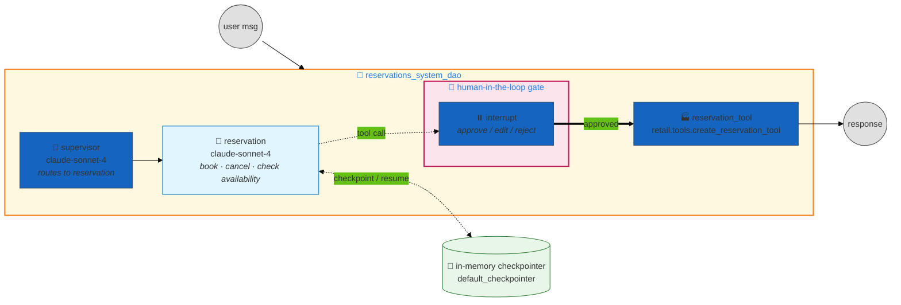

# Reservations System — Human-in-the-Loop Confirmation Demo

> **The smallest useful dao-ai app: one supervisor, one `reservation` agent, and a single tool that pauses for human approval before it commits.** This example exists to teach one thing clearly — how a `human_in_the_loop` block on a tool turns an ordinary agent call into an approve/edit/reject checkpoint, backed by an in-memory conversation checkpointer.

| ✨ Feature | What this example shows |
|---|---|
| 🧍 **Human-in-the-loop tool** | `reservation_tool` carries a `human_in_the_loop` block — the agent's call is **interrupted** and surfaced to a reviewer before it executes |
| 🧩 **Single-agent supervisor** | Supervisor orchestration with exactly one downstream agent (`reservation`) — the minimal shape of a dao-ai multi-agent app |
| 💾 **In-memory checkpointer** | `default_checkpointer` with no database → type inferred as **memory**. Required for HITL: the interrupt is persisted so the turn can resume after approval |
| 🏭 **Factory tool** | The tool is built by a factory function (`retail.tools.create_reservation_tool`), not UC/VS/Genie — no data or functions ship with this example |

---

## Architecture

No data assets, no Vector Search, no Lakebase. A user message enters the supervisor, which hands off to the single `reservation` agent; when that agent decides to call `reservation_tool`, the HITL middleware pauses the graph and waits for a human decision before the tool runs.



---

## Agents

| # | Agent | Model | Tools | Role |
|---|---|---|---|---|
| — | `supervisor` | `databricks-claude-sonnet-4` | — | Orchestration entry point. With a single downstream agent, its only routing target is `reservation`. |
| 1 | `reservation` | `databricks-claude-sonnet-4` | `reservation_tool` | Books, cancels, and checks availability for reservations. Its one tool is HITL-gated. |

Both the agent and the supervisor router run on `databricks-claude-sonnet-4` (`temperature: 0.1`, `max_tokens: 8192`).

---

## How the HITL confirmation works

This is the point of the example. The `reservation_tool` function block carries:

```yaml
tools:
  reservation_tool:
    name: reservation_tool
    function:
      type: factory
      name: retail.tools.create_reservation_tool
      human_in_the_loop:
        review_prompt: |
          Would you like to reserver your reservation?
```

When `human_in_the_loop` is present on a tool's `function`, dao-ai wires **LangChain's `HumanInTheLoopMiddleware`** onto the agent (`create_hitl_middleware_from_tool_models` in `dao_ai.middleware.human_in_the_loop`). At runtime:

1. The `reservation` agent decides to call `reservation_tool`.
2. Instead of executing immediately, the middleware raises a **LangGraph `interrupt`**. The graph pauses, and the `review_prompt` (`"Would you like to reserver your reservation?"`) is surfaced to the reviewer as the interrupt description.
3. The reviewer returns one of the allowed decisions. This config sets no `allowed_decisions`, so the model default applies: **`approve`, `edit`, `reject`**.
   - **approve** → the tool runs with the original arguments
   - **edit** → the reviewer modifies the arguments, then the tool runs
   - **reject** → the tool is skipped and the turn ends with feedback
4. On resume, the checkpointer replays state and execution continues from the interrupt.

**Why the in-memory checkpointer is not optional here.** The middleware requires a checkpointer to persist the paused turn between the interrupt and the human's decision. This app supplies one via `memory.checkpointer` (`default_checkpointer`, no database → inferred as memory), which also gives the conversation short-term state within a session. A `respond` decision and a tamper-evident `audit` block are both available on the model but are **not** configured in this example.

---

## Deploy

This app ships **no data, functions, or Vector Search**, so there is nothing to provision — use `dao-ai agent up` (not `workflow up`).

```bash
CONFIG=examples/15_complete_applications/reservations_system/reservations_system.yaml

# Validate first (schema + anchor + graph construction)
uv run dao-ai validate -c "$CONFIG"

# Bring it up as a Databricks App (default --mode apps)
uv run dao-ai agent up -c "$CONFIG" -p DEFAULT

# ...or deploy to a Model Serving endpoint instead
uv run dao-ai agent up -c "$CONFIG" --mode model_serving -p DEFAULT
```

The config registers the model as `nfleming.retail_ai.reservations_system_dao`, names the App `reservations_system_dao`, and (in Model Serving mode) targets endpoint `reservation_agent_dao`. Adjust the `catalog` / `schema` parameters for your workspace.

---

## Sample prompts

*Illustrative — derived from the agent prompt and the config's `input_example`; this example ships no validated prompt set.* Each prompt that reaches `reservation_tool` triggers the HITL interrupt described above.

| Prompt | Expected behavior |
|---|---|
| *"Can you create a reservation for me?"* | Routes to `reservation`; a booking tool call raises the approval interrupt |
| *"Book a table for two on Friday at 7pm."* | Same — pauses on the `review_prompt` before committing |
| *"Cancel my reservation."* | Cancellation flows through the same HITL gate |
| *"Do you have availability this weekend?"* | Availability check — may answer without triggering the confirmation interrupt |

The `input_example` passes `custom_inputs.configurable.user_id = john.smith@databricks.com`; `conversation_id` is auto-generated as a UUID when not supplied.

---

## File layout

```
reservations_system/
├── README.md                     # this file
└── reservations_system.yaml      # dao-ai config (whole app — ~88 lines)
```

No `data/`, `functions/`, or `examples.yaml` — everything the app needs is in the single YAML.

---

## Related dao-ai patterns referenced

- **HITL middleware** — `src/dao_ai/middleware/human_in_the_loop.py` (`HumanInTheLoopModel`, `create_hitl_middleware_from_tool_models`)
- **Audit receipts on HITL tools** — `src/dao_ai/middleware/audit_hitl.py` (the `audit` block, not used here)
- **A richer complete app** — `examples/15_complete_applications/commerce/commerce_supervisor.README.md`
