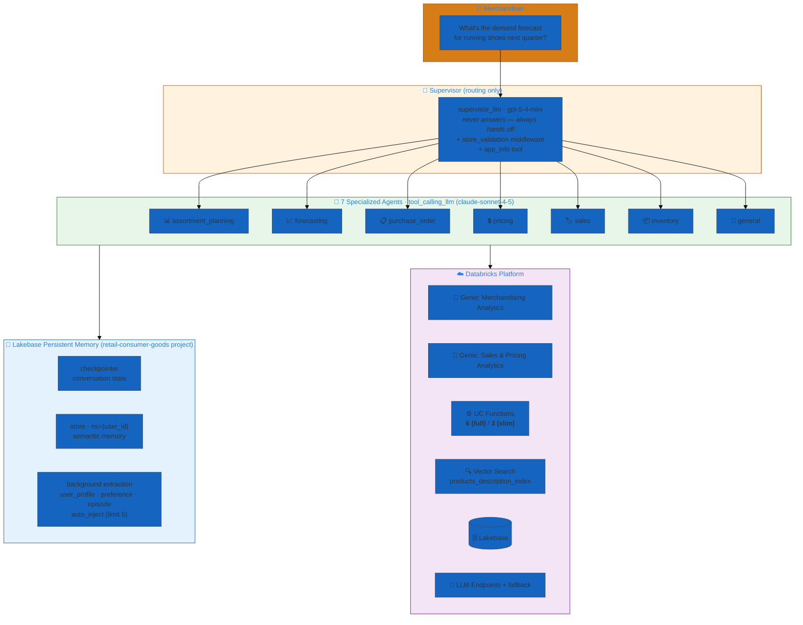
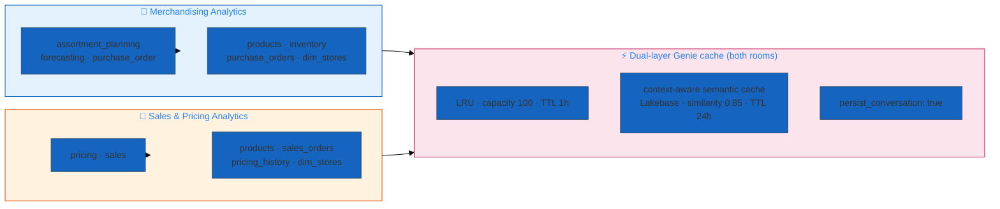

# Sporting Goods Store — Merchandiser 360 — one data plane, two orchestration profiles

> **A multi-agent merchandising assistant for a sporting-goods retailer (think Dick's / SportsPlex).** This directory ships **two dao-ai configs over one shared data plane**: a **full** build (`sporting_goods_store.yaml`) that auto-provisions its Genie rooms, runs OBO end-to-end, and adds a retrieval verifier + UPC-lookup coverage; and a **slim** build (`sporting_goods_store_slim.yaml`) that reuses pre-built Genie spaces, runs on a stable service principal, and trims the tool surface. Both are 7-agent **supervisor** systems with Lakebase persistent memory, two Genie analytics rooms, instructed vector search, and production monitoring. Pick the full config for a from-scratch provision on a fresh workspace; pick slim for a fast redeploy against infrastructure that already exists.

---

## Variant comparison

| | **Full** — `sporting_goods_store.yaml` | **Slim** — `sporting_goods_store_slim.yaml` |
|---|---|---|
| App name | `sporting_goods_store_dao` | `sporting_goods_store_slim` |
| Registered model | `sporting_goods_store_dao` | `sporting_goods_store_slim` |
| Endpoint name | `sporting_goods_store_dao` | `sporting_goods_store_dao` *(shared)* |
| Agents | 7 (supervisor + 7 specialists) | 7 (identical roster) |
| Genie rooms | 2 — **auto-provisioned** on first deploy (`table_sources`, `text_instructions`, `sample_questions` declared; `space_id` supplied at run time via the `provision-genie` taskValue) | 2 — **reuse existing spaces** by hardcoded `space_id` (no table sources / instructions / auto-provisioning) |
| UC functions wired | **6** — SKU **and** UPC variants of product / inventory / store-inventory lookups | **3** — SKU-only variants (`find_product_by_sku`, `find_inventory_by_sku`, `find_store_inventory_by_sku`) |
| Retrieval verifier | ✅ `verifier_llm` + retriever `verifier:` block (`warn_and_retry`, 1 retry) | ❌ no verifier model, no verifier block |
| Vector store auth | OBO — `on_behalf_of_user: true` | SP — `on_behalf_of_user: false`, `target_qps: 500` on endpoint |
| Warehouse auth | OBO — `on_behalf_of_user: true` | SP — `on_behalf_of_user: false` |
| `tables:` resource block | ✅ declared (needed to feed Genie auto-provisioning) | ❌ omitted |
| `genie_parent_path` param | ✅ (where new Genie spaces are created) | ❌ (spaces already exist) |
| Default `warehouse_id` | `d58e5fb998498840` | `4b9b953939869799` |

**What slim trims, in one sentence:** the machinery you only need the *first* time — Genie-space creation, the UPC lookup functions, the retrieval verifier, and per-user OBO — leaving a leaner config that redeploys fast against already-provisioned infrastructure. Everything downstream (prompts, memory, middleware, monitoring, evaluation, the 6-table dataset) is byte-for-byte identical between the two.

---

## Architecture

Both variants are the same shape: a routing **supervisor** that never answers directly, seven merchandising specialists, a Lakebase memory layer that wraps every turn, and a Databricks data plane (two Genie rooms, UC functions, vector search). The diagram below is the shared architecture; the two call-outs mark where the variants diverge.



**Where the variants differ on this diagram:**
- **Genie rooms** — Full declares `table_sources` + `text_instructions` + `sample_questions` and creates the spaces on first deploy (the `provision-genie` job task emits the `space_id` as a taskValue). Slim points `space_id` at spaces that already exist and skips creation.
- **UC Functions** — Full wires all 6 (SKU + UPC); slim wires the 3 SKU-only functions. This only changes which tools the `inventory` and `pricing` agents carry (see the Agents table).
- **Auth path** — Full runs the vector store and warehouse **on behalf of the calling user** (OBO); slim runs them under the `retail_consumer_goods_sp` service principal. Genie rooms, UC functions, and Lakebase are SP-backed (`on_behalf_of_user: false`) in **both**.

### Genie routing — two rooms, one job each

The two Genie rooms are the analytical backbone. They are deliberately split by concern so each specialist queries a focused semantic space.



---

## Agents

Seven specialists plus a routing supervisor, identical in both variants except for the tool lists on `inventory` and `pricing` (slim has no UPC-lookup functions). Every specialist runs the shared `tool_calling_llm` (`databricks-claude-sonnet-4-5`, with `databricks-claude-sonnet-4-6` as an automatic fallback); the supervisor runs the faster `supervisor_llm` (`databricks-gpt-5-4-mini`).

| Agent | Role | Tools (full) | Slim delta |
|---|---|---|---|
| **supervisor** | Routing coordinator. Explicitly instructed: *"You do NOT answer questions yourself… Always hand off. Never answer directly."* Carries `store_validation` middleware + `app_info`. | `app_info` | same |
| **assortment_planning** | Category mix, planogram strategy, seasonal transitions, SKU rationalization | `merchandising_analytics` (Genie), `product_vector_search` | same |
| **forecasting** | Demand prediction, trend/velocity analysis, stockout-risk assessment | `merchandising_analytics` (Genie), `current_time` | same |
| **purchase_order** | PO lifecycle, vendor management, reorder quantities, receiving | `merchandising_analytics` (Genie), `find_inventory_by_sku_uc` | same |
| **pricing** | Markdowns, promotions, competitive pricing, margin analysis, clearance | `sales_pricing_analytics` (Genie), `find_product_by_sku_uc`, `find_product_by_upc_uc` | drops `find_product_by_upc_uc` |
| **sales** | Performance analytics, revenue tracking, store comparisons, returns. Has `recursion_limit: 12` + explicit efficiency guidelines (one comprehensive Genie query, watch `cache_hit`) | `sales_pricing_analytics` (Genie), `find_inventory_by_sku_uc`, `product_vector_search` | same |
| **inventory** | Stock levels, replenishment, allocation, store-level availability | `find_inventory_by_sku_uc`, `find_inventory_by_upc_uc`, `find_store_inventory_by_sku_uc`, `find_store_inventory_by_upc_uc`, `product_vector_search` | drops both `_by_upc_uc` (keeps 3 tools) |
| **general** | Product info + store inquiries not owned by a specialist | `product_vector_search` | same |

Each specialist's prompt carries the same header (`User Id`, `Store Number`), a responsibilities section, explicit tool-usage guidance, and a response-style section. All seven prompts are first-class `prompts:` objects tagged `environment: production`, `domain: merchandising`, and registered to the `sporting_goods_store` schema. Every agent's `handoff_prompt` is a one-line description the supervisor routes against.

---

## Data plane (shared by both variants)

Both configs point at **`retail_consumer_goods.sporting_goods_store`** in Unity Catalog and provision the identical dataset, functions, and vector index. This section is written once because nothing here differs between full and slim.

### Schema layout

```
retail_consumer_goods.sporting_goods_store/
├── 📊 Tables (6) — Delta, CDF + auto-optimize enabled
│   ├── products          ← 30 rows · VS source (long_description embedded)
│   ├── inventory         ← 24 rows · per-product × store snapshot
│   ├── dim_stores        ← 5 rows  · store dimension
│   ├── sales_orders      ← 15 rows · transaction line items
│   ├── purchase_orders   ← 10 rows · PO line items
│   └── pricing_history   ← 15 rows · price-change events
│
├── 🛠️ UC Functions (6 defined; full wires all 6, slim wires 3)
│   ├── find_product_by_sku(sku ARRAY<STRING>)              ← slim ✅
│   ├── find_product_by_upc(upc ARRAY<STRING>)              ← slim ✗
│   ├── find_inventory_by_sku(sku ARRAY<STRING>)            ← slim ✅
│   ├── find_inventory_by_upc(upc ARRAY<STRING>)            ← slim ✗
│   ├── find_store_inventory_by_sku(store, sku ARRAY<STRING>) ← slim ✅
│   └── find_store_inventory_by_upc(store, upc ARRAY<STRING>) ← slim ✗
│
└── 🔍 VS index — products_description_index
    └── source: products.long_description · pk: product_id
        endpoint: dbdemos_vs_endpoint (STANDARD)
```

### Tables

| Table | Rows | What it holds |
|---|---|---|
| `products` | 30 | Master catalog: `sku`, `upc`, `brand_name`, `merchandise_class`, `department_name`, `sport_category`, `base_price`/`msrp`/`cost`, seasonal + merchandising + supplier + lifecycle attributes, and a rich `long_description` (the VS embedding source). |
| `inventory` | 24 | Per-product × store stock: `store_quantity`, `warehouse_quantity`, `stockout_risk_level`, `is_out_of_stock`/`is_low_stock`, demand predictions, `aisle_location`. |
| `dim_stores` | 5 | Store dimension: SportsPlex Denver flagship, Austin South, Chicago North, Portland Pearl, Orlando outlet — with region/district hierarchy, format, sqft, department flags. |
| `sales_orders` | 15 | Sales line items: `qty`, `unit_price`, `discount_amount`, `margin_amount`/`margin_pct`, `channel` (in_store/online/mobile_app), `is_return`. |
| `purchase_orders` | 10 | PO line items: `supplier_name`, `quantity_ordered`/`received`, `po_status` (draft→received→cancelled), `expected`/`actual_delivery_date`, `buy_plan_id`, `buyer_name`. |
| `pricing_history` | 15 | Price-change events: `original_price`/`new_price`, `price_change_type` (initial/markdown/clearance/promotion/competitive/rollback), `markdown_pct`, `promotion_name`, `effective_date`/`end_date`. |

All tables carry `delta.enableChangeDataFeed = true` so the Vector Search Delta-Sync and downstream analytics stay incremental. The catalog/schema come from `parameters.catalog` / `parameters.schema` and can be overridden with `--param`.

### Catalog & brands

The synthetic catalog spans athletic footwear, apparel, team sports, fitness equipment, outdoor/camping, cycling, golf, and accessories — across 21 brands: **Nike, Adidas, Under Armour, New Balance, Patagonia, The North Face, Columbia, Wilson, Spalding, Coleman, YETI, Osprey, Trek, Giro, Oakley, Garmin, Hydro Flask, Callaway, Lululemon, Bowflex, Rogue Fitness**. SKUs follow a `AAA-AAA-999` pattern (e.g. `NKE-RUN-001`); store identifiers are `DEN-FLAG`, `AUS-SOUTH`, `CHI-NORTH`, `PDX-PEARL`.

### UC functions

All six functions take an `ARRAY<STRING>` of SKUs or UPCs (so a single call can look up many products) and return a typed `TABLE`. The `find_store_inventory_by_*` pair additionally take a `store` argument and are the store-scoped lookups the `inventory` agent uses once `store_num` is known. Function comments steer the agent explicitly — e.g. *"Use product_vector_search to find SKUs first if you only know product descriptions… For broad inventory queries without specific SKUs, use the Genie analytics tool instead."* Each function is registered with a smoke test (`sku: ["NKE-RUN-001"]`, `store: "DEN-FLAG"`) that runs during provisioning.

### Instructed vector search

`products_retriever` wraps `products_description_index` with the instructed-retrieval stack (identical in both variants except full adds the `verifier` sub-block):

- **Hybrid search** — `query_type: HYBRID`, `num_results: 50`
- **Query decomposition** — up to 3 sub-queries via `decomposition_llm`, merged with Reciprocal Rank Fusion (`rrf_k: 60`), filter case normalized to uppercase. Ships five worked filter examples (e.g. `"Nike running shoes"` → `{brand_name: NIKE, sport_category: RUNNING, merchandise_class: FOOTWEAR}`).
- **LLM rerank** — domain instructions (boost specified brands, prefer exact `sport_category`, honor price sensitivity), `top_n: 10`
- **Verifier (full only)** — `verifier_llm`, `on_failure: warn_and_retry`, `max_retries: 1`
- **Cross-encoder rerank** — `ms-marco-MiniLM-L-12-v2`, `top_n: 20`

### Memory (Lakebase)

Both variants share the same `memory:` block, backed by the **`retail-consumer-goods`** Lakebase project (`on_behalf_of_user: false` — SP-backed):

- **checkpointer** — durable conversation state
- **store** — semantic memory namespaced per user (`namespace: "{user_id}"`), embedded with `databricks-gte-large-en`
- **extraction** — background extraction into three schemas (`user_profile`, `preference`, `episode`), `auto_inject: true` (limit 5), `background_extraction: true`. Extraction runs on `tool_calling_llm`; the memory-search query is rephrased by `fast_llm`. Instructions target the user's name/role/focus areas, preferred categories/brands, stores managed, and notable pricing/buying/assortment decisions.

---

## Why these design choices?

### When to use full vs slim

| Pick **full** when… | Pick **slim** when… |
|---|---|
| Deploying to a **fresh workspace** with no Genie spaces yet — it creates them for you and emits the `space_id`s | The Genie spaces (and the rest of the infra) **already exist** and you just want a fast redeploy |
| You want **per-user (OBO) governance** on catalog reads and Genie — each merchandiser's queries run under their own identity/permissions | You want a **stable service-principal** identity for predictable auth (no OBO token plumbing) |
| You need **UPC lookups** (barcode-driven flows) alongside SKU | Your flows are **SKU-only** and you want a leaner tool surface |
| You want the extra **retrieval verifier** guardrail on VS results | You're optimizing for latency/cost and accept VS results without the verifier pass |

Because both write to the **same schema, same dataset, same Genie rooms**, you can provision once with the full config, capture the emitted Genie `space_id`s, drop them into the slim config's parameter defaults, then iterate with slim from then on. The two apps have distinct app + registered-model names, so they can coexist in one workspace.

### Why a routing-only supervisor?

The supervisor prompt is emphatic that it holds **no tools and no data** and must hand off every request. This keeps routing cheap (it runs the fast `gpt-5-4-mini`) and keeps every substantive answer inside a specialist whose prompt, tools, and monitoring guidelines are purpose-built for that merchandising function. The only tool it carries is `app_info` (self-description / capability discovery).

### Why split Genie into two rooms?

Merchandising analytics (assortment, demand, POs, category performance over `products`/`inventory`/`purchase_orders`) and sales-&-pricing analytics (revenue, margin, promo lift over `sales_orders`/`pricing_history`) are different question spaces with different join patterns and text instructions. Two focused rooms give Genie tighter grounding than one catch-all room, and each room carries its own dual-layer cache.

### Why dual-layer Genie caching?

Each Genie tool wraps an **LRU cache** (100 entries, 1h TTL) *and* a **context-aware semantic cache** (Lakebase-backed, 0.85 similarity, 24h TTL), both with `invalidate_on_empty_result: true` and `persist_conversation: true`. The LRU catches exact repeats; the semantic layer catches paraphrases. The `sales` prompt even teaches the model to watch `cache_hit`/`consecutive_cache_hits` and call the feedback tool to break a stale-cache loop — a runtime signal, not a config toggle.

### Why the store-number middleware?

`store_validation` (`create_custom_field_validation_middleware`) sits on the supervisor and requires a `store_num` (example `DEN-FLAG`) before inventory/sales lookups run, so store-scoped queries resolve to the correct location. `user_id` is captured too (optional) to key the Lakebase memory namespace.

### Why mixed models + a fallback?

`gpt-5-4-mini` (fast, cheap) handles routing, decomposition, verification, and memory-query rephrasing; `claude-sonnet-4-5` handles the tool-calling specialists where reasoning quality matters, with `claude-sonnet-4-6` wired as an automatic fallback so a single endpoint hiccup doesn't drop the turn.

---

## Deploy

Both configs carry a `datasets:` block and `unity_catalog_functions:` block, so the **workflow** bundle is the right entry point — it stands up the schema, loads the six tables, deploys the UC functions, provisions Vector Search + Lakebase (+ Genie spaces for the full variant), deploys the agent as a Databricks App, and runs evaluation, all as one Databricks Job DAG. Substitute `sporting_goods_store_slim.yaml` in any command below to operate the slim variant.

### Prerequisites

- **Profile** configured (e.g. `DEFAULT`) via `databricks configure`
- **Secret scope** `retail_consumer_goods` with `RETAIL_AI_DATABRICKS_CLIENT_ID`, `RETAIL_AI_DATABRICKS_CLIENT_SECRET`, `RETAIL_AI_DATABRICKS_HOST` (env-var fallbacks are declared)
- **Vector Search endpoint** `dbdemos_vs_endpoint` exists (or change `endpoint.name`)
- **SQL Warehouse** — override `--param warehouse_id=<id>` for your workspace (defaults differ per variant)
- **Slim only** — the two Genie spaces must already exist; set `--param merchandising_genie_space_id=…` / `--param sales_pricing_genie_space_id=…` (or edit the defaults)

### Validate

```bash
# Full
uv run dao-ai validate -c examples/15_complete_applications/sporting_goods_store/sporting_goods_store.yaml

# Slim
uv run dao-ai validate -c examples/15_complete_applications/sporting_goods_store/sporting_goods_store_slim.yaml
```

### Chat locally

```bash
uv run dao-ai chat -c examples/15_complete_applications/sporting_goods_store/sporting_goods_store.yaml
```

### Visualize the graph

```bash
uv run dao-ai graph \
  -c examples/15_complete_applications/sporting_goods_store/sporting_goods_store.yaml \
  -o sporting_goods_architecture.png
```

### Provision + deploy (workflow)

```bash
# Full — provisions everything incl. Genie spaces, then deploys the App
uv run dao-ai workflow up \
  -c examples/15_complete_applications/sporting_goods_store/sporting_goods_store.yaml \
  -p DEFAULT

# Slim — reuses existing Genie spaces; pass the space IDs if not baked into defaults
uv run dao-ai workflow up \
  -c examples/15_complete_applications/sporting_goods_store/sporting_goods_store_slim.yaml \
  -p DEFAULT
```

`dao-ai workflow up` = `generate → deploy → run` for the provisioning job. Use `workflow generate` / `deploy` / `run` for granular control, and `workflow destroy` to tear it down. To deploy the agent alone (without re-provisioning data), use the `agent` verb group (`dao-ai agent up … --mode apps` for a Databricks App, `--mode model_serving` for a serving endpoint). Both variants target Databricks **Apps** (`enable_chat_proxy: true`, `permissions: CAN_QUERY` for `users`); the shared `endpoint_name` means a Model-Serving deploy of one variant would reuse the `sporting_goods_store_dao` endpoint name.

---

## Sample prompts

Grounded in the two configs' `app_info` sample prompts and the evaluation `question_guidelines`. Personas map to the supervisor's routing targets; queries reference real brands/SKUs/stores from the catalog.

### Quick start (from `app_info` sample_prompts — identical in both variants)

- "What Nike running shoes do we carry?"
- "What's the demand forecast for running shoes next quarter?"
- "Show me open purchase orders from Nike"
- "What are our margin targets for footwear?"
- "How are trail running shoes performing this month?"
- "What's the stock level on SKU NKE-RUN-001?"

### By specialist (from the evaluation persona guidelines)

| Agent | Prompt | Persona |
|---|---|---|
| **assortment_planning** | "Plan the fall assortment transition for outdoor gear" | Merchandiser |
| **forecasting** | "What is the demand forecast for camping equipment this summer?" | Demand planner |
| **purchase_order** | "Which purchase orders are overdue from Nike?" | Buyer |
| **pricing** | "What markdowns should we take on winter outerwear?" · "How did the Spring Running promotion perform on Nike Pegasus?" | Pricing analyst |
| **sales** | "Compare sales performance between Denver flagship and Portland stores" · "Show me the top 10 selling products by revenue this month" | Store manager |
| **inventory** | "What products have critical stockout risk across our stores?" · "What is our current inventory position on Adidas Ultraboost?" | Store manager |
| **general** | "What products do we carry for basketball?" | Any |

Every chat/eval turn supplies `custom_inputs.configurable` with `user_id: merchandiser_01` and `store_num: DEN-FLAG` (the `store_validation` middleware requires `store_num`).

---

## Monitoring & evaluation (shared)

Both variants ship identical production monitoring and evaluation:

- **Monitoring** — built-in scorers `safety`, `completeness`, `relevance_to_query`, `tool_call_efficiency` at `sample_rate: 1.0`, plus custom guideline scorers at `guidelines_sample_rate: 0.5`: `merchandising_accuracy` (counts/prices/PO status must come from tools, not fabricated), `tool_usage_quality` (Genie for aggregates, UC fns for specific SKU/UPC, VS for attribute search), and `response_professionalism` (retail terminology, consistent currency formatting, actionable next steps).
- **Evaluation** — `num_evals: 25` judged by `judge_llm` (`claude-sonnet-4-5`), spanning five personas (merchandiser, buyer, pricing analyst, store manager, demand planner) and all seven specializations, written to a `evaluation` table in the schema. Guideline set `merchandising_relevance` enforces catalog-grounded, tool-sourced, seasonally-aware answers.

---

## File layout

```
sporting_goods_store/                              # shared use-case dir
├── README.md                                      # this file (covers both variants)
├── sporting_goods_store.yaml                      # FULL — auto-provision Genie, OBO, 6 UC fns, verifier
├── sporting_goods_store_slim.yaml                 # SLIM — reuse Genie spaces, SP auth, 3 UC fns
├── data/                     # DDL + seed data (6 tables × 2 files) — shared
│   ├── products.sql        + product_data.sql        (30 rows)
│   ├── inventory.sql       + inventory_data.sql       (24 rows)
│   ├── dim_stores.sql      + dim_stores_data.sql      (5 rows)
│   ├── sales_orders.sql    + sales_orders_data.sql    (15 rows)
│   ├── purchase_orders.sql + purchase_orders_data.sql (10 rows)
│   └── pricing_history.sql + pricing_history_data.sql (15 rows)
└── functions/                # 6 UC SQL functions — shared
    ├── find_product_by_sku.sql
    ├── find_product_by_upc.sql
    ├── find_inventory_by_sku.sql
    ├── find_inventory_by_upc.sql
    ├── find_store_inventory_by_sku.sql
    └── find_store_inventory_by_upc.sql
```

> Note: there is **no `examples.yaml`** in this directory. The sample prompts above are sourced from each config's `app_info.args.sample_prompts` and the `evaluation.question_guidelines` — they are grounded in the shipped configs, not invented.

---

## Related dao-ai patterns referenced

- **Supervisor orchestration** — `examples/15_complete_applications/hardware_store/hardware_store.yaml`
- **Lakebase memory** — `examples/15_complete_applications/hardware_store/hardware_store_lakebase.yaml`
- **Instructed retrieval** — `examples/15_complete_applications/hardware_store/hardware_store_instructed.yaml`
- **Commerce supervisor / swarm (Lakebase + Genie + VS)** — `examples/15_complete_applications/commerce/`
- **Genie tool + caching** — see the `tools:` blocks in either config
