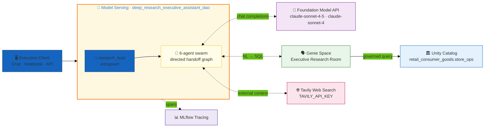
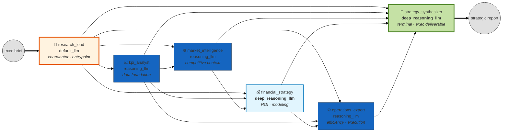
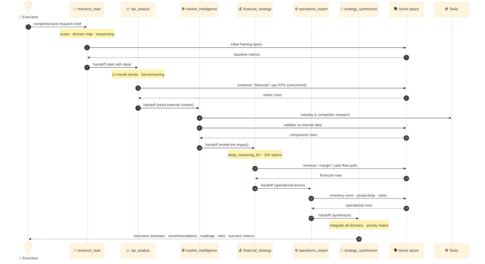

# Deep Research Swarm — Executive Strategy Assistant

> **Reference implementation of a 6-agent research swarm on dao-ai.** A collaborative team of specialists — coordinator, KPI analyst, market intelligence, financial strategy, operations, and synthesizer — that turns a single C-suite research brief into an integrated, data-driven strategic report. Every agent shares one **Genie room** over `retail_consumer_goods.store_ops`, agents **hand off directly to each other** (no central hub), and the graph terminates only at the synthesizer.

| ✨ Feature | What this example shows |
|---|---|
| 🐝 **Swarm orchestration** | Six peers with an explicit, directed **handoff graph**. Any agent can pull in the next specialist it needs; `strategy_synthesizer` is the single terminal node (`handoffs: []`). No supervisor / hub-and-spoke. |
| 🧭 **Coordinator entrypoint** | `default_agent: research_lead` — every turn starts at the coordinator, which scopes the inquiry and fans out to specialists. It is *not* a router that every agent returns to. |
| 🧠 **Reasoning-tiered models** | Three model tiers by cognitive load: `default_llm` (coordination) → `reasoning_llm` (analysis, temp 0.2) → `deep_reasoning_llm` (finance + synthesis, 32K tokens, Claude-Sonnet-4 with a Sonnet-4-5 fallback). |
| 🗣️ **Shared Genie tool** | All six agents carry the *same* `executive_research_genie_tool` bound to one Genie space (`space_id: 01f05dd0…`), giving every specialist NL→SQL access to the same governed warehouse tables. |
| 🌐 **Web-research capable** | `TAVILY_API_KEY` is provisioned as a serving env var (sourced from `env` or the `retail_consumer_goods` secret scope) so the market-intelligence workflow can reach external sources. |
| ⏱️ **Bounded recursion** | Every agent prompt caps graph recursion at 5 iterations and is told to *"run as many tools as you can concurrently"* — keeps a swarm from looping and encourages parallel Genie calls. |
| 🚀 **Model Serving deploy** | Ships as a registered UC model + serving endpoint (`deep_research_executive_assistant_dao`), `users` granted `CAN_QUERY`. No Lakebase, no Vector Search — this app is purely reasoning + Genie. |

---

## Architecture

The system is three interacting layers: the client, a swarm of six reasoning agents deployed behind a Model Serving endpoint, and the governed data + model backends they call. Each layer has a focused diagram below.

### 1. System layers

The top-level shape: client → Model Serving endpoint (a `ResponsesAgent` wrapping the 6-agent swarm) → Foundation Model API (Claude tiers), one Genie space over `retail_consumer_goods.store_ops`, and outbound web research via Tavily. Traces flow to MLflow.



**Key wiring details that are easy to miss:**
- **Every agent shares one tool instance.** `executive_research_genie_tool` (a `type: genie` tool) is defined once with a YAML anchor and attached to all six agents. There is exactly one Genie space (`space_id: 01f05dd06c421ad6b522bf7a517cf6d2`) — specialists don't each get their own space; they all query the same governed room and rely on their prompts to ask domain-appropriate questions.
- **The Genie room is the data plane.** The config declares 8 `tables` and 7 `functions` under `retail_consumer_goods.store_ops`, but they are *not* attached to agents as UC-function tools — they are the objects the Genie space sits on top of. The swarm's only agent-facing tool is the Genie tool.
- **Tavily is a serving env var, not a wired tool.** `environment_vars.TAVILY_API_KEY` is injected into the endpoint (`{{secrets/retail_consumer_goods/TAVILY_API_KEY}}`), enabling the market-intelligence workflow's external research. In this config version the only tool explicitly bound to agents is the Genie tool.

### 2. Swarm topology

This is a **directed handoff graph**, not a hub-and-spoke. `research_lead` is the entrypoint and can reach any specialist. Analysis flows generally left-to-right (data → market → finance → operations), and every path converges on `strategy_synthesizer`, which is the single terminal node with **no outbound handoffs**. Any specialist can also hand *back* to `strategy_synthesizer` early, and the synthesizer's *prompt* lets it request more work — but the wired outbound edges are exactly those below.



**Wired in the YAML as:**
```yaml
orchestration:
  swarm:
    default_agent: research_lead        # entrypoint every turn
    handoffs:
      research_lead:                     # can reach all five peers
      - kpi_analyst
      - market_intelligence
      - financial_strategy
      - operations_expert
      - strategy_synthesizer
      kpi_analyst:
      - market_intelligence
      - financial_strategy
      - operations_expert
      - strategy_synthesizer
      market_intelligence:
      - financial_strategy
      - strategy_synthesizer
      financial_strategy:
      - operations_expert
      - strategy_synthesizer
      operations_expert:
      - strategy_synthesizer
      strategy_synthesizer: []           # terminal — no outbound edges
```

**Why the graph narrows as it flows right.** `research_lead` and `kpi_analyst` are "wide" (they can fan to almost everyone) because coordination and data-gathering feed every other domain. Downstream specialists have progressively fewer edges — `operations_expert` can only go to the synthesizer — because by then the useful next move is almost always synthesis. This encodes the intended research pipeline *as graph structure* while still allowing the coordinator to jump straight to any specialist for a narrow inquiry.

### 3. Per-turn execution lifecycle

A full run for the canonical "comprehensive executive research report" brief. The coordinator scopes the work, pulls the KPI foundation first (as its prompt mandates), fans out to the domain specialists, and everything converges on the synthesizer for the C-suite deliverable. Each agent may issue multiple concurrent Genie queries.



**Observations:**
- **The coordinator's prompt mandates the sequence.** `research_lead` is instructed to *"always start with kpi_analyst for foundational data analysis"* before pulling market, financial, or operations specialists — so even though its handoff edges reach everyone, the intended first hop is the KPI foundation.
- **The synthesizer is the only agent that produces the executive deliverable.** Its prompt defines the fixed six-part structure: Executive Summary → Integrated Analysis → Strategic Recommendations → Implementation Roadmap → Risk Management → Success Metrics.
- **Concurrency is a first-class instruction.** Every prompt ends with *"Run as many tools as you can concurrently"* — a single specialist turn can issue several Genie queries in parallel rather than serially.
- **Recursion is capped at 5** in every prompt, which bounds how many handoff hops a swarm can take before it must converge on the synthesizer.

---

## Agents

All six agents carry the single shared `executive_research_genie_tool`. Model tier is the primary differentiator.

| # | Agent | Model alias | Underlying model | Role |
|---|---|---|---|---|
| 1 | `research_lead` | `default_llm` | claude-sonnet-4-5 · temp 0.1 · 16K | **Coordinator / executive interface.** Scopes the inquiry, maps domains, sequences the team, assures coverage. Entrypoint (`default_agent`). |
| 2 | `kpi_analyst` | `reasoning_llm` | claude-sonnet-4-5 · temp 0.2 · 16K | **Data foundation.** CAC/LTV/churn/NPS, financial & operational KPIs, 12-month trends, benchmarking, cross-validation. The mandated first hop. |
| 3 | `market_intelligence` | `reasoning_llm` | claude-sonnet-4-5 · temp 0.2 · 16K | **External context.** Industry trends, competitive intel, regulatory landscape, market sizing. The web-research workflow (Tavily) lives here. |
| 4 | `financial_strategy` | `deep_reasoning_llm` | claude-sonnet-4 · temp 0.1 · 32K · fallback → sonnet-4-5 | **Financial modeling & ROI.** Cost-benefit, risk-adjusted returns, investment prioritization. Highest token budget for long chains. |
| 5 | `operations_expert` | `reasoning_llm` | claude-sonnet-4-5 · temp 0.2 · 16K | **Efficiency & execution.** Process optimization, supply-chain/inventory, productivity, cost reduction, implementation planning. |
| 6 | `strategy_synthesizer` | `deep_reasoning_llm` | claude-sonnet-4 · temp 0.1 · 32K · fallback → sonnet-4-5 | **Terminal synthesizer.** Consolidates all domains into the six-part C-suite deliverable. Single node with no outbound handoffs. |

**Model-tier rationale (from `resources.models`):**
- **`default_llm`** (claude-sonnet-4-5, temp 0.1) — coordination is orchestration, not deep analysis; low temperature keeps scoping deterministic.
- **`reasoning_llm`** (claude-sonnet-4-5, temp 0.2) — the three analytic specialists run at a slightly higher temperature to surface non-obvious patterns and hypotheses.
- **`deep_reasoning_llm`** (claude-sonnet-4, temp 0.1, **32K tokens**) — financial modeling and final synthesis need the longest reasoning chains and the largest output budget; they carry a `claude-sonnet-4-5` fallback for capacity resilience.
- Two extra aliases are declared but unused by agents in this config: `fast_llm` (llama-3-1-8b) and `tool_calling_llm` (sonnet-4-5 with a sonnet-4 fallback) — available for future specialization.

---

## Data plane

There are **no local `data/` or `functions/` SQL files** in this example. The swarm reaches its data exclusively through the Genie space, which sits on top of pre-existing Unity Catalog objects in `retail_consumer_goods.store_ops`. The config declares those objects so `dao-ai` can wire the Genie tool and validate references — it does not create them.

```
retail_consumer_goods.store_ops/         # backs the Genie space
├── 📊 Tables (8)
│   ├── employee_performance
│   ├── products
│   ├── inventory
│   ├── customers
│   ├── managers
│   ├── employee_tasks
│   ├── appointments
│   └── evaluation
│
├── 🛠️ UC Functions (7) — declared for reference; Genie plans over them
│   ├── find_inventory_by_sku      · find_inventory_by_upc
│   ├── find_product_by_sku        · find_product_by_upc
│   ├── find_store_by_number
│   └── find_store_inventory_by_sku · find_store_inventory_by_upc
│
└── 🗣️ Genie Space — "Executive Research Genie Room"
    space_id: 01f05dd06c421ad6b522bf7a517cf6d2
    exposed to all 6 agents as executive_research_genie_tool
```

**Prerequisite, not provisioned by this config:** the Genie space and the `store_ops` tables must already exist in your workspace. Point `genie_rooms.executive_research_genie_room.space_id` at your own space, and adjust the `executive_research_schema` anchor (`catalog_name` / `schema_name`) if your data lives elsewhere.

---

## Why these design choices?

### Why a swarm instead of a supervisor pipeline?

Deep executive research is **non-linear and iterative** — a financial anomaly may send you back to KPIs, a market trend may reshape the operational plan. A swarm lets specialists hand off to whichever peer their findings demand, rather than forcing every step back through a central router. The directed handoff graph still encodes the *intended* flow (data → market → finance → ops → synthesis) without hard-coding it into a single supervisor.

### Why does every agent share one Genie tool instead of scoped tools?

The research domains all draw from the **same governed warehouse**. Giving each specialist its own narrow tool set would fragment access and force artificial handoffs just to fetch a number. Instead, every agent gets the full Genie room and relies on its **prompt** to ask domain-appropriate questions — the KPI analyst asks about churn and LTV, operations asks about inventory turns, all against one space. Unity Catalog governs what the space can see; the prompts govern what each agent asks.

### Why three model tiers?

Cost and capability follow cognitive load. Coordination (`default_llm`) and mid-weight analysis (`reasoning_llm`) run on Sonnet-4-5; only the two agents that do the heaviest, longest reasoning — financial modeling and final synthesis — get `deep_reasoning_llm` with a 32K output budget. Spending the large-context budget only where multi-domain integration happens is more efficient than uniformly maxing tokens everywhere.

### Why cap recursion at 5 and push concurrency?

Swarms can loop — A hands to B hands back to A. Every prompt caps graph recursion at **5 iterations** to guarantee convergence on the synthesizer, and instructs each agent to *"run as many tools as you can concurrently"* so a single research turn issues parallel Genie queries instead of a slow serial chain. Together these bound both depth and latency.

### Why a fallback on the deep-reasoning models?

`deep_reasoning_llm` and `tool_calling_llm` declare `fallbacks` (Sonnet-4 → Sonnet-4-5). The heaviest agents are the ones you least want to fail on a capacity blip mid-report; the fallback trades a small quality delta for availability on the two nodes that own the final deliverable.

---

## Deploy

### Prerequisites

- **Profile**: `DEFAULT` (or your equivalent Databricks profile) configured via `databricks configure`
- **Genie space**: The Executive Research space (`space_id: 01f05dd06c421ad6b522bf7a517cf6d2`) exists — or update the `space_id` in the YAML to point at yours
- **Data**: `retail_consumer_goods.store_ops` tables exist and the Genie space is built over them
- **Secret / env**: `TAVILY_API_KEY` available either as an environment variable or as key `TAVILY_API_KEY` in the `retail_consumer_goods` secret scope
- **Serving mode**: This app has no `orchestration.mode` override, so it deploys to **Model Serving** (`ServingMode.MODEL_SERVING`, the default) — a registered UC model + serving endpoint, not a Databricks App

### Validate + deploy

```bash
# Validate first (catches schema, anchor, and swarm graph-construction errors)
DATABRICKS_CONFIG_PROFILE=DEFAULT uv run dao-ai validate \
  -c examples/99_complete_applications/deep_research/deep_research.yaml

# Deploy to Model Serving
uv run dao-ai workflow up \
  -c examples/99_complete_applications/deep_research/deep_research.yaml \
  -p DEFAULT \
  --mode model_serving
```

This registers `retail_consumer_goods.store_ops.deep_research_dao` and deploys the serving endpoint `deep_research_executive_assistant_dao`, granting `users` the `CAN_QUERY` entitlement.

### Verify

```bash
# Registered model version exists
databricks --profile DEFAULT registered-models get \
  retail_consumer_goods.store_ops.deep_research_dao

# Serving endpoint READY
databricks --profile DEFAULT serving-endpoints get deep_research_executive_assistant_dao
```

---

## Sample prompts

The canonical prompt is defined in **`examples.yaml`** (`comprehensive_executive_research`). It is a single, deliberately maximal C-suite brief that exercises the entire swarm end-to-end. Run it with the custom inputs from the file:

```jsonc
// custom_inputs.configurable (from examples.yaml)
{ "thread_id": "1", "user_id": "ali_ghodsi", "store_num": 101 }
```

**The brief (verbatim, abridged for length):**

> *"I need a comprehensive executive research report analyzing our Q3 2025 performance and strategic positioning. Please conduct a deep dive analysis covering: Customer KPI Performance (CAC, LTV, churn, retention, NPS, satisfaction over the past 12 months); Financial Performance (revenue growth, margin trends, profitability, cash flow, ROI); Operational Efficiency (inventory turnover, productivity ratios, supply chain, cost trends); and Market Position (competitive standing, market share, industry benchmarks, external dynamics)…"*

The brief then poses five **strategic questions** the swarm must address (quoted from `examples.yaml`):

- *"Where are we underperforming relative to industry benchmarks and why?"*
- *"What are the top 3 strategic opportunities for growth in the next 6-12 months?"*
- *"What operational improvements could deliver the highest ROI?"*
- *"How do current market trends impact our strategic priorities?"*
- *"What are the financial implications of recommended strategic initiatives?"*

…and specifies the **deliverable** it expects back — the exact six-part structure `strategy_synthesizer` produces:

- Executive summary with 3-4 key strategic insights
- Integrated analysis across all business dimensions
- Prioritized strategic recommendations with clear rationale
- Implementation roadmap with timelines and resource requirements
- Risk assessment and mitigation strategies
- Success metrics for tracking progress

**Expected route:** `research_lead` → `kpi_analyst` → `market_intelligence` → `financial_strategy` → `operations_expert` → `strategy_synthesizer`, with each specialist issuing one or more Genie queries against the Executive Research space.

### Invoke the endpoint

```bash
databricks --profile DEFAULT serving-endpoints query deep_research_executive_assistant_dao \
  --request '{
    "input": [{"role":"user","content":"Analyze our Q3 2025 customer KPI performance and give me the top 3 growth opportunities."}],
    "custom_inputs": {"configurable": {"thread_id":"1","user_id":"ali_ghodsi","store_num":101}}
  }'
```

---

## File layout

```
deep_research/
├── README.md              # this file
├── deep_research.yaml     # dao-ai config — 6-agent swarm, Genie tool, 3 model tiers
└── examples.yaml          # canonical comprehensive_executive_research brief
```

No `data/` or `functions/` directories — the data plane is the external Genie space over `retail_consumer_goods.store_ops`.

---

## Related dao-ai patterns referenced

- **Swarm orchestration** — `examples/13_orchestration/swarm_pattern.yaml`
- **Genie tool** — `examples/99_complete_applications/commerce/` (Genie-backed retail agents)
- **Model tiers + fallbacks** — `resources.models` in this config (`deep_reasoning_llm`, `tool_calling_llm`)
- **Commerce Swarm** (companion complete-app, pipeline variant) — `examples/99_complete_applications/commerce/commerce_swarm.README.md`
