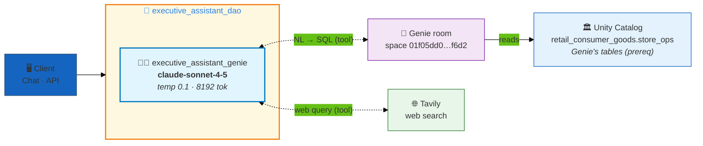
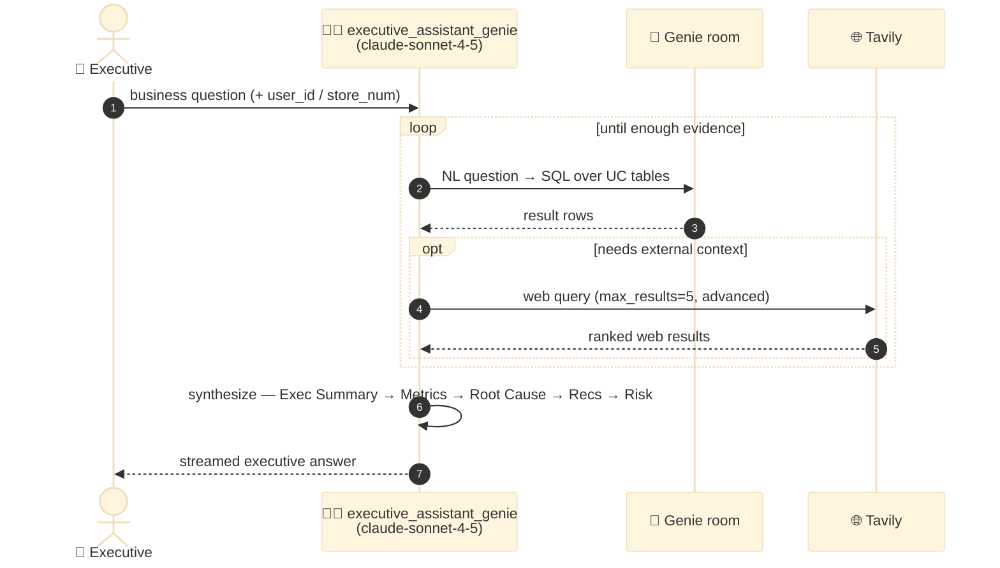

# Executive Assistant — Single-Agent Genie + Web Search Analyst

> **Reference implementation of a single-agent executive analyst on dao-ai.** One reasoning agent (`executive_assistant_genie`) that answers C-suite questions by querying a **Databricks Genie room** for internal business data and reaching out to the **web via Tavily** for external context — then formats findings in an executive-summary-first structure. No custom orchestration, no memory, no data provisioning: the simplest useful shape for a data-grounded assistant.

| ✨ Feature | What this example shows |
|---|---|
| 🧑‍💼 **Single-agent design** | Exactly one agent, no supervisor/handoff graph. The whole app is one `ResponsesAgent` with two tools. |
| 🧞 **Genie as a tool** | `type: genie` tool wraps an existing Genie space (natural-language → SQL over `retail_consumer_goods`). The agent decides when and how many times to query. |
| 🌐 **Live web search** | `langchain_tavily.TavilySearch` wired as a `type: factory` tool for external benchmarks / market context — a real tool span, not just an env var. |
| 🧠 **Claude Sonnet reasoning** | `databricks-claude-sonnet-4-5` at `temperature: 0.1` — deterministic, multi-step reasoning for executive analysis. |
| 🗂️ **Executive prompt contract** | A long system prompt fixes a 5-part response structure (Executive Summary → Metrics → Root Cause → Recommendations → Risk). |
| 🔐 **Secret-backed API key** | `TAVILY_API_KEY` resolves from the `retail_consumer_goods` secret scope (or a local env var), injected as an app environment variable. |
| 📡 **Streaming enabled** | `tags.streaming: true`; users get `CAN_QUERY` on the deployed endpoint. |

---

## Architecture

This is a **single-agent** app. There is no routing graph — one agent owns the turn end to end, calling either tool (or both, repeatedly) until it can answer.



### Per-turn execution

The agent loops over its two tools autonomously — the system prompt explicitly instructs it to make **multiple tool calls** to cross-validate before answering.



---

## Agents

| # | Agent | Model | Tools | Role |
|---|---|---|---|---|
| 1 | `executive_assistant_genie` | **databricks-claude-sonnet-4-5** (`temp 0.1`, `max_tokens 8192`) | `executive_assistant_genie_tool` (genie), `tavily_search_tool` (factory) | Executive data analyst & strategic advisor. Queries Genie for internal KPIs/inventory/employee/store metrics, uses Tavily for external benchmarks, and returns a structured executive brief. |

**Tool detail:**

| Tool | Type | Wiring | Notes |
|---|---|---|---|
| `executive_assistant_genie_tool` | `genie` | `genie_room` → space `01f05dd06c421ad6b522bf7a517cf6d2` | Natural-language querying of the data warehouse. The Genie space and its underlying tables are a **prerequisite** — this config does not create them. |
| `tavily_search_tool` | `factory` | `langchain_tavily.TavilySearch` (`max_results: 5`, `topic: general`, `search_depth: advanced`) | A real, wired LangChain tool — appears as its own tool span. It also depends on `TAVILY_API_KEY` being present (see below). |

---

## Why these design choices?

### Why a single agent instead of a supervisor/handoff graph?
The job is narrow: answer executive business questions from one data warehouse plus the open web. There is no B2C/B2B split, no specialist domains, no transactional side effects — nothing that needs routing. A single agent with two tools is the honest minimum. Adding a supervisor would only add an LLM call and trace noise.

### Why Claude Sonnet at temperature 0.1?
Executive analysis is multi-step reasoning: read metrics, find correlations, attribute root cause, recommend action. `claude-sonnet-4-5` is the right tier for that quality bar. `temperature: 0.1` keeps numeric analysis and recommendations stable across runs; `max_tokens: 8192` leaves room for the full 5-part response structure.

### Why Genie *as a tool* rather than a fixed SQL function?
Executive questions are open-ended ("why did retention dip?"), so the agent needs to ask ad-hoc questions and drill down. A Genie space turns natural language into SQL on demand and lets the agent iterate — exactly what a `type: genie` tool provides. Hard-coding UC functions would fix the question set in advance.

### Why is Tavily a tool and not just retrieval?
External context (industry benchmarks, competitor moves, market conditions) isn't in the warehouse. Wiring Tavily as a `factory` tool lets the agent decide *when* external signal is worth fetching, and keeps that fetch observable as its own span. Note the two-part dependency: the **tool** is wired in `tools:`, and its **API key** is supplied separately via `TAVILY_API_KEY`.

### Why secret-backed config for the API key?
`variables.tavily_search_key` accepts either a local env var (`TAVILY_API_KEY`) or the `retail_consumer_goods` scope secret, and `app.environment_vars` injects `{{secrets/retail_consumer_goods/TAVILY_API_KEY}}` into the deployed app. No key material lives in the YAML.

---

## Deploy

### Prerequisites

These are **inputs this config assumes exist** — it provisions none of them (there is no `data/` or `functions/` directory here):

- **Profile**: `DEFAULT` (or your equivalent) configured via `databricks configure`.
- **Genie space**: `01f05dd06c421ad6b522bf7a517cf6d2` exists and is granted to the runtime principal. Update `genie_rooms.executive_assistant_genie_room.space_id` to point at your own space.
- **Genie's underlying tables**: whatever `retail_consumer_goods.store_ops` (or your Genie space) queries must already be populated. This app reads them through Genie; it does not create or load them.
- **Secret scope**: `retail_consumer_goods` exists with key `TAVILY_API_KEY` (or export `TAVILY_API_KEY` locally).
- **Registered-model target**: `retail_consumer_goods.store_ops` catalog/schema exists for the `executive_assistant_dao` model.

### Validate + deploy

```bash
# Validate first (schema, anchors, tool/agent wiring, graph construction)
DATABRICKS_CONFIG_PROFILE=DEFAULT uv run dao-ai validate \
  -c examples/99_complete_applications/executive_assistant/executive_assistant.yaml

# Deploy the app
uv run dao-ai workflow up \
  -c examples/99_complete_applications/executive_assistant/executive_assistant.yaml \
  -p DEFAULT \
  --mode apps
```

The `app:` block registers the model `executive_assistant_dao` in `retail_consumer_goods.store_ops`, serves it under endpoint `executive_assistant_agent_dao`, injects `TAVILY_API_KEY`, and grants `users` the `CAN_QUERY` entitlement. There is no data/VS/UC-function provisioning stage — deploy is model-registration + serving only.

### Verify

```bash
# App running
databricks --profile DEFAULT apps get executive_assistant_dao

# Serving endpoint ready
databricks --profile DEFAULT serving-endpoints get executive_assistant_agent_dao
```

---

## Sample prompts

The canonical example is defined in [`examples.yaml`](./examples.yaml). It shows the expected request shape — a user message plus `custom_inputs.configurable` carrying `thread_id`, `user_id`, and `store_num`:

```yaml
# examples.yaml → average_sales_percentage
messages:
  - role: user
    content: "Hey Assistant, What is the average sales achievement percentage for employees?"
custom_inputs:
  configurable:
    thread_id: "1"
    user_id: "ali_ghodsi"
    store_num: 101
```

That prompt routes to the Genie tool (employee-performance data) and comes back as an executive brief.

**Other questions this agent is designed for** (drawn from the system prompt's stated responsibilities — verify against your own Genie space's tables before relying on them):

- *"Which customer segments are churning fastest this quarter, and why?"* — Genie (customer KPIs) → root-cause analysis
- *"How is inventory turnover trending, and where are we seeing stockouts?"* — Genie (inventory/supply chain)
- *"Compare our store performance across locations and flag the underperformers."* — Genie (store performance)
- *"What are current retail industry benchmarks for NPS, and how do we compare?"* — Tavily (external) + Genie (internal NPS)

---

## File layout

```
executive_assistant/
├── README.md                    # this file
├── executive_assistant.yaml     # dao-ai config — 1 agent, 2 tools, app block
└── examples.yaml                # canonical sample prompt + custom_inputs shape
```

> No `data/` or `functions/` directory. Any tables the Genie room reads are **prerequisites**, not assets this example provisions.

---

## Related dao-ai patterns referenced

- **Genie tool** — `type: genie` first-class tool ([`reference_dao_ai_first_class_tool_types`])
- **Factory tools** — `langchain_tavily.TavilySearch` via `type: factory`
- **Multi-agent + Genie contrast** — `examples/99_complete_applications/commerce/commerce_supervisor.README.md` (when a single agent isn't enough)
- **Secret-backed variables** — `variables.*.options` with `env` / `scope`+`secret` fallback
