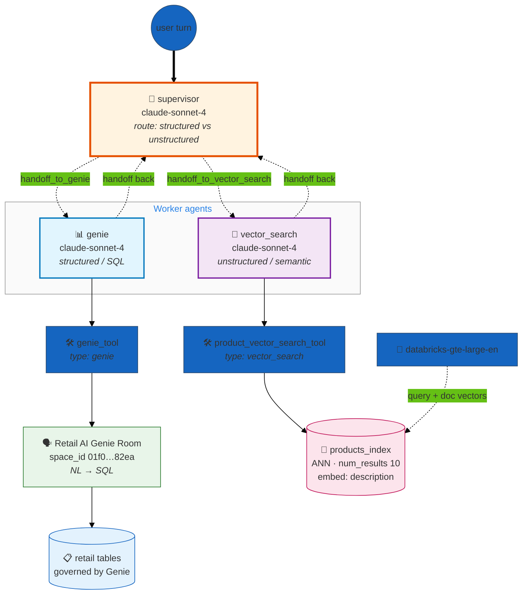

# Genie × Vector Search Hybrid — Structured + Unstructured Retrieval

> **A minimal supervisor over two retrieval agents that read the same retail domain two different ways.** One agent answers with **structured** analytics through a Genie space (natural language → SQL over governed tables); the other answers with **unstructured** semantic search over a Vector Search product index. A supervisor classifies each turn and routes to whichever retrieval path fits the question.

| ✨ Feature | What this example shows |
|---|---|
| 🧭 **Supervisor orchestration** | `app.orchestration.supervisor` is a central router. It reads each user turn, picks one worker agent via an auto-generated `handoff_to_<agent>` tool, and the worker hands control back — hub-and-spoke, not a pipeline |
| 🔀 **Hybrid retrieval** | The two worker agents deliberately cover the two halves of retrieval: `genie` (structured/SQL) and `vector_search` (unstructured/semantic). The interesting question this example poses is *which path does a given question belong to?* |
| 🧮 **Structured path — Genie** | `genie_tool` (`type: genie`) talks to the **"Retail AI Genie Room"** space. Genie turns natural language into SQL and executes it against curated retail tables — right for aggregations, filters, counts, joins |
| 🔎 **Unstructured path — Vector Search** | `vector_search_tool` (`type: vector_search`) runs ANN similarity search over `products_index`, embedding the `description` column with `databricks-gte-large-en` — right for fuzzy "find me something like…" product discovery |
| 🧱 **Prerequisite-driven** | This directory ships **config only** — no `data/`, no `functions/`. The Genie space, the `products` source table, and the `products_index` are **prerequisites** you point the config at |
| 🎛️ **Single reasoning model** | `databricks-claude-sonnet-4` at `temperature: 0.1` drives both workers *and* the supervisor router — consistent, low-variance routing and answers |

> ⚠️ **This is a skeleton/template example.** The two worker agents ship with **placeholder** `prompt` and `handoff_prompt` text (literally `"Answers questions about foo"` / `"…about bar"`). The *retrieval wiring* — Genie room, Vector Search index, retriever, tools, supervisor — is real and complete; the agent instructions are stubs you are expected to fill in for your domain. Everything below documents what the config wires up, and flags the stubs where they matter.

---

## Architecture

A supervisor sits in front of two worker agents. Each worker owns exactly one retrieval tool, and those two tools reach into two different stores over the same retail domain: Genie issues governed SQL against Delta tables; Vector Search does ANN similarity over an embedded index. The supervisor's one job is to decide which store a question belongs to.



**How a turn flows:**
1. Every user turn starts at the **supervisor**. It classifies the request and calls exactly one `handoff_to_<agent>` tool (`handoff_to_genie` or `handoff_to_vector_search`).
2. The chosen worker invokes its single tool, gets results, and composes an answer.
3. The worker calls its injected `handoff_to_supervisor` tool to return control. The supervisor decides whether it is done or needs the other worker, then produces the final response.

This is **hub-and-spoke**: workers never hand off to each other, only back to the supervisor. Compare the [commerce_supervisor](../commerce/commerce_supervisor.README.md) example for the same pattern at a larger scale.

---

## Agents

| Agent | Model | Tool | Retrieval kind | What it is for |
|---|---|---|---|---|
| `genie` | `databricks-claude-sonnet-4` | `genie_tool` (`type: genie`) → **Retail AI Genie Room** | **Structured** (NL → SQL over Delta tables) | Analytical questions that need aggregation, filtering, counting, or joining governed retail data |
| `vector_search` | `databricks-claude-sonnet-4` | `product_vector_search_tool` (`type: vector_search`) → `products_index` | **Unstructured** (ANN semantic similarity) | Open-ended product discovery over the free-text `description` column |

**Genie path (structured).** `genie_tool` targets the Genie space `space_id: 01f01c91f1f414d59daaefd2b7ec82ea` (overridable via `RETAIL_AI_GENIE_SPACE_ID`). Genie translates the user's natural language into SQL and runs it against the tables in that space, so this path is authoritative for "how many", "what's the total", "which stores", "filter by X" style questions.

**Vector Search path (unstructured).** `product_vector_search_tool` runs through `products_retriever` over `products_index` (endpoint `one-env-shared-endpoint-12`, `STANDARD`). It embeds the `description` column with `databricks-gte-large-en`, searches with `query_type: ANN`, and returns the top **10** results. Columns returned: `product_id`, `sku`, `upc`, `brand_name`, `product_name`, `merchandise_class`, `class_cd`, `description`. This path is right for "find me something like…" where the match is semantic, not a SQL predicate.

> The `genie` and `vector_search` agents' `prompt`/`handoff_prompt` fields are **placeholders** in the shipped config. Before deploying for real, replace them with instructions that describe your domain and, critically, give the supervisor clear `handoff_prompt` routing signals (e.g. genie = "counts, totals, filters, joins over retail data"; vector_search = "semantic product lookup / discovery").

---

## Why these design choices?

### Why split retrieval into two agents at all?
Structured and unstructured retrieval have different failure modes and different "shapes" of good answer. A Genie/SQL query is exact and auditable but brittle to fuzzy intent; a vector search is tolerant of fuzzy intent but can't do arithmetic or exact joins. Giving each its own agent keeps each tool's contract clean and lets the supervisor make one crisp routing decision instead of one agent juggling two very different tools.

### Why a supervisor instead of a pipeline?
There is no fixed order between the two paths — a turn needs *one or the other* (occasionally both). A supervisor is the natural fit: it inspects the turn and routes. A linear pipeline would force every question through a stage it doesn't need. (When stages *do* have a fixed order, the [commerce](../commerce/commerce_supervisor.README.md) pipeline/swarm variants are the better reference.)

### Why the same model everywhere?
Routing quality and answer quality both benefit from a strong reasoner, and at `temperature: 0.1` `databricks-claude-sonnet-4` gives low-variance routing. Keeping one model alias (`default_llm`) across supervisor + both workers keeps the example minimal; you can split it later (e.g. a cheaper router) exactly as the larger commerce examples do.

### Why is there no `data/` or `functions/` directory?
This example is about **routing between two existing stores**, not provisioning them. The Genie space, the `products` table, and `products_index` are **prerequisites**. That keeps the example focused on the hybrid-retrieval pattern rather than on data setup — and makes it a drop-in template to point at retail data you already have.

---

## Deploy

### Prerequisites
- **Profile**: a configured Databricks CLI profile (e.g. `DEFAULT`).
- **Genie space**: the space referenced by `space_id` (or set `RETAIL_AI_GENIE_SPACE_ID`) exists and is scoped to your retail tables.
- **Source table**: `${catalog}.${schema}.products` exists (defaults: `nfleming.retail_ai.products`). Override with the `catalog` / `schema` parameters.
- **Vector Search index**: `products_index` exists on endpoint `one-env-shared-endpoint-12` (`STANDARD`), embedding `description` via `databricks-gte-large-en`. Change `endpoint.name` / `index.name` in the YAML to match your workspace.

### Validate + bring up

```bash
# Validate first (catches schema, anchor, and graph-construction errors)
DATABRICKS_CONFIG_PROFILE=DEFAULT uv run dao-ai validate \
  -c examples/99_complete_applications/genie_vector_search_hybrid/genie_vector_search_hybrid.yaml

# Generate + deploy + start as a Databricks App (default --mode apps)
uv run dao-ai agent up \
  -c examples/99_complete_applications/genie_vector_search_hybrid/genie_vector_search_hybrid.yaml \
  -p DEFAULT
```

To deploy to a Model Serving endpoint instead of an App:

```bash
uv run dao-ai agent up \
  -c examples/99_complete_applications/genie_vector_search_hybrid/genie_vector_search_hybrid.yaml \
  --mode model_serving -p DEFAULT
```

This registers the model `genie_vector_search_hybrid_dao` and (in `model_serving` mode) the endpoint `genie_and_vector_search_agent_dao`. The app grants `CAN_MANAGE` to all `users`.

> Because this directory ships no datasets, use `dao-ai agent up` (build + deploy the agent). `dao-ai workflow up` is for examples that also provision tables/VS/UC functions — this one assumes those already exist.

### Verify

```bash
# App running
databricks --profile DEFAULT apps get genie_vector_search_hybrid_dao

# Or interactive chat against the config
uv run dao-ai chat \
  -c examples/99_complete_applications/genie_vector_search_hybrid/genie_vector_search_hybrid.yaml -p DEFAULT
```

---

## Sample prompts (illustrative)

> ⚠️ **Illustrative only.** The shipped agent prompts are placeholders, so these are *not* validated against a deployed app — they are examples of the kind of question each retrieval path is designed for, derived from the tool and retriever config. Adapt them to your data after filling in the agent prompts.

| Intended path | Illustrative prompt | Why it routes there |
|---|---|---|
| **`genie`** (structured / SQL) | *"How many products are in each merchandise class?"* | Aggregation over governed columns — a SQL job for Genie |
| **`genie`** (structured / SQL) | *"List brands with more than 20 SKUs."* | Grouped count + filter — exact, not semantic |
| **`vector_search`** (unstructured / semantic) | *"Find me a lightweight waterproof jacket for hiking."* | Free-text intent matched against embedded `description` |
| **`vector_search`** (unstructured / semantic) | *"Show products similar to a stainless steel travel mug."* | Semantic similarity, no SQL predicate expresses it |

---

## File layout

```
genie_vector_search_hybrid/
├── README.md                          # this file
└── genie_vector_search_hybrid.yaml    # dao-ai config (supervisor + 2 retrieval agents)
```

No `data/` or `functions/` — the Genie space, `products` table, and `products_index` are prerequisites, not created here.

---

## Related dao-ai patterns referenced

- **Supervisor orchestration** — `examples/13_orchestration/supervisor_pattern.yaml`
- **Supervisor at scale (commerce)** — `examples/99_complete_applications/commerce/commerce_supervisor.README.md`
- **Genie tool (`type: genie`)** — natural language → SQL over a Genie space
- **Vector Search tool (`type: vector_search`)** — ANN semantic retrieval via a retriever + VS index
